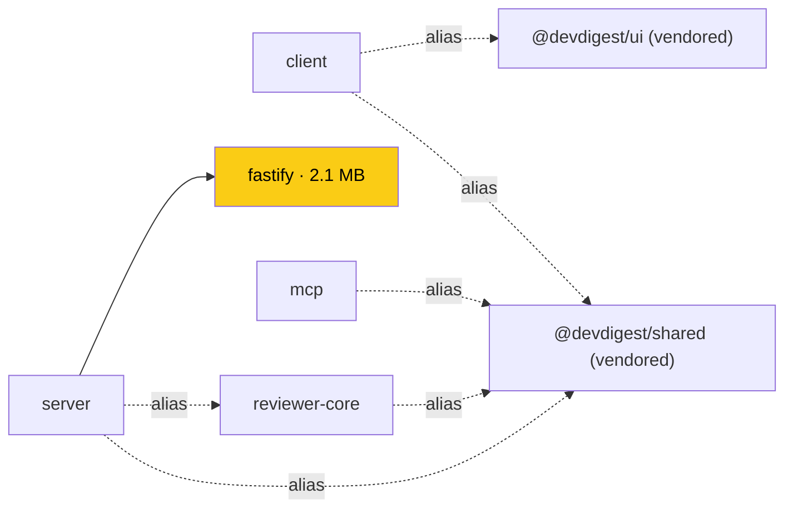

# Dependency report — <date>

## 1. Scope
| Package | Manager | Prod | Dev | Installed | Notes |
|---|---|---|---|---|---|

Not analyzed: … (reason)

## 2. Dependency map

Dashed = internal (alias / relative import), solid = external npm. One extra block per package with its top-10 deps, colored by tier (XL red `#f87171`, L orange, M yellow, S green).

## 3. Size breakdown — <package>
| # | Dependency | Kind | Version | Size | % of pkg | Tier |
|---|---|---|---|---|---|---|
… N more deps — X MB

## 4. Findings & Priorities
### P0
- **<pkg> › <dep/file>** — evidence. *Recommendation:* … `command`
### P1
### P2
### Info

## 5. Summary
1. <package/dep> — action (P#).
2. …

_Method & limits: ran collect.mjs, <outdated/audit>; failed/skipped: …; sizes are installed on-disk sizes, not bundle sizes._
