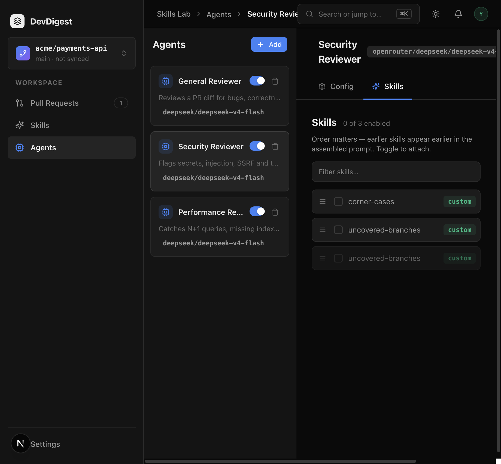
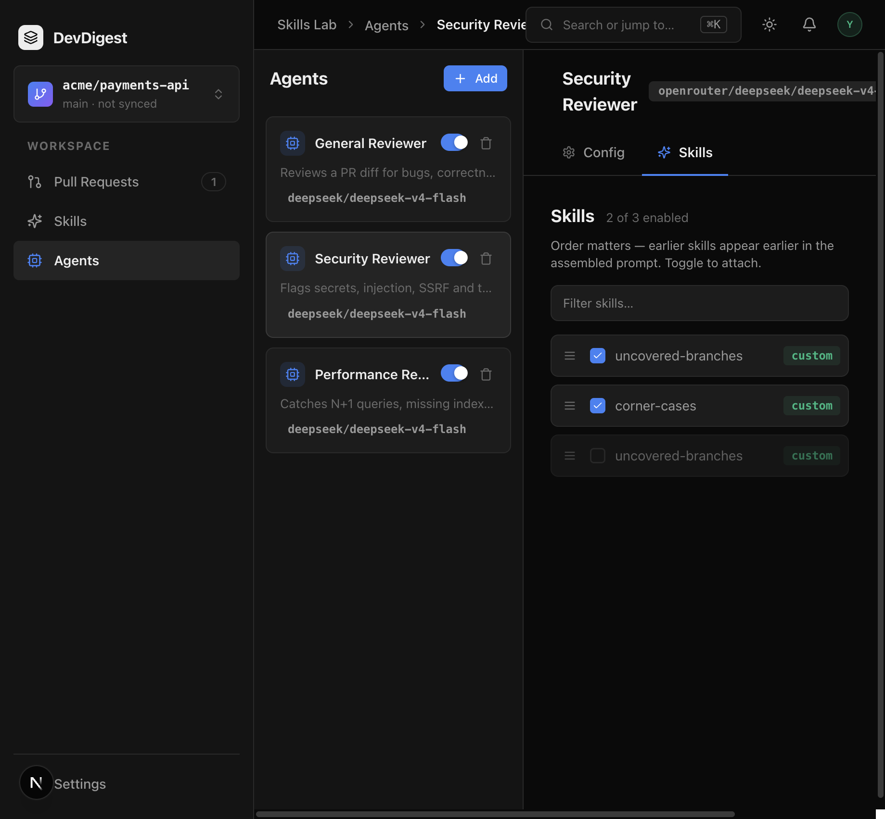
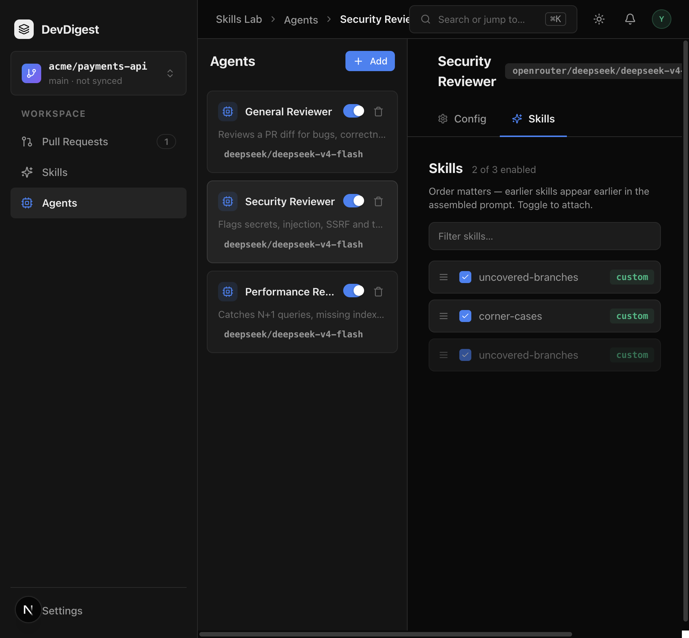

# Task 2.0 Proofs – Agent editor Skills tab

## Task Summary

`/agents/:id?tab=skills` lists the full workspace catalog with drag handle, per-agent checkbox, type badge, “N of M enabled”, and a name filter. Bindings POST `{ skills: [{ skill_id, enabled }] }`. Unlinked rows stay unchecked until the first check or drop; uncheck keeps the row.

## What This Task Proves

- Config + Skills are the only editor tabs (`VALID_TABS` / `TABS`).
- Dual-gate count: globally disabled skills stay visible and do not increment N.
- Checkbox bind + native HTML5 reorder persist across reload.
- Colocated RTL tests cover count, uncheck-keeps-row, name-only filter, and helpers.

## Evidence Summary

Client hermetic suite, typecheck, lint, and a live Skills tab session on Security Reviewer (`21762c8a-dc87-4ded-89cd-e3e1b7369aa6`). Prompt injection is parent 3.0.

## Artifact: Colocated RTL tests

**What it proves:** Six catalog skills with three dual-enabled show “3 of 6 enabled”; unchecking Alpha POSTs `enabled: false` and keeps the row; name filter hides non-matching rows; unlinked rows paint unchecked; AgentEditor has Config + Skills only.
**Why it matters:** The editor contract is covered without a browser or live API.
**Command:** `cd client && pnpm test`

```
 ✓ src/app/agents/[id]/_components/AgentEditor/_components/SkillsTab/helpers.test.ts (5 tests)
 ✓ src/app/agents/[id]/_components/AgentEditor/_components/SkillsTab/SkillsTab.test.tsx (3 tests)
 ✓ src/app/agents/[id]/_components/AgentEditor/AgentEditor.test.tsx (2 tests)
 Test Files  23 passed (23)
      Tests  93 passed (93)
```

## Artifact: Typecheck + lint

**What it proves:** The new tab and hooks type-check and lint.
**Command:** `cd client && pnpm typecheck && pnpm lint`

```
$ tsc --noEmit
$ eslint .
```

## Artifact: Skills tab URL + bind / reorder / reload

**What it proves:** `http://localhost:3000/agents/21762c8a-dc87-4ded-89cd-e3e1b7369aa6?tab=skills` is reachable beside Config. Binding `uncovered-branches` then `corner-cases`, dragging the first above the second, and reloading keeps order and checkboxes. A globally disabled `uncovered-branches` stays in the list; checking it does not change “2 of 3 enabled”.
**Why it matters:** The dual-gate UI and persist path match the spec, not only the mocked tests.
**Command:** browser against studio `:3000` (API already on `:3001`)
**GET after reload:**

```
0 True True uncovered-branches
1 True True corner-cases
2 True False uncovered-branches
```

`2 of 3 enabled` after reload (all three boxes checked; third `skill_enabled: false`).

**Artifact path:** `docs/specs/02-spec-skills-agent-binding/02-proofs/02-skills-tab-initial.png`



**Artifact path:** `docs/specs/02-spec-skills-agent-binding/02-proofs/02-skills-tab-reorder.png`



**Artifact path:** `docs/specs/02-spec-skills-agent-binding/02-proofs/02-skills-tab-dual-gate.png`


**Artifact path:** `docs/specs/02-spec-skills-agent-binding/02-proofs/02-skills-tab-reload.png`



## Reviewer Conclusion

The Skills tab binds and reorders workspace skills with dual enablement. Prompt assembly is not in this task.
