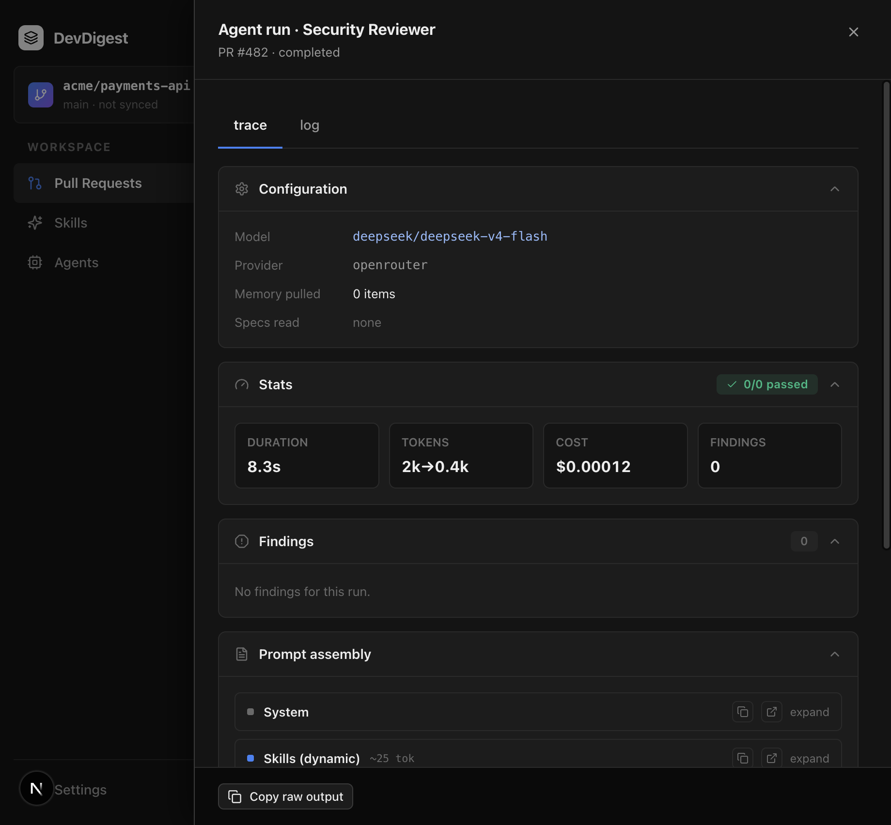
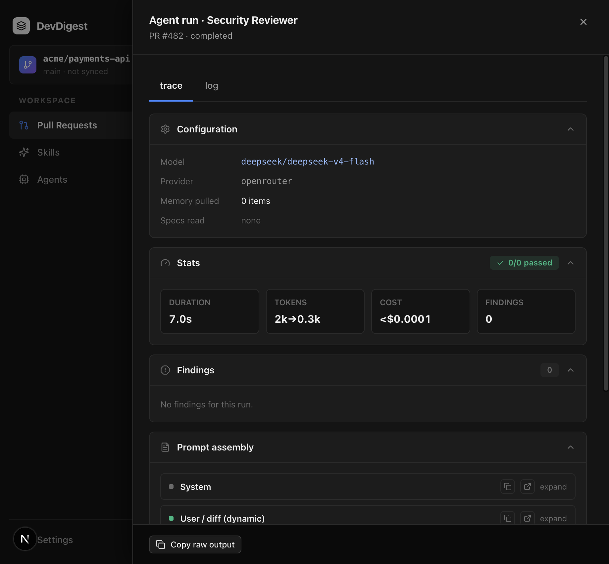

# Task 3.0 Proofs – Prompt assembly + trace skills block

## Task Summary

`ReviewRunExecutor` loads linked skills, keeps rows where both `skills.enabled` and `agent_skills.enabled` are true, sorts by `order`, and passes **bodies only** into `reviewPullRequest` via `skillsPromptArg`. Empty → omit the key. Success traces keep `outcome.assembly`. The Prompt assembly UI shows a display-only `ceil(chars/4)` figure on the skills block.

## What This Task Proves

- Dual-gate filter returns bodies in `order`; global-off / per-agent-off / empty → `[]`.
- `skillsPromptArg(['a'])` is `{ skills: ['a'] }`; `[]` is `{}`.
- `assemblePrompt` joins bodies under `## Skills / rules` without `<untrusted>`; omitted / `[]` / whitespace-only → `assembly.skills` is null.
- Trace UI: non-empty skills → block + non-zero `~N tok`; `null` → block absent; billing `TOKENS` tile is unchanged.

## Evidence Summary

Hermetic helpers + assembly + drawer tests, typecheck/lint, and three live Security Reviewer runs on PR `#482`.

## Artifact: Dual-gate bodies helper

**What it proves:** Two dual-enabled bodies survive in `order`; a global-off or per-agent-off row is dropped; empty / all-disabled → `[]`; values are bodies.
**Command:** `cd server && pnpm exec vitest run src/modules/agents/helpers.test.ts`

```
 ✓ src/modules/agents/helpers.test.ts (4 tests)
```

## Artifact: Omit-when-empty glue

**What it proves:** `skillsPromptArg` cannot produce `skills: []`.
**Command:** `cd server && pnpm exec vitest run src/modules/reviews/helpers.test.ts`

```
 ✓ src/modules/reviews/helpers.test.ts (2 tests)
```

## Artifact: assemblePrompt skills section

**What it proves:** `skills: ['body-a', 'body-b']` lands in `assembly.skills` and `## Skills / rules` without wrapping those bodies in `<untrusted>`. Omitted / `[]` / whitespace-only → `assembly.skills` is null.
**Command:** `cd server && pnpm exec vitest run test/prompt-structured.test.ts`

```
 ✓ test/prompt-structured.test.ts (7 tests)
```

## Artifact: Trace drawer token figure

**What it proves:** Opening Prompt assembly with `skills: "### skill"` shows `Skills (dynamic)` and `~3 tok` (`ceil(10/4)`). `skills: null` hides the block. Billing `12k→1.5k` is unchanged.
**Command:** `cd client && pnpm test`

```
 ✓ src/app/repos/[repoId]/pulls/[number]/_components/RunTraceDrawer/RunTraceDrawer.test.tsx (4 tests)
 Test Files  23 passed (23)
      Tests  95 passed (95)
```

## Artifact: Typecheck + lint + hermetic suites

**Command:** `cd server && pnpm typecheck && pnpm lint && pnpm exec vitest run --exclude '**/*.it.test.ts'`
**Command:** `cd client && pnpm typecheck && pnpm lint`
**Command:** `cd reviewer-core && npm test && npm run typecheck`

```
server: Test Files  23 passed (23) / Tests  163 passed (163)
client: Test Files  23 passed (23) / Tests  95 passed (95)
reviewer-core: Test Files  3 passed (3) / Tests  23 passed (23)
```

## Artifact: Live runs on PR #482 (Security Reviewer)

**What it proves:** Dual-enabled bodies inject in link order; a globally disabled skill is omitted; reordering swaps `assembly.skills`; disabling the remaining per-agent flags omits the skills block. Live log says `Injecting 2 skill(s)` and never dumps bodies. Billing TOKENS (`2k→0.4k`) is independent of `~25 tok`.
**Why it matters:** Executor glue is the path the studio actually uses.

Run `357e6a9f` (order: uncovered-branches, corner-cases):

```
Injecting 2 skill(s)
assembly.skills length=100 → ~25 tok
# Catch blocks too
Also flag uncovered catch paths.

# Corner cases
Cover empty and overflow inputs.
## Skills / rules present; bodies not wrapped in <untrusted>
```

Run `279fa2b5` (order swapped: corner-cases first):

```
SKILLS_START # Corner cases | Cover empty and overflow
HAS_CORNER_FIRST True
HAS_CATCH True
```

Run `7bcc03a9` (per-agent flags off; only a globally disabled link remains):

```
assembly.skills = null
## Skills / rules absent
no Injecting N skill(s) log line
```

**Artifact path:** `docs/specs/02-spec-skills-agent-binding/02-proofs/03-trace-skills-tokens.png`



**Artifact path:** `docs/specs/02-spec-skills-agent-binding/02-proofs/03-trace-skills-omitted.png`



## Reviewer Conclusion

Skills enter the prompt only when both gates are on, in stored order, as trusted bodies. The trace shows an approximate token figure on that block alone; billing stats are untouched.
