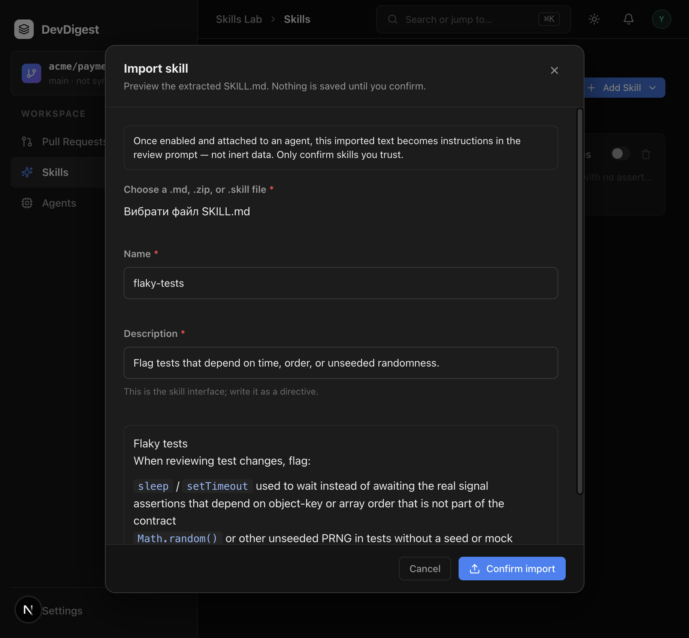
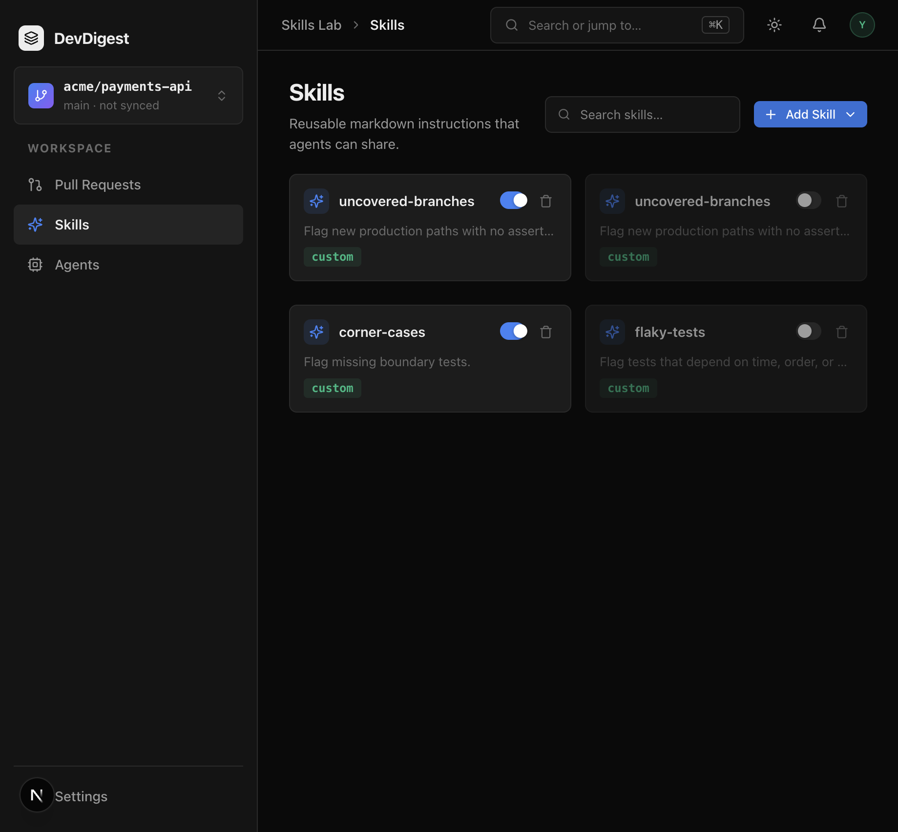

# Task 2.0 Proofs – Confirm-only import API and Skills Lab UI

## Task Summary

Authors pick **Add Skill → Import from file**, preview the extracted `SKILL.md` with a trust warning, and persist only on Confirm. Confirm writes `enabled = false` and `source = imported`. Cancel and preview leave the catalog unchanged. URL / Community import stay unwired.

## What This Task Proves

- `SkillSource` includes `imported` as distinct from `imported_url`. Drizzle `text` already stores it; `pnpm db:generate` is a no-op.
- Preview HTTP does not insert. Confirm creates a disabled imported row. Zip-slip preview is HTTP 400. Manual `POST /skills` stays `source: manual`.
- Skills Lab shows Create **and** Import from file. Confirm stays disabled until description is non-empty. The warning states imported text becomes **instructions**, not inert data.

## Evidence Summary

Contracts + Postgres import cases + client RTL + browser import of `docs/skill-fixtures/flaky-tests/SKILL.md`. Live API at `:3001` and studio at `:3000`.

## Artifact: Schema generate is a no-op

**What it proves:** `skills.source` is unconstrained `text` in `0000_init.sql`. Adding `'imported'` to the Zod/drizzle unions does not emit SQL.
**Why it matters:** Applied migrations stay immutable.
**Command:** `cd server && pnpm db:generate`

```
No schema changes, nothing to migrate 😴
```

## Artifact: Contracts accept `imported`

**What it proves:** `SkillSource.parse('imported')` succeeds; `Skill.parse` with `source: 'imported'` succeeds; `'imported_url'` remains a distinct value.
**Why it matters:** File import must not overload URL import.
**Command:** `cd server && pnpm exec vitest run test/contracts.test.ts`

```
 ✓ test/contracts.test.ts (10 tests)
```

## Artifact: Preview does not persist; confirm is disabled + imported

**What it proves:** Fixture markdown preview leaves `GET /skills` unchanged. Confirm returns `enabled: false`, `source: 'imported'`, body = SKILL.md core. Zip-slip preview → 400. Manual create stays `manual`.
**Why it matters:** Confirm is the only persist seam; zip-slip maps to 400 not 422.
**Command:** `cd server && pnpm exec vitest run test/skills.it.test.ts`

```
 ✓ test/skills.it.test.ts (9 tests)
```

## Artifact: Skills Lab menu and import modal

**What it proves:** Add Skill contains Create and Import from file, not URL/Community. Warning copy is in the document before Confirm. Confirm stays disabled while description is empty. Confirm calls persist; Cancel does not.
**Why it matters:** UI matches Unit 1 without expanding scope to URL/community.
**Command:** `cd client && pnpm test -- src/app/skills/_components/SkillsListView`

```
 ✓ ImportSkillModal.test.tsx (3 tests)
 ✓ SkillsListView.test.tsx (3 tests)
 Test Files  25 passed (25)
      Tests  100 passed (100)
```

(`pnpm test` runs the whole client suite; the two colocated files above are the 2.0 cases.)

## Artifact: Browser import of the fixture

**What it proves:** `http://localhost:3000/skills` → Add Skill → Import from file → `SKILL.md` preview with trust warning → Confirm → `flaky-tests` on the list with the toggle **off**.
**Why it matters:** Confirm ≠ enable. Dual-gate (spec 02) keeps this body out of prompts until the author enables and attaches.
**URL:** `http://localhost:3000/skills`

**Artifact path:** `docs/specs/03-spec-skills-import-and-test-quality/03-proofs/03-import-preview-warning.png`



**Artifact path:** `docs/specs/03-spec-skills-import-and-test-quality/03-proofs/03-import-disabled-list.png`



## Reviewer Conclusion

Import is confirm-only, starts disabled, and never executes archive extras. Persistence and UI are in place for the Test Quality catalog (task 3.0) and the fixture-PR experiment (task 4.0).
