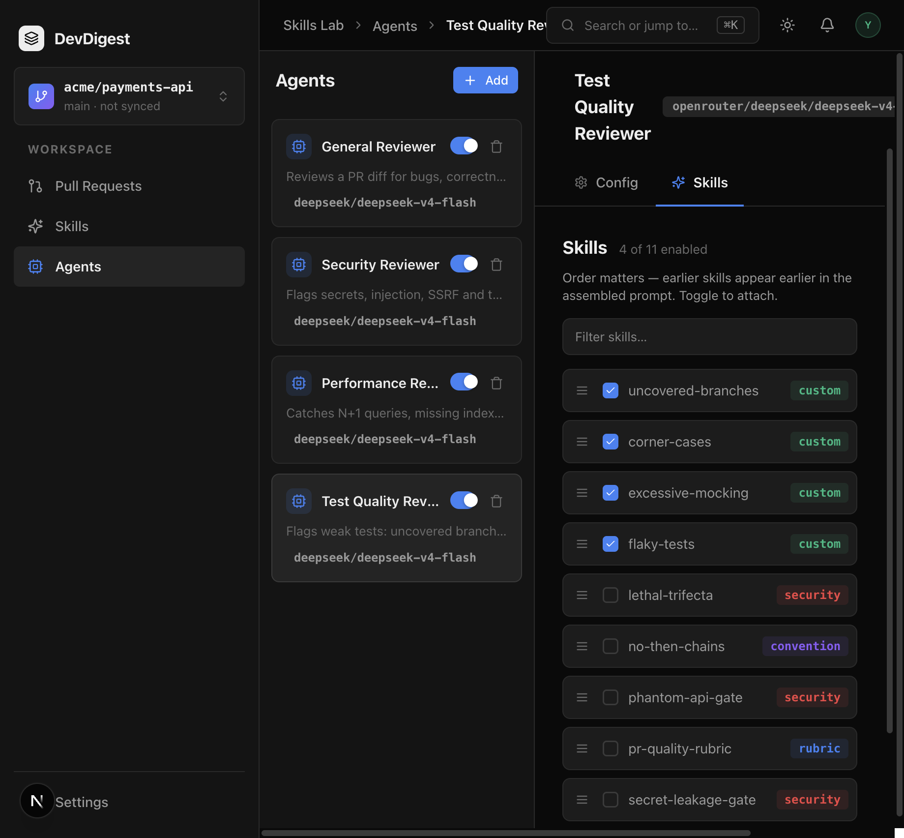

# Task 3.0 Proofs – Seed mockup catalog and Test Quality Reviewer

## Task Summary

Idempotent seed of the mockup skill catalog, attachments on Security / Performance (General stays empty), and **Test Quality Reviewer** with three test-quality skills. `flaky-tests` is not seeded; it is imported, enabled, and attached.

## What This Task Proves

- Second `seed()` does not duplicate catalog names or the Test Quality agent.
- Security / Performance / General / Test Quality link matrix matches the spec, including a shared `pr-quality-rubric` `skill_id`.
- Import + enable + attach of the flaky fixture yields four ordered Test Quality links ending with `flaky-tests`.

## Evidence Summary

Postgres `skills-seed.it.test.ts` (seed twice in `beforeAll`) plus live `pnpm db:seed` twice against the studio database. Browser: Test Quality `?tab=skills` after seed + import.

## Artifact: Idempotent seed

**What it proves:** Catalog names are unique; exactly one Test Quality Reviewer; `flaky-tests` is absent until import.
**Why it matters:** Re-running `pnpm db:seed` must not clone reviewers or skills.
**Command:** `cd server && pnpm exec vitest run test/skills-seed.it.test.ts`

```
 ✓ test/skills-seed.it.test.ts (3 tests)
```

Live: `cd server && pnpm db:seed` twice → `GET /agents` has one Test Quality Reviewer (`deepseek/deepseek-v4-flash`). Studio DB also has a leftover duplicate `uncovered-branches` from earlier manual creates (not produced by seed; the it-test workspace is unique).

## Artifact: Link matrix + shared rubric

**What it proves:** Security has four enabled catalog skills and two disabled links; Performance only `pr-quality-rubric` with the same `skill_id`; General `[]`; Test Quality three ordered custom skills with non-empty descriptions.
**Command:** same file, case `seeds the Security / Performance / General / Test Quality link matrix`

## Artifact: Import + attach flaky-tests

**What it proves:** After `POST /skills/import` of the fixture, `PUT enabled: true`, and `POST /agents/:id/skills` appending the new id, Test Quality GET returns four names ending with `flaky-tests`.
**Why it matters:** At least one Test Quality skill arrives through Unit 1, not SQL seed.
**Artifact path:** `docs/skill-fixtures/flaky-tests.skill.zip` (`SKILL.md` + dummy `scripts/pwn.sh` = `echo ignored`)

## Artifact: Studio Skills tab

**What it proves:** Test Quality Reviewer uses the same agent chrome (name, model chip). Skills tab shows four attached skills after seed + import (`uncovered-branches`, `corner-cases`, `excessive-mocking`, `flaky-tests`).
**URL:** `http://localhost:3000/agents` → Test Quality `?tab=skills`
**Artifact path:** `docs/specs/03-spec-skills-import-and-test-quality/03-proofs/03-test-quality-skills-tab.png`



`cd server && pnpm exec tsc --noEmit -p tsconfig.json` exit 0.

## Reviewer Conclusion

Catalog reuse and Test Quality Reviewer are seeded idempotently. `flaky-tests` stays import-only. Fixture PR #901 is task 4.0.
