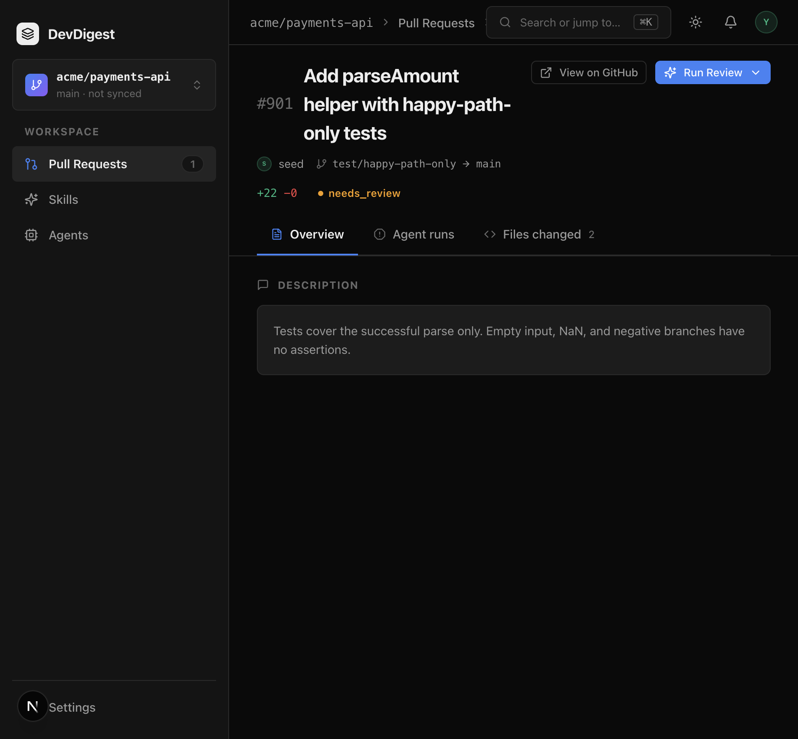

# Task 4.0 Proofs – Fixture PR control experiment

## Task Summary

PR **#901** on `acme/payments-api` is a happy-path-only test control. Hermetic tests prove Test Quality skill bodies appear in `assemblePrompt` when passed and are omitted when `skillsPromptArg([])` spreads nothing. Live LLM runs are a **manual demo**, not a CI gate.

## What This Task Proves

- The committed diff has a production helper with empty / NaN / negative branches and a test that only asserts `'42' → 42`.
- Seed looks up by repo + number; `pr_files.patch` is non-null so `diff-loader.ts` can reconstruct without a clone.
- `assembly.skills` contains the three seeded Test Quality bodies and the user message has `## Skills / rules`; empty `skillsPromptArg` → `assembly.skills === null`.
- No second assembler. No live LLM in CI.

## Evidence Summary

Hermetic vitest (173 tests) plus seed it-test for #901. Studio page shows the title/body. Trace screenshots need a provider key in Settings (none configured in this environment).

## Artifact: Hermetic prompt inclusion / exclusion

**What it proves:** Fixture diff + `TEST_QUALITY_SKILL_BODIES` (exported from `seed-skills.ts` so wording cannot drift) → `assembly.skills` contains each body and `## Skills / rules`. `skillsPromptArg([])` is `{}` and omitted skills stay `null`. No provider is called.
**Why it matters:** Dual-gate injection (spec 02) is the only assembler. CI must not depend on model wording.
**Command:** `cd server && pnpm exec vitest run test/prompt-structured.test.ts src/modules/reviews/helpers.test.ts`

```
 ✓ src/modules/reviews/helpers.test.ts (3 tests)
 ✓ test/prompt-structured.test.ts (8 tests)
```

**Command:** `cd server && pnpm exec vitest run --exclude '**/*.it.test.ts'`

```
 Test Files  24 passed (24)
      Tests  173 passed (173)
```

## Artifact: Seeded PR #901 with patch

**What it proves:** Second seed does not duplicate #901. `pr_files.patch` includes `parseAmount`.
**Command:** `cd server && pnpm db:seed` (twice is covered by `skills-seed.it.test.ts` `beforeAll`) and `pnpm exec vitest run test/skills-seed.it.test.ts`

```
 ✓ test/skills-seed.it.test.ts (4 tests)
   includes: seeds PR #901 with a non-null pr_files.patch
```

**Artifact path:** `docs/skill-fixtures/happy-path-only.diff`

## Artifact: Studio PR page

**What it proves:** Title/body state that tests cover the happy path only.
**URL:** `http://localhost:3000/repos/7a3b3ddc-f480-46d8-9882-52fc326b3a2b/pulls/901`
**Artifact path:** `docs/specs/03-spec-skills-import-and-test-quality/03-proofs/03-fixture-pr-901.png`



## Manual demo checklist (not CI)

Live traces were **not** captured here: Settings has no OpenRouter/OpenAI/Anthropic key (`OPENROUTER_API_KEY` empty; settings store has no provider key). Do **not** fail CI on model wording. Capture the two named screenshots when a key is present:

1. **Test Quality off on #901**
   - Agents → Test Quality → Skills: uncheck the four links (or disable the agent-skill toggles).
   - Open #901 → Run Review → Test Quality Reviewer only.
   - Trace → Prompt assembly: **no** `## Skills / rules` block. Findings should not be test-quality-specific (or the run may skip/approve). Screenshot optional companion to (2).

2. **Test Quality on on #901** — save as `03-proofs/03-fixture-trace-skills-on.png`
   - Re-enable the Test Quality skill links.
   - Run Review again.
   - Trace → Prompt assembly: skills block present, non-zero token count (spec 02 UI). Live findings **may** cite uncovered branch + missing corner; wording is not a CI gate.

3. **Security on this feature’s PR** — save as `03-proofs/03-security-self-review-skills.png`
   - Operator clicks Run Review on **Security** (no auto-run, no new agent, no `pr-self-review`).
   - Trace skills block includes `no-then-chains` (front-end) **and** `secret-leakage-gate` or `lethal-trifecta` (back-end).
   - Prefer this spec’s own GitHub/GitLab PR once opened; locally, Security’s seeded links already carry both skills on any run.

Placeholder paths (capture when a key exists):

- `docs/specs/03-spec-skills-import-and-test-quality/03-proofs/03-fixture-trace-skills-on.png`
- `docs/specs/03-spec-skills-import-and-test-quality/03-proofs/03-security-self-review-skills.png`

## Reviewer Conclusion

Hermetic control is green and #901 is seeded with a reconstructable patch. Live LLM screenshots remain operator-only, matching the spec’s “demo not CI” rule. Next: `/SDD-4-validate-spec-implementation`.
