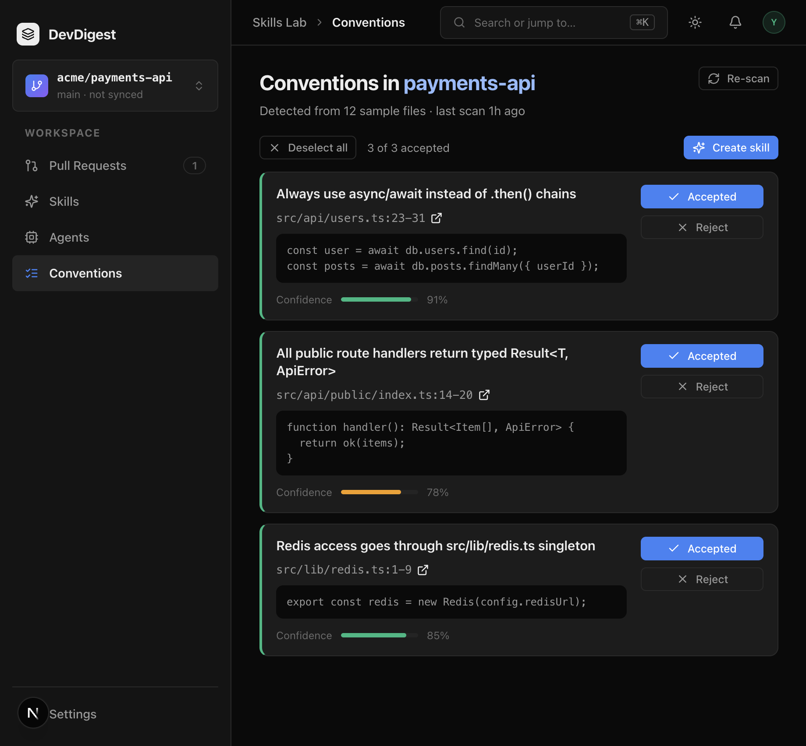

# Task 2 Proofs – Conventions page list, triage, evidence

## Task Summary
Skills Lab gains a Conventions page at `/repos/:repoId/conventions`. Authors see grounded candidates, accept/reject/edit them, open evidence on the code host, and select accepted cards for compose.

## What This Task Proves
- Sidebar Conventions is a Skills Lab item (`ListChecks`) and `activeKeyFor` already maps `/conventions`.
- Empty list shows Run extraction; a non-empty list shows Re-scan, cards, and Create skill.
- Accept/Reject/edit persist via PATCH; Deselect all does not PATCH; rejected cards stay visible and are not selectable.
- Evidence `href` is `repoBlobUrl` (GitHub `#L23-L31`, GitLab `#L23-31`).

## Evidence Summary
Client vitest (helpers + view) and the full client suite passed. Browser: breadcrumb Skills Lab → Conventions, title “Conventions in payments-api”, cards match the list mockup closely enough.

## Artifact: Colocated list tests

**What it proves:** Empty CTA; cards render rule / path:range / snippet / confidence; Accept/Reject/rule PATCH bodies; Create skill disabled after Deselect all; rejected card click does not enable Create skill.
**Why it matters:** Triage is the product; selection must not silently change `status`.
**Command:** `cd client && pnpm exec vitest run src/app/repos/[repoId]/conventions/_components/ConventionsView`
**Result summary:** 7 tests passed (3 view + 4 helpers, including GitHub/GitLab evidence hrefs).

```
 ✓ ConventionsView.test.tsx (3 tests)
 ✓ helpers.test.ts (4 tests)
 Test Files  2 passed (2)
      Tests  7 passed (7)
```

## Artifact: Client quality gates

**What it proves:** Typecheck, lint, and the existing client suite stay green.
**Why it matters:** NAV exception and new route must not regress Skills Lab.
**Command:** `cd client && pnpm typecheck && pnpm lint && pnpm test`
**Result summary:** typecheck 0; eslint 0 errors; 27 files / 107 tests passed.

## Artifact: Browser list

**What it proves:** Sidebar Conventions is active; breadcrumb Skills Lab → Conventions; title, subtitle, cards, Accept/Reject, Create skill.
**Why it matters:** Matches [04-mockup-conventions-list.png](../04-mockup-conventions-list.png).
**URL:** `http://localhost:3000/repos/7a3b3ddc-f480-46d8-9882-52fc326b3a2b/conventions`
**Artifact path:** `docs/specs/04-spec-conventions-extractor/04-proofs/04-conventions-list.png`



**Result summary:** Live extract on the seed repo sampled 0 files (no clone). Rows for the screenshot were inserted to match the mockup so the UI proof is reviewable; wording is not a CI gate.

## Reviewer Conclusion
Task 2.0 is done. Compose-to-skill (modal + `POST .../skills`) is parent 3.0.
