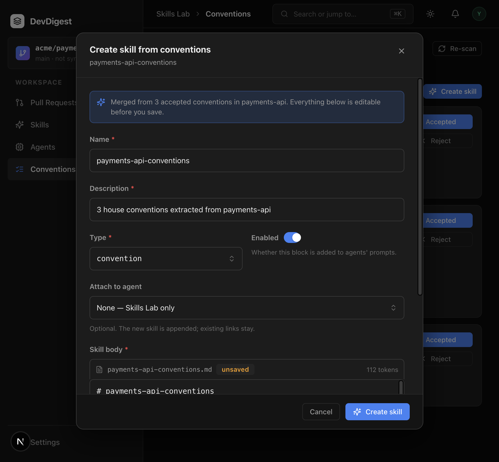

# Task 3 Proofs – Create skill from accepted conventions

## Task Summary
Selected accepted candidates compose into one markdown skill (`source: extracted`) via `POST /repos/:id/conventions/skills`. Optional `agent_id` appends the skill with `AgentsService.linkSkill`. Cancel is a no-op.

## What This Task Proves
- Body assembler keeps accepted rows only; a rejected row in the input is omitted.
- Compose refuses non-accepted / missing / other-repo ids with 400 even if the client body includes those rules.
- `SkillsService.create` still defaults `source: 'manual'`; compose is the only writer of `extracted`.
- Optional agent link is additive (previous `skill_id`s remain).
- Modal banner shows N; Create stays disabled while name/description/body are empty; Cancel does not POST; token label is present; agent picker can stay empty.

## Evidence Summary
Server helpers, conventions/skills integration tests, client colocated tests, typecheck, and lint passed. Browser: Create skill opens the compose modal matching the mockup fields.

## Artifact: Body assembler (hermetic)

**What it proves:** Two accepted rows in, rejected dropped; slug is heading-safe.
**Why it matters:** Rejected / pending / deselected rules must never become reviewer instructions by accident of the assembler.
**Command:** `cd server && pnpm exec vitest run src/modules/conventions/helpers.test.ts`
**Result summary:** 10 tests passed.

```
 ✓ src/modules/conventions/helpers.test.ts (10 tests)
```

## Artifact: Compose integration

**What it proves:** Two accepted ids → one skill `extracted` / `convention`, body contains both rules not the rejected one; `GET /skills` includes it; a no-compose snapshot is unchanged; non-accepted id → 400; `agent_id` appends without replacing existing links.
**Why it matters:** Server must not trust the edited markdown to skip the accepted-id gate.
**Command:** `cd server && pnpm exec vitest run test/conventions.it.test.ts test/skills.it.test.ts`
**Result summary:** conventions 5 passed; skills 9 passed (`POST /skills` still `source: 'manual'`).

```
 ✓ test/conventions.it.test.ts (5 tests)
 ✓ test/skills.it.test.ts (9 tests)
```

## Artifact: Compose modal (client)

**What it proves:** Banner N; Create disabled when name is emptied; Cancel does not POST; token label present; no split-toggle; empty agent picker omits `agent_id`; choosing an agent includes `agent_id`.
**Why it matters:** One modal = one skill; attach-to-agent is optional and additive.
**Command:** `cd client && pnpm exec vitest run src/app/repos/[repoId]/conventions`
**Result summary:** 14 tests passed (view + helpers + modal). `pnpm typecheck` and `pnpm lint` clean.

## Artifact: Browser modal

**What it proves:** Fields match [04-mockup-create-skill.png](../04-mockup-create-skill.png): name, description, type, enabled, body, token label. Agent picker sits below Enabled (Q5; not on the mockup).
**Why it matters:** Demoable unit 3 is visible without a live model.
**URL:** `http://localhost:3000/repos/7a3b3ddc-f480-46d8-9882-52fc326b3a2b/conventions` → Create skill
**Artifact path:** `docs/specs/04-spec-conventions-extractor/04-proofs/04-create-skill-modal.png`



## Reviewer Conclusion
Task 3.0 is done. Spec 04 implementation is complete. Next: `/SDD-4-validate-spec-implementation`. Spec 05 (API Contract Reviewer) is out of scope.
