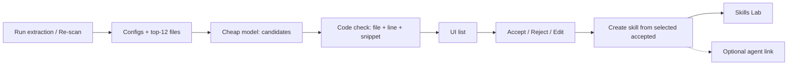

# 04-spec-conventions-extractor.md

Answers: [04-questions-1-conventions-extractor.md](./04-questions-1-conventions-extractor.md). Follow-on: **05 API Contract Reviewer** (out of this spec). Depends on [01 skills library](../01-spec-skills/01-spec-skills.md) and [02 agent binding](../02-spec-skills-agent-binding/02-spec-skills-agent-binding.md).

## Introduction/Overview

A cloned repository already has house-rules in configs and real code, but they never become reusable reviewer instructions. This spec adds a Conventions page: the studio samples the clone without a model, a cheap model proposes grounded candidates, the user accepts or rejects each one, then turns the selected accepted rows into a skill (and, optionally, attaches that skill to an existing agent). Most proposals will be weak; the product value is the triage plus evidence links, not a perfect extractor.

## Goals

- A user can run extraction on the active repo and see every surviving candidate (rule, evidence path + line range, snippet, confidence).
- A user can accept, reject, or edit a candidate; rejected and unselected rows never enter a skill.
- A user can open **Create skill from conventions**, edit name / description / type / enabled / body, save one skill (`source = extracted`), or cancel with no skill row.
- Repeating Create skill with a different accepted subset produces additional skills (one or several, without a split-toggle).
- Evidence path is a code-host link (GitHub or GitLab) to the file and line range.

## User Stories

- **As a reviewer author**, I want to scan the repo for house-rules so I do not invent conventions from memory.
- **As a reviewer author**, I want to reject bad guesses and edit decent ones so only rules I trust become instructions.
- **As a reviewer author**, I want to merge the accepted rules I selected into one markdown skill, preview the body, and save or walk away.
- **As a reviewer author**, I want an optional attach-to-agent step so the new skill can ride the next review without a second invent-the-wiring task.
- **As someone checking a guess**, I want to open the cited file at the cited lines on the code host so I can see whether the rule is real.

## Demoable Units of Work

### Unit 1: Extract, ground, persist, re-scan

**Purpose:** Turn a clone into a list of candidates that actually exist in files. Serve authors who click Run extraction / Re-scan.

**Functional Requirements:**
- The system shall add a conventions module (`routes.ts` → `service.ts` → `repository.ts`) registered in `server/src/modules/index.ts`, workspace-scoped like repos/skills.
- `POST /repos/:id/conventions/extract` shall:
  1. Collect samples **in code, with no model call**: style configs found in the clone (`eslint`, `tsconfig`, `prettier` and common filename variants) **plus** `repoIntel.getConventionSamples(repoId, 12)`. Configs are added even though rank sampling treats them as junk — that exclusion stays; configs are a separate list.
  2. Read file text through the existing git/clone adapter (`GitClient.readFile` / clone path). Do not execute repo code.
  3. Call the workspace **conventions** feature model (`resolveFeatureModel(..., 'conventions')`) via `completeStructured`. The model returns a list of `{ category, rule, evidence_path, evidence_start_line, evidence_end_line, evidence_snippet, confidence }`. Do **not** use a model step to pick files (ignore the mock `ConventionFileSelection` dialogue).
  4. Drop any candidate whose file is missing, whose line range is out of bounds, or whose snippet does not occur in that range (trim-tolerant, case-sensitive). Path must stay inside the clone (reject `..` and absolute paths).
  5. Persist survivors. Re-scan **deletes and replaces only `pending`** rows for that repo. `accepted` and `rejected` stay. A new pending row that matches an existing row’s `rule` + `evidence_path` (same repo) is not inserted.
- `GET /repos/:id/conventions` shall return the repo’s candidates plus enough metadata for the subtitle: last extract time and how many files were sampled (survive a reload).
- Schema (new migration only; do not edit applied files): add `status` `pending | accepted | rejected` (default `pending`); keep `accepted` boolean **in sync** (`true` iff `status = accepted`) so older contracts do not lie; add `category` (text, nullable), `evidence_start_line` / `evidence_end_line` (integers, nullable until grounded); add `created_at`. Extend `ConventionCandidate` in `server/src/vendor/shared` (mirror to client). Index `repo_id` if missing (list path).
- Missing clone, unknown repo, or other workspace → 404/400 as other repo routes do. Empty sample set → extract still runs; may return zero candidates (not a 500).
- Live model output is not a CI gate. Hermetic tests use `MockLLMProvider` + fixture files.

**Proof Artifacts:**
- Hermetic: grounding helper — existing file+range+snippet keeps the candidate; missing file / bad line / snippet not in range / `../etc/passwd` drops it; no `child_process` use.
- Hermetic: re-scan fixture — pending replaced; accepted/rejected kept; duplicate rule+path not inserted.
- Integration (`*.it.test.ts`): `POST extract` with mock structured output persists grounded rows; `GET` lists them with `status=pending`; second extract does not duplicate accepted.
- CLI: `cd server && pnpm db:generate` appends a **new** migration; `pnpm typecheck` passes.

---

### Unit 2: Conventions page — list, accept / reject / edit, evidence

**Purpose:** Let the author triage guesses the way the mockup shows, on the active repo.

**Functional Requirements:**
- The user shall open `/repos/:repoId/conventions` (thin `page.tsx` + colocated `_components/`). Breadcrumb: Skills Lab → Conventions. Title: “Conventions in {repo name}”. Subtitle: sampled-file count and last scan (mockup: “Detected from N sample files · last scan …”). Empty state uses existing i18n (`conventions.page.empty`) with **Run extraction**. After a first run, primary refresh is **Re-scan**.
- Add a **Conventions** item under Skills Lab in `client/src/vendor/ui/nav.ts` (same NAV exception as Skills in spec 01). `activeKeyFor` already maps `/conventions`.
- Each card shows: editable rule title, `path:start-end`, snippet, confidence bar + percent, **Accepted** and **Reject**. Accepted cards use the mockup’s filled Accepted control and leading accent. Rejected cards stay on the list (audit) but cannot be selected for compose. Pending has neither control in the selected state.
- Clicking the path (external-link control) opens `repoBlobUrl` for the repo’s `provider`, `full_name`, a ref the studio already has (`default_branch` is acceptable when head SHA is not on the repo summary), file, start line, end line. New tab.
- The user shall edit a candidate’s `rule` (inline on the title or a small edit control — the mockup shows the resting state). Persist via `PATCH /repos/:id/conventions/:cid` (`rule` and/or `status`). Category may be edited if exposed; it is not a badge on the mockup list.
- Selection (mockup **Deselect all** / “N of M accepted”): only **accepted** cards can be selected. Selection is UI state for the next compose; it does not change `status`. Deselect all clears selection only. **Create skill** is disabled when zero accepted cards are selected.
- Data via `client/src/lib/hooks/` (new `conventions.ts` or equivalent). i18n stays under `client/messages/<locale>/conventions.json` — extend, don’t invent a second namespace. Colocated `styles.ts` / `helpers.ts` / `constants.ts`; tests beside the view.

**Proof Artifacts:**
- Component tests (mocked GET): empty CTA; cards render rule, path:range, snippet, confidence; Accept calls PATCH `{ status: 'accepted' }`; Reject calls `{ status: 'rejected' }`; Create skill disabled at 0 selected; Deselect all does not PATCH status.
- Component test: evidence control `href` uses `repoBlobUrl` (GitHub and GitLab cases, reuse `repo-urls.test.ts` patterns).
- Browser: `http://localhost:3000/repos/<id>/conventions` — sidebar Conventions active; after extract, cards match the list mockup closely enough (title, evidence, confidence, Accept/Reject, Create skill).
- Screenshot: `docs/specs/04-spec-conventions-extractor/04-proofs/04-conventions-list.png`.

---

### Unit 3: Create skill from selected accepted conventions

**Purpose:** Turn the author’s chosen accepted rows into one skill they can still edit, save, or abandon.

**Functional Requirements:**
- **Create skill** opens the mockup modal **Create skill from conventions**. Banner: merged from **N** accepted conventions in **{repo}**; everything below is editable. Defaults: name `{repo-slug}-conventions`, description stating house conventions from that repo, type `convention`, enabled on, body assembled only from **selected accepted** rows (rejected, pending, and deselected accepted are omitted).
- Assembled body shape (mockup): heading = skill name; one short instruction to flag violations and cite `file:line`; then `## {category-or-slug}` + rule + `Detected in \`path:start-end\`` per selected row. User may rewrite any of it before save.
- Fields: Name (required), Description (required — existing `Skill` contract `min(1)`, even if the mockup omits the star), Type, Enabled (copy: whether this block is added to agents’ prompts), Skill body (required) with unsaved affordance. Token figure is display-only: reuse the client `approxTokens` heuristic (`ceil(chars/4)`), not a second formula.
- **Optional agent picker** (answered Q5; not drawn on the mockup): choose an existing workspace agent or none. None → skill lands in Skills Lab only. An agent → after create, **append** with existing `AgentsService.linkSkill` (do **not** call `setSkills` / replace the agent’s list).
- Confirm calls a conventions compose endpoint (or equivalent service method) that: verifies every id is `accepted` and belongs to this repo; `POST`-equivalent create through `SkillsService` with `source = 'extracted'` (enum value already exists; today’s create hard-codes `manual`); then optional `linkSkill`. Cancel / close persists no skill and does not change convention rows.
- One modal = one skill. Several skills = several trips with different selections. No “split into N skills” control.
- After save, the skill is in `GET /skills` and the Skills Lab list. Footer copy on the mockup (“Saved as v1 · added to Skills Lab”) is the success outcome, not a second write.

**Proof Artifacts:**
- Hermetic: body assembler includes only the given accepted rows; a rejected row passed in is ignored or the compose call 400s if the server receives a non-accepted id.
- Integration: compose of two accepted ids creates one skill `source=extracted`, `type=convention`, body contains both rules and neither rejected rule; Cancel path (no compose call) leaves `GET /skills` unchanged; optional `agent_id` appends a link (`GET /agents/:id/skills` includes the new id, previous links remain).
- Component tests: modal banner N; Create disabled while name/description/body empty; Cancel does not POST; token label present.
- Browser: save → skill appears in `/skills`; attach → agent Skills tab shows it. Screenshot: `docs/specs/04-spec-conventions-extractor/04-proofs/04-create-skill-modal.png`.

## Non-Goals (Out of Scope)

1. **API Contract Reviewer**, its 3–4 skills, import-for-demo, fixture breaking-change PR, and without/with-skills experiment — spec 05.
2. **Anthropic Citations API** (provider-specific). Grounding is our file+line+snippet check on the clone.
3. **Model-picked file lists** (`ConventionFileSelection`), sampling 84 files, or changing PageRank.
4. **Auto-creating a Conventions agent.** Attach is optional onto an agent that already exists.
5. **Quality levers beyond this spec’s sampling + gate** (confidence filter UI, category grouping, second model pass) — listed below, not built.
6. **Evals / Stats / Context / community catalog / URL import.**
7. **CI-gating on live LLM wording.** Demo video is a lab artefact, not a unit test.
8. **Executing anything from the clone** (eslint CLI, prettier, ts-morph full-project typecheck).

## Design Considerations

Layout follows the supplied mockups:

- List: [04-mockup-conventions-list.png](./04-mockup-conventions-list.png)
- Compose: [04-mockup-create-skill.png](./04-mockup-create-skill.png)

Do not add Eval Dashboard / Memory / Multi-Agent chrome even though the mockup sidebar shows those Global items. Skills Lab items in scope: Pull Requests (existing), Skills, Agents, **Conventions**. Reuse `@devdigest/ui` Modal, Button, FormField, TextInput, SelectInput, Textarea — same as Create Skill. Do not build a second markdown IDE; a monospace textarea plus the mockup’s filename/unsaved/token chrome is enough.

**Selection vs status:** Accepted is persistent. Checkbox-like selection on accepted cards is ephemeral and only feeds the next compose (Deselect all / N of M accepted).

**Edit:** Mockup shows resting cards. Spec 07 answer still requires editing the rule on the candidate before or after accept.

## Repository Standards

- New server slice: `server/src/modules/conventions/{routes,service,repository}.ts`. Routes: Zod at the boundary, one service call. Service does not import Fastify or Drizzle tables. Evidence check and body assembly are pure helpers (hermetic tests).
- Shared contracts: edit `server/src/vendor/shared/contracts/knowledge.ts`, mirror to `client/src/vendor/shared`. Schema name = type name. REST snake_case.
- Client: thin page; colocated `_components/<Name>/`; hooks in `src/lib/hooks/`; no ad-hoc `fetch`.
- Tests beside source; `*.it.test.ts` for Postgres. Do not hand-edit applied migrations or lockfiles.
- `SkillSource.extracted` is the value for compose; do not overload `manual` or `imported`.
- `linkSkill` already appends — reuse it. Dual-gate prompt injection stays spec 02; this spec does not touch `reviewer-core`.
- Commits: `feat:` / `fix:` prefixes.
- NAV edit in vendored `client/src/vendor/ui/nav.ts` is an explicit exception (same as spec 01).

## Technical Considerations

Latest standards used:

- **Agent Skills** ([agentskills.io best practices](https://agentskills.io/skill-creation/best-practices), 2026): one skill = one coherent unit. Merging selected house-rules into `{repo}-conventions` is one unit; splitting by repeating compose keeps units small when categories diverge. Progressive disclosure (references/, scripts/) is unused — this product still stores a single markdown body.
- **Grounding** (Anthropic Citations docs, 2026): a citation guarantees the passage **exists**, not that the interpretation is right. We implement existence ourselves (file + line + snippet) because the studio’s LLM port is OpenAI-compatible, not Anthropic Citations. Human accept/reject remains mandatory.

Implementation notes:

- Feature model default for `conventions` already lives in Settings; do not hard-code a model id in the module.
- `getConventionSamples` returning `[]` when repo-intel is off is existing degraded behaviour — configs-only extract is still valid.
- Blob links: `client/src/lib/repo-urls.ts` (`repoBlobUrl`). Prefer a known commit SHA if the client already has one; otherwise `default_branch` (line numbers may drift; acceptable for this spec).
- Compose must not trust the client-supplied body to skip the accepted-id check: even if the user edits the markdown, the server still refuses non-accepted ids.
- Onion: conventions service may call `SkillsService.create` and `AgentsService.linkSkill` as application-layer collaboration; it must not insert into `skills` from the conventions repository.

### Quality levers (design only — not in this spec’s code)

Most candidates will be wrong. Beyond configs + top-12 + the evidence gate, later work could: raise sample N for large monorepos; include `AGENTS.md` / `CONTRIBUTING.md` as first-class samples; drop model rows below a confidence floor in the UI; group cards by `category`; ask the model for a good/bad example pair (as API Contract skills will in spec 05); or re-rank by how often the snippet appears. None of these ship in 04. Record any live-run observation in the PR description, not as extra UI.

## Security Considerations

- Model output is untrusted. Never write, `exec`, or fetch a model-supplied path. Evidence reads are confined to the clone; `..` and absolute paths are dropped.
- Candidates and skill bodies are workspace-scoped (`getContext`). Cross-workspace repo id → 404.
- Skill body after save is **prompt instructions** (same trust warning spirit as spec 03 import). Enabled + attached means it will be injected (spec 02 dual gate). The Enabled caption on the mockup must stay honest.
- Do not commit API keys. Extraction uses existing SecretsProvider keys.
- Markdown preview, if any, uses the existing renderer only.

## Success Metrics

1. Run extraction on a cloned indexed repo → UI list of grounded candidates (zero is allowed if the gate drops everything; a mock-LLM integration still proves persist).
2. Accept two, reject one → Create skill body contains the two and not the rejected; `source=extracted`.
3. Evidence control opens the code host at the cited file and line range.
4. Optional agent attach: agent Skills tab lists the new skill; previous links unchanged.
5. Re-scan does not wipe accepted/rejected.
6. Cancel compose leaves `GET /skills` unchanged.

## Open Questions

1. Exact default wording of the assembled skill preamble is an implementation detail as long as it tells the reviewer to flag violations and cite `file:line`.
2. Whether `category` is a closed enum or free text — default **free text** from the model, slugified for `##` headings; no extra spec if the slug is ugly.
3. Head SHA vs `default_branch` for blob links — default **default_branch** unless a SHA is already on the repo DTO.
4. Spec 05 will own API Contract Reviewer; this spec’s demo need not wait on 05.
