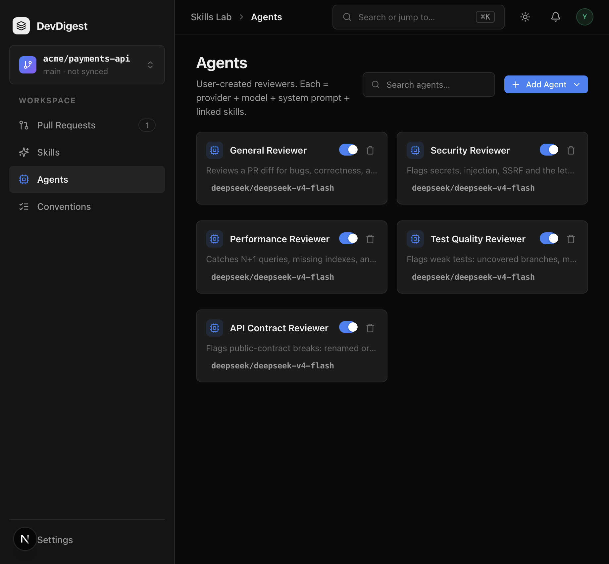

# Task 1.0 Proofs – Seed API Contract Reviewer and three skills

## Task Summary

Fresh workspaces now get an **API Contract Reviewer** plus three enabled `custom` skills (`breaking-change`, `response-schema`, `semver-discipline`). `deprecation-policy` is still absent so Unit 2 can import it. No new routes or migrations.

## What This Task Proves
- Seed is idempotent: one agent, three unique skill names, no `deprecation-policy`.
- Links attach only to this agent, in order, all enabled; other agents’ matrices stay as spec 03.
- Each skill body has a good/bad pair; the system prompt follows severity/verdict conventions without a JSON schema example.
- Studio `/agents` shows the new card (name + default model).

## Evidence Summary

Hermetic + Postgres it-tests are green. `pnpm typecheck` and `pnpm lint` passed. Live `GET /agents/:id/skills` after `pnpm db:seed` returns the three enabled links. Screenshot of the agents list is below.

## Artifact: Hermetic skill bodies and prompt conventions

**What it proves:** Exported bodies contain `## Good` / `## Bad` and the flag instruction for each row. The prompt names `CRITICAL` / `WARNING` / `SUGGESTION`, `request_changes`, and no-findings, and does not contain `json_schema` or `{ verdict`.
**Why it matters:** Hermetic tests import the same constants seed writes, so wording cannot drift.
**Command:** `cd server && pnpm exec vitest run src/db/seed-skills.test.ts`

```
 ✓ src/db/seed-skills.test.ts (5 tests) 5ms
 Test Files  1 passed (1)
      Tests  5 passed (5)
```

## Artifact: Seed integration matrix

**What it proves:** After two `seed()` calls: one API Contract Reviewer with `ci_fail_on=critical` and the default provider/model; unique three skill names; `deprecation-policy` absent; links `['breaking-change','response-schema','semver-discipline']` all enabled `custom`; spec 03 matrices for General / Security / Performance / Test Quality unchanged.
**Why it matters:** Wipe + reseed is the demo stand. Import Unit 2 needs `deprecation-policy` missing.
**Command:** `cd server && pnpm exec vitest run test/skills-seed.it.test.ts`

```
 ✓ test/skills-seed.it.test.ts (4 tests) 5753ms
 Test Files  1 passed (1)
      Tests  4 passed (4)
```

## Artifact: Quality gates

**What it proves:** Hermetic server suite still passes with the new file; typecheck and ESLint clean; no new migration SQL.
**Why it matters:** No schema or engine change — seed-only.
**Command:** `cd server && pnpm exec vitest run --exclude '**/*.it.test.ts' && pnpm typecheck && pnpm lint`

```
 Test Files  26 passed (26)
      Tests  192 passed (192)
$ tsc --noEmit -p tsconfig.json
$ eslint .
```

`ls server/src/db/migrations/*.sql` still 17 files (unchanged).

## Artifact: Studio agents list

**What it proves:** After `pnpm db:seed` against the local stack, `/agents` renders **API Contract Reviewer** with the default model chip (`deepseek/deepseek-v4-flash`). Live `GET /agents/:id/skills` is the three enabled custom links (skill-count badge on the list card is optional; `AgentCard` only shows it when `skillCount` is passed).
**Why it matters:** Authors see the new reviewer without Create Agent.
**URL:** `http://localhost:3000/agents`
**Artifact path:** `docs/specs/05-spec-api-contract-reviewer/05-proofs/05-agent-card.png`



Live API after seed: `API Contract Reviewer` links `[('breaking-change', True, 'custom'), ('response-schema', True, 'custom'), ('semver-discipline', True, 'custom')]`.

## Reviewer Conclusion

Parent 1.0 is done: seed delivers the specialised agent and three skills, leaves `deprecation-policy` for import, and does not disturb existing reviewers. Ready for parent 2.0.
