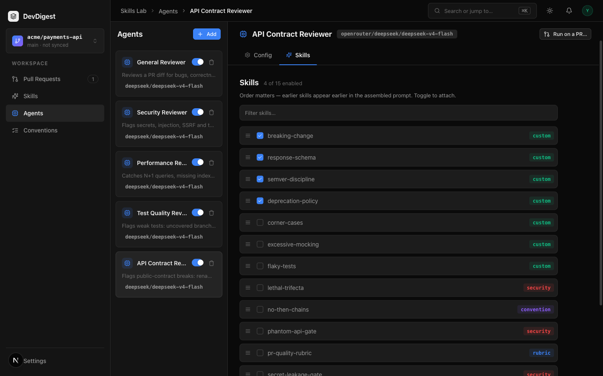

# Task 2.0 Proofs – Import `deprecation-policy` and attach on the Skills tab

## Task Summary

`deprecation-policy` is an import-only skill (not seeded). Authors preview `docs/skill-fixtures/deprecation-policy/SKILL.md`, confirm, enable it, then attach it to **API Contract Reviewer** as the fourth ordered link. No new import parser or Create Agent path.

## What This Task Proves
- Preview of the fixture does not insert a catalog row.
- Confirm writes `enabled: false`, `source: imported`.
- Enable + `POST /agents/:id/skills` with the full ordered set keeps the three seeded `skill_id`s and appends the imported one.
- Studio Skills tab shows four checked rows ending with `deprecation-policy`.

## Evidence Summary

Postgres it-test covers preview length, confirm flags, and attach order. Live studio: Add Skill → Import from file of the fixture, then API Contract `?tab=skills` with four enabled links.

## Artifact: Import + attach it-test

**What it proves:** `POST /skills/import/preview` leaves `GET /skills` length unchanged. Confirm is 201 with `enabled: false` and `source: 'imported'`. After enable + full `skills` POST, `GET /agents/:id/skills` is `['breaking-change','response-schema','semver-discipline','deprecation-policy']` and the first three `skill_id`s match the pre-attach snapshot.
**Why it matters:** At least one API Contract skill arrives through the spec 03 import path, not SQL seed. Replace-only `{ skill_ids }` is not used.
**Command:** `cd server && pnpm exec vitest run test/skills-seed.it.test.ts`

```
 ✓ test/skills-seed.it.test.ts (5 tests) 8258ms
 Test Files  1 passed (1)
      Tests  5 passed (5)
```

Includes `import + enable + attach deprecation-policy yields four ordered API Contract links`.

## Artifact: Quality gates

**What it proves:** Hermetic suite, typecheck, and lint stay green with the new fixture + it-test.
**Command:** `cd server && pnpm exec vitest run --exclude '**/*.it.test.ts' && pnpm typecheck && pnpm lint`

```
 Test Files  26 passed (26)
      Tests  192 passed (192)
$ tsc --noEmit -p tsconfig.json
$ eslint .
```

## Artifact: Studio import + Skills tab

**What it proves:** `/skills` Import from file of `deprecation-policy/SKILL.md` created a disabled `source: imported` row. After enable + attach, API Contract Skills tab shows four checked custom skills, last row `deprecation-policy`. Create Agent was not used. No Evals/Stats/Context tabs added.
**URL:** `http://localhost:3000/skills` then `http://localhost:3000/agents/347ceae1-5dfc-4802-986a-4fa67ece126f?tab=skills`
**Artifact path:** `docs/specs/05-spec-api-contract-reviewer/05-proofs/05-skills-tab.png`



Live `GET /agents/:id/skills` after attach: `[('breaking-change', True), ('response-schema', True), ('semver-discipline', True), ('deprecation-policy', True)]`. Imported row: `source: imported`.

## Reviewer Conclusion

Parent 2.0 is done: `deprecation-policy` is imported, enabled, and appended as the fourth API Contract link without a second parser. Ready for parent 3.0 (#902 control experiment).
