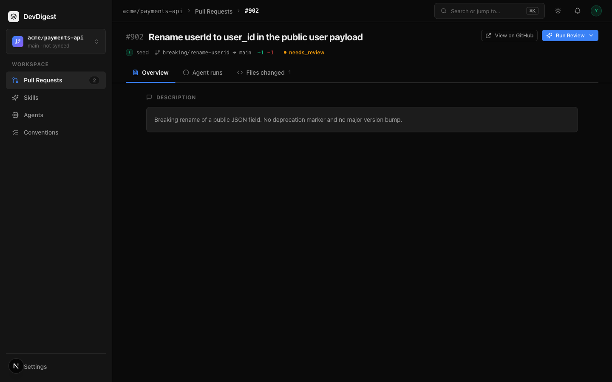
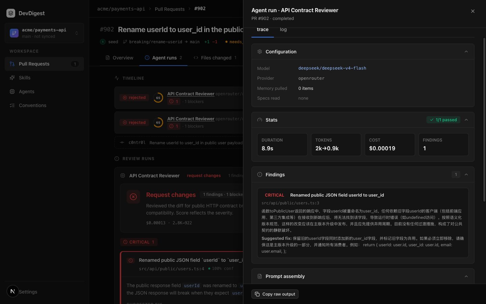
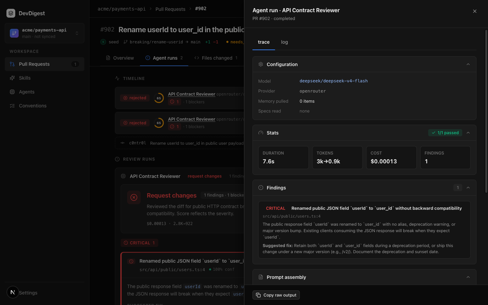

# Task 3.0 Proofs – Fixture PR #902 without / with skills

## Task Summary

PR **#902** on `acme/payments-api` is a silent public-field rename (`userId` → `user_id`, no alias, no `deprecated`, no `/v2/`). Hermetic `assemblePrompt` proves API-contract skill bodies appear under `## Skills / rules` when passed and are omitted when `skillsPromptArg([])` spreads nothing. Live API Contract runs on this PR are a **demo**, not a CI gate.

## What This Task Proves
- Seed looks up by repo + number; `pr_files.patch` is non-null so the PR page works without a clone.
- Exported `API_CONTRACT_SKILL_BODIES` land in `assembly.skills`; empty `skillsPromptArg` → `assembly.skills === null`.
- Studio shows the breaking title/body. Skills-off trace has no SKILLS block; skills-on has the block and a non-zero token count.
- No second assembler. No `reviewer-core` change. No live-LLM e2e job.

## Evidence Summary

Hermetic vitest (193 tests) plus seed it-test for #902. Live OpenRouter key was present in workspace secrets (`GET /settings/secrets-status` → `openrouter: true`) even though `server/.env` `OPENROUTER_API_KEY` is empty — so the two named traces were captured. Live wording cited the rename; that must not fail CI.

## Artifact: Hermetic prompt inclusion / exclusion

**What it proves:** Fixture diff + `API_CONTRACT_SKILL_BODIES` (exported from `seed-skills.ts`) → `assembly.skills` contains each body and `## Skills / rules`. `skillsPromptArg([])` is `{}` and omitted skills stay `null`. No provider is called.
**Why it matters:** Dual-gate injection (spec 02) is the only assembler. CI must not depend on model wording.
**Command:** `cd server && pnpm exec vitest run test/prompt-structured.test.ts`

```
 ✓ test/prompt-structured.test.ts (9 tests) 57ms
 Test Files  1 passed (1)
      Tests  9 passed (9)
```

**Command:** `cd server && pnpm exec vitest run --exclude '**/*.it.test.ts'`

```
 Test Files  26 passed (26)
      Tests  193 passed (193)
```

## Artifact: Seeded PR #902 with patch

**What it proves:** Second seed does not duplicate #902. `pr_files.patch` contains `userId` and `user_id` and does not contain `deprecated`. Title/body match `/rename|breaking/i`.
**Command:** `cd server && pnpm exec vitest run test/skills-seed.it.test.ts`

```
 ✓ test/skills-seed.it.test.ts (6 tests) 4718ms
 Test Files  1 passed (1)
      Tests  6 passed (6)
```

**Artifact path:** `docs/skill-fixtures/breaking-response-rename.diff`

## Artifact: Studio PR page

**What it proves:** Title and body state a breaking public JSON rename with no deprecation and no major bump. Files tab can reconstruct from the stored patch (`+1 / −1` on `src/api/public/users.ts`).
**URL:** `http://localhost:3000/repos/7a3b3ddc-f480-46d8-9882-52fc326b3a2b/pulls/902`
**Artifact path:** `docs/specs/05-spec-api-contract-reviewer/05-proofs/05-fixture-pr-902.png`



## Manual demo checklist (not CI)

Provider: workspace secrets had OpenRouter (`secrets-status.openrouter === true`). `.env` `OPENROUTER_API_KEY` length 0 — do not treat env emptiness as “no key”. Live findings **must not** fail CI.

1. **API Contract off on #902** — save as `05-proofs/05-trace-skills-off.png`
   - Skills tab: uncheck all four links (`breaking-change`, `response-schema`, `semver-discipline`, `deprecation-policy`).
   - Run Review → API Contract Reviewer only.
   - Trace → Prompt assembly: **no** SKILLS block. Tokens still non-zero (system + user). This demo’s off-run still flagged the rename; wording is not a gate.

2. **API Contract on on #902** — save as `05-proofs/05-trace-skills-on.png`
   - Re-enable the four links.
   - Run Review again.
   - Trace → Prompt assembly: SKILLS block present (here ~341 tokens; log `Injecting 4 skill(s)`). Stats tokens 3k→0.9k. Live finding cited `userId` → `user_id` without alias / deprecation / major; **not a CI gate**.

3. **e2e**
   - Do **not** add a live-LLM flow.
   - `e2e/specs/03-agents.flow.json` still waits for “Security Reviewer”.

**Artifact path:** `docs/specs/05-spec-api-contract-reviewer/05-proofs/05-trace-skills-off.png`



**Artifact path:** `docs/specs/05-spec-api-contract-reviewer/05-proofs/05-trace-skills-on.png`



## Reviewer Conclusion

Hermetic control is green and #902 is seeded with a reconstructable patch. Live traces prove skills-off omits the SKILLS block and skills-on injects it with a non-zero token count. Model wording on the rename is demo-only. Next: `/SDD-4-validate-spec-implementation`.
