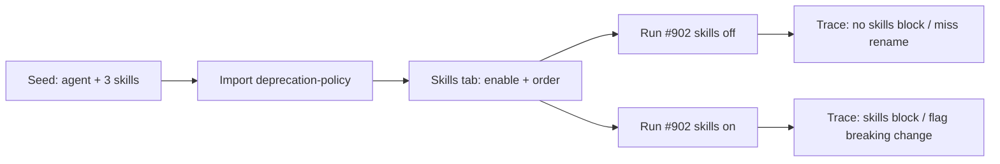

# 05-spec-api-contract-reviewer.md

Answers: [05-questions-1-api-contract-reviewer.md](./05-questions-1-api-contract-reviewer.md). Depends on [01 skills library](../01-spec-skills/01-spec-skills.md), [02 agent binding](../02-spec-skills-agent-binding/02-spec-skills-agent-binding.md), and [03 import + Test Quality](../03-spec-skills-import-and-test-quality/03-spec-skills-import-and-test-quality.md). Conventions extractor ([04](../04-spec-conventions-extractor/04-spec-conventions-extractor.md)) is **out of this spec**.

## Introduction/Overview

A general reviewer can mention a broken API in passing and still miss a silent field rename. This spec adds one specialised agent — **API Contract Reviewer** — whose job is public HTTP contracts: breaking changes, response shape, major-version discipline, and deprecation instead of quiet deletion. The studio already has Create Agent, skill import, the Skills tab, and dual-gate prompt injection. This spec fills the catalog the same way Test Quality did: seed the agent plus three skills, import the fourth, and prove the difference on a fixture PR that actually breaks a public payload.

## Goals

- After `pnpm db:seed`, the workspace has exactly one **API Contract Reviewer** with three attached, enabled skills: `breaking-change`, `response-schema`, `semver-discipline`.
- `deprecation-policy` is **absent** from seed; a user can import it from a committed fixture, enable it, and attach it on the agent’s Skills tab (four ordered links).
- Each of the four skill bodies is directive and includes one **good** and one **bad** example. The agent system prompt reviews API contracts, not general product bugs.
- PR **#902** on `acme/payments-api` is a silent public-field rename (or equivalent signature break) with no deprecation and no major bump.
- Hermetic tests prove skill bodies appear in `assemblePrompt` when passed and are omitted when not. A live run is a demo proof, not a CI gate.

## User Stories

- **As a reviewer author**, I want an agent that only hunts public-contract breakage so those comments are not buried in a general review.
- **As a reviewer author**, I want four small skills (breaking change, response shape, semver, deprecation) so I can turn one of them off without losing the others.
- **As a demo operator**, I want to import at least one of those skills through the existing Import path so the lab still exercises preview → confirm → enable → attach.
- **As a demo operator**, I want one fixture PR that is quiet without the skills and noisy with them, so the value is visible in one comparison.

## Demoable Units of Work

### Unit 1: Seed API Contract Reviewer and three skills

**Purpose:** Give every freshly seeded workspace a specialised API reviewer without inventing a new engine. Serve authors who open `/agents` after `pnpm db:seed`.

**Functional Requirements:**
- The system shall seed **API Contract Reviewer** idempotently (lookup by workspace + name), same `DEFAULT_PROVIDER` / `DEFAULT_MODEL` as the other built-ins. Leave `ci_fail_on` at the table default (`critical`). Do not add a scheduler; the user still clicks Run Review.
- The system prompt shall live in `server/src/db/seed-prompts.ts` and a matching `docs/agent-prompts/api-contract-reviewer.md` (linked from `docs/agent-prompts/README.md`). It must follow [agent-prompt conventions](../../agent-prompts/README.md): role + priority list, quality bar, `CRITICAL` / `WARNING` / `SUGGESTION` rubric with anti-inflation, verdict mapping including “no findings ⇒ approve”, findings discipline, **no JSON shape**. Scope: public HTTP contract in **this** diff — not test quality, not secrets, not N+1.
- Suggested severity (wording may vary; the mapping must stay honest):
  - **CRITICAL** — silent break of a public contract (removed/renamed field or route, newly required request field, narrowed type) with no deprecation window and no major version path.
  - **WARNING** — break is real but a deprecation marker or changelog exists and is incomplete, or a major bump is missing while a compatibility shim remains.
  - **SUGGESTION** — docs-only or additive optional field.
- The system shall seed three skills via existing `seed-skills.ts` upsert-by-(workspace, name). All `type = custom`, `enabled = true`, `source = manual`, descriptions required and directive (UI-only; injection uses `body`). **Do not** insert `deprecation-policy`.

  | Name | Body must instruct the model to flag | Good / bad pair (required in the markdown) |
  |---|---|---|
  | `breaking-change` | Change or deletion of a **public** contract: renamed/removed route, method, path param, or JSON field that existing clients send or read | **Bad:** rename `userId` → `user_id` (or delete the field) with no alias. **Good:** keep the old field, or ship `/v2/` (or a major bump) and leave `/v1/` until sunset. |
  | `response-schema` | Response **shape** drift: type change, newly required response field, optional → required, nullability, enum narrowing | **Bad:** `email: string` becomes `email: string \| null` (or the reverse: clients that sent `null` now 400). **Good:** add an **optional** field; do not remove or rename an existing one. |
  | `semver-discipline` | A breaking contract change with no major version bump (URL prefix, package version, or changelog “BREAKING”) | **Bad:** breaking rename on the same `/v1/` path, patch bump only. **Good:** breaking change only on `/v2/` (or documented major) while `/v1/` stays compatible. |

- After seed, `GET /agents/:id/skills` for this agent returns those three links, enabled, in that order. Do not attach these skills to General / Security / Performance / Test Quality. General stays catalog-empty.
- Second `pnpm db:seed` must not duplicate the agent or the three skill names.

**Proof Artifacts:**
- Integration (`skills-seed.it.test.ts` or a sibling): after two `seed()` calls, exactly one agent named `API Contract Reviewer`; `GET /skills` contains `breaking-change`, `response-schema`, `semver-discipline` once each and does **not** contain `deprecation-policy`; `GET /agents/:id/skills` is those three names, all enabled, descriptions non-empty.
- Hermetic: exported body constants from `seed-skills.ts` (same pattern as `TEST_QUALITY_SKILL_BODIES`) each contain a `## Good` and `## Bad` (or equivalent headings) and the flag instruction for that row.
- URL: `http://localhost:3000/agents` — card visible (existing `AgentCard`: name, model chip, skill count 3).
- Screenshot: `docs/specs/05-spec-api-contract-reviewer/05-proofs/05-agent-card.png`.

---

### Unit 2: Import `deprecation-policy` and attach on the Skills tab

**Purpose:** Walk the existing import + dual-gate path again. Serve the lab checklist “at least one skill via import”.

**Functional Requirements:**
- Commit `docs/skill-fixtures/deprecation-policy/SKILL.md` with YAML `name` / `description` and a body that instructs: do not silently delete a public field or route; mark it deprecated (comment, header, or OpenAPI `deprecated: true`), keep the old name working, name a sunset. Include a good/bad pair. **Bad:** delete `userId` in the same PR. **Good:** keep `userId`, add `user_id`, document deprecation. Type on confirm: `custom`.
- The user shall import that file (or an optional zip with dummy `scripts/` that is ignored) through **Add Skill → Import**. Preview, trust warning, confirm → `enabled = false`, `source = imported`. Then enable in the library and attach on API Contract’s Skills tab **appending** to the three seeded links (existing `POST /agents/:id/skills` full ordered set; do not call a replace that drops the first three).
- After attach, `GET /agents/:id/skills` is four ordered names: `breaking-change`, `response-schema`, `semver-discipline`, `deprecation-policy`. Dual-gate still applies: library `enabled` and per-agent `enabled` must both be true to inject.
- Reuse spec 03 import routes and UI. Do **not** add a second parser, multipart, or URL fetch. Create Agent modal is **not** required for this unit (Q2).

**Proof Artifacts:**
- Integration: preview of the fixture does not insert a row; confirm + enable + attach → four ordered links including `deprecation-policy`; previous three `skill_id`s unchanged.
- Browser: `/skills` import of the fixture; `/agents/<id>?tab=skills` shows four rows, last one the imported skill. Screenshot: `docs/specs/05-spec-api-contract-reviewer/05-proofs/05-skills-tab.png`.

---

### Unit 3: Fixture PR #902 and without / with skills experiment

**Purpose:** Make the skills’ effect visible on one control diff. Serve demo operators and CI prompt tests.

**Functional Requirements:**
- Commit `docs/skill-fixtures/breaking-response-rename.diff`: a small public handler under `src/api/public/` (filename is an implementation detail) that **renames** a JSON response field clients already use (canonical example: `userId` → `user_id`) **without** keeping the old key, **without** `deprecated`, and **without** a `/v2/` (or other major) path. Title/body of the PR must say the payload field was renamed.
- `seed.ts` inserts PR **#902** on `acme/payments-api` (lookup by repo + number, same pattern as #901). Persist `pr_files.patch` from that diff so `diff-loader.ts` can reconstruct without a clone. Idempotent on second seed.
- **Hermetic (CI):** with the three seeded API-contract bodies passed into `assemblePrompt` (and optionally the imported fourth), `assembly.skills` contains those bodies and the user message contains `## Skills / rules`; with `skillsPromptArg([])`, `assembly.skills` is null. Use the committed #902 diff as `diff`. No live LLM. Reuse `server/src/platform/prompt.js` / `skillsPromptArg` — do **not** add a second assembler and do **not** change `reviewer-core` unless a bug is found.
- **Demo (not CI):** on #902, run **only** API Contract Reviewer with its skill links unchecked (expect no skills block in the trace; the agent is allowed to miss the rename). Re-enable the links, run again (expect a skills block + non-zero token count; live findings **may** cite the renamed field / missing major bump / missing deprecation — wording is not a CI gate).
- Do not add an e2e live-LLM job. Existing `e2e/specs/03-agents.flow.json` waits for “Security Reviewer” only — a fifth agent card must not break it; do not require a new flow unless that wait starts failing.

**Proof Artifacts:**
- Test: `cd server && pnpm exec vitest run test/prompt-structured.test.ts` — #902 diff + exported API-contract bodies → skills present; empty `skillsPromptArg` → `assembly.skills === null`.
- Test: seed it-test — #902 exists once after two seeds; `pr_files.patch` contains `user_id` (or the chosen old/new field pair) and not a deprecation marker.
- URL: after `./scripts/dev.sh`, `http://localhost:3000/repos/<id>/pulls/902`.
- Screenshots: `05-proofs/05-fixture-pr-902.png`; `05-proofs/05-trace-skills-off.png`; `05-proofs/05-trace-skills-on.png`. Checklist: `05-proofs/05-task-3-proofs.md`.

## Non-Goals (Out of Scope)

1. **Conventions extractor changes** — sampling N, `AGENTS.md` as a sample, confidence filter, category grouping, write-back to `CLAUDE.md` / `AGENTS.md` in the clone, Claude `/insights`-style extra CTAs. Design notes only (below).
2. **oasdiff / OpenAPI CI gate** or any deterministic spec-diff binary. The reviewer reads a **code** diff through LLM skills.
3. **New review engine, routes, or tables.** No new Fastify plugin. No migration unless a later audit finds a real schema gap (none expected).
4. **Create Agent modal as the only way to get this agent.** Seed is the stand. The modal already exists for other authors.
5. **Attaching API-contract skills to General / Security / Performance / Test Quality.**
6. **URL / community import, executing `scripts/`, eval dashboard, skill Stats.**
7. **CI-gating on live LLM wording.**
8. **A `pr-self-review` agent.**

## Design Considerations

No new mockups. Reuse Skills Lab, Import modal (spec 03), agent card, and the Skills tab (spec 02). API Contract Reviewer should look like Test Quality Reviewer: name, model chip, skill count. Do not add Evals / Stats / Context / CI tabs.

**Skills tab copy** already says order matters. Keep seeded order: breaking-change → response-schema → semver-discipline → (imported) deprecation-policy.

Skill descriptions are short “when to flag” sentences for the list UI. The good/bad examples live in the **body** (injected). Description is not injected (spec 01 / 02).

## Repository Standards

- Seed stays idempotent: agents by workspace + name; skills via `SkillsRepository.insert` (transactional row + `skill_versions` v1 — `server/INSIGHTS.md`).
- Prompt originals in `docs/agent-prompts/`; runtime copy in `seed-prompts.ts`. Keep them in sync. Editing seed only affects **new** workspaces.
- Fixture files are committed under `docs/skill-fixtures/`, not generated at runtime. Seed reads them with `new URL('../../../docs/skill-fixtures/...', import.meta.url)` from `server/src/db/` (three hops, not four — `server/INSIGHTS.md`).
- Hermetic prompt tests import **exported body constants** from `seed-skills.ts` so wording cannot drift (`03-audit` lesson).
- Tests beside source except `server/test/*.it.test.ts`. Do not hand-edit applied migrations or lockfiles.
- Dual-gate injection stays spec 02. Do not wrap skill bodies in `<untrusted>`.
- Commits: `feat:` / `fix:` prefixes.
- NAV / conventions module / `reviewer-core`: do not touch.

## Technical Considerations

Latest standards used:

- **Agent Skills** ([agentskills.io best practices](https://agentskills.io/skill-creation/best-practices), 2026): one skill = one coherent unit; put in the body what the model would get wrong without it; concise examples beat a HTTP textbook; description says *when* to apply. Progressive disclosure (`references/`, `scripts/`) is unused — this product still stores a single markdown body. Import still reads only `SKILL.md`.
- **API breaking changes** ([oasdiff breaking-change rules](https://www.oasdiff.com/docs/breaking-changes), 2026): a change is breaking if a consumer of the **old** contract can stop working (removed/renamed field or path, newly required request property, narrowed types). Deprecation needs a sunset, not a silent delete. We teach those classes in skill markdown; we do **not** run oasdiff.

Implementation notes:

- Reuse `filesFromUnifiedDiff` in `seed.ts` (already used for #901). Do not copy the helper into a second file unless a later task extracts it for tests.
- `skillsPromptArg` already turns an empty list into omitted `skills`. Extend `prompt-structured.test.ts`; do not fork assembly.
- Imported skills start disabled (spec 03). The Unit 2 path must enable before attach or the fourth body will not inject (dual gate).
- Feature models / Settings: this agent uses the same provider/model as other built-ins. Do not hard-code a second model id.

### Quality levers (design only — not in this spec’s code)

Most Conventions Extractor candidates will stay weak (spec 04). Later work, **not 05**, could: raise sample N; treat `AGENTS.md` / `CONTRIBUTING.md` as first-class samples; UI confidence floor; group by `category`; ask the extract model for a good/bad pair (this spec’s skills are the template); re-rank by snippet frequency.

A Claude Code `/insights` analog (after triage: “write these lines into `AGENTS.md` / `CLAUDE.md`”, “create a skill”, “new way to use the studio”) is a **different product**: write-back mutates the clone’s git and is a separate trust boundary from a workspace skill row. Do not spec or build it here.

## Security Considerations

- Imported `deprecation-policy` is untrusted text until confirm; after enable + attach it **is** prompt instructions (existing import warning). Do not execute fixture `scripts/`.
- Fixture diff is fake application code. Do not embed real secrets or live API keys. Reviews use existing SecretsProvider keys.
- Workspace scoping unchanged (`getContext`). Do not write skill bodies into the clone.
- Markdown preview: existing renderer only.

## Success Metrics

1. Two `pnpm db:seed` → one API Contract Reviewer; three named skills linked and enabled; `deprecation-policy` absent until import.
2. Import fixture → enable → attach → four ordered Skills-tab rows; trace of a run with all four enabled shows a skills block.
3. #902 lists in the studio; patch is a silent public-field rename.
4. Hermetic: skills on → bodies in `assembly.skills`; skills off → `null`.
5. Live demo: skills off misses or does not cite the rename as a contract break; skills on flags the rename (and ideally missing major / missing deprecation). Wording must not fail CI.

## Open Questions

1. Exact markdown wording of the four bodies and the agent prompt is an implementation detail as long as Unit 1’s instruction table and `docs/agent-prompts/README.md` conventions are honoured.
2. Exact old/new field names in #902 default to `userId` → `user_id`. Another public rename is allowed without a new spec if the PR title still says it is a breaking payload change.
3. Optional zip of `deprecation-policy` (dummy `scripts/`) is nice for parity with `flaky-tests.skill.zip` but **not** required if the markdown import path is proven.
4. A dedicated e2e flow that only waits for the new card text is optional; do not add it if `03-agents` still passes.
