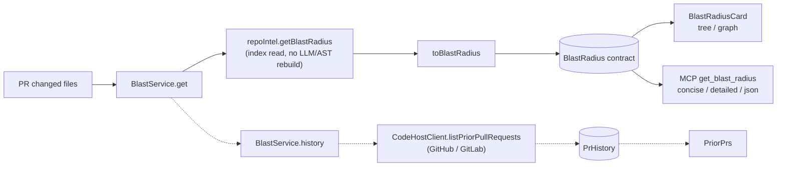

# Blast Radius — data flow

Companion to [06-spec-blast-radius.md](./06-spec-blast-radius.md) / [06-tasks-blast-radius.md](./06-tasks-blast-radius.md).
Explains how a PR's changed files become the impact map shown in the UI and
returned by MCP — not the requirements (see the spec) or the task checklist.

## Flow

`BlastRadius` is the single response both `GET /pulls/:id/blast` (UI) and the
`get_blast_radius` MCP tool read — same route, same shape, no divergent copy.
`GET /pulls/:id/history` (dashed branch above) is a separate, best-effort call
to the code host, cached per PR head sha; it never blocks or fails the main
blast read.

## Degraded handling

`repoIntel.getBlastRadius` sets `degraded: true` with a `reason` — `flag_off`,
`index_failed`, `index_partial`, `repo_too_large`, or `no_data` — instead of
throwing. `toBlastRadius` passes these through unchanged. Both consumers treat
"no callers" and "degraded" as distinct: an empty `downstream` next to
`degraded: true` means "we don't know," not "nothing depends on this" (UI
shows a badge + Resync button; the MCP tool prepends a warning line).

## Limits (source of truth: `repo-intel/constants.ts`)

- `MAX_CALLERS_PER_SYMBOL` (20) — caller fan-out cap per changed symbol
- `BFS_DEPTH` (2) — how far the caller graph is walked
- `INDEXER_VERSION` — bump forces a full reindex; a stale version shows as
  `index_partial`/`index_failed` degraded reasons, not a crash

Grouping, sort order, and the `summary` string are computed once in
`toBlastRadius` (`server/src/modules/blast/helpers.ts`) — neither the UI nor
the MCP tool re-applies these limits or re-sorts.
