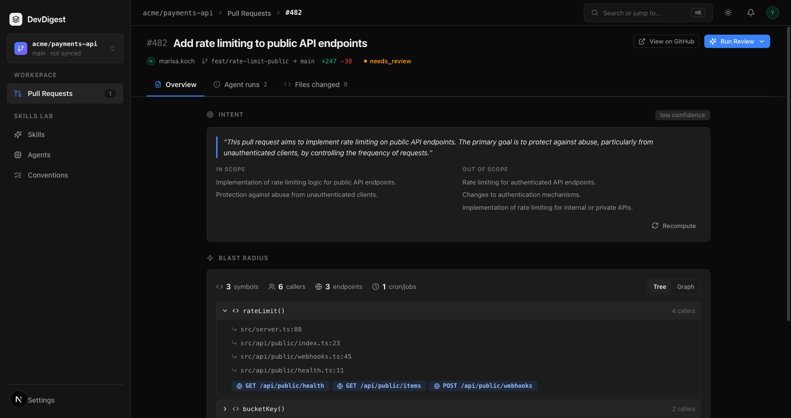
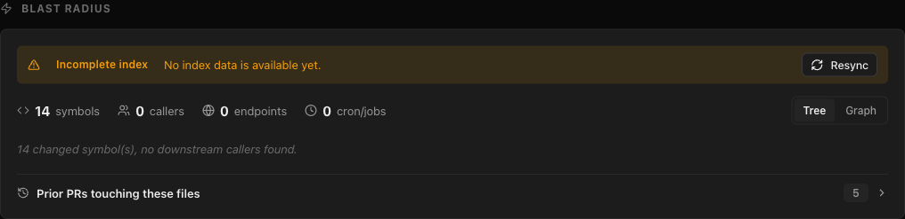
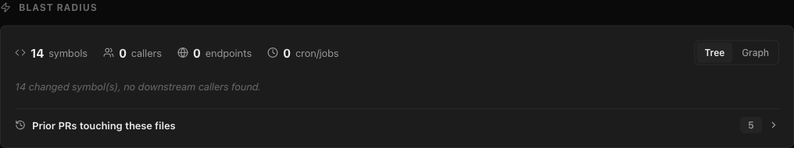

# Task 2 Proofs – Blast radius block (Tree view) on the PR Overview tab

## Task Summary
`BlastRadiusCard` sits on the Overview tab under the Intent card. It reads `GET /pulls/:id/blast` through `useBlastRadius`, shows a count summary, a collapsible tree (symbol → callers `file:line` → endpoint pills, cron pills styled separately), clear empty states, and a degraded badge with the reason plus a Resync button.

## What This Task Proves
- Summary shows symbols / callers / endpoints / crons.
- Each changed symbol lists its callers as `file:line` links to the exact line on the code host (GitHub and GitLab), pinned to the indexed commit.
- No callers → readable text; incomplete index → separate badge with reason + Resync (`POST /repos/:id/resync`), and the card refreshes once the index advances.
- All strings come from `client/messages/en/blast.json`.

## Evidence Summary
RTL tests cover every state; screenshots on the running stack show the seeded test PR (#482, 4+2 callers, 3 endpoints, 1 cron), a real GitLab PR (caller link to `gitlab.com/...#L36`), the degraded state, and the post-Resync no-callers state.

## Artifact: Client tests

**Command:** `cd client && pnpm test && pnpm typecheck && pnpm lint`
**Result summary:** 34 files / 168 tests pass; typecheck and lint clean. Covers counts, GitHub/GitLab URLs (`indexed_sha` preferred, `head_sha` fallback), cron vs endpoint pills, `noDownstream`, `empty.noSymbols`, zero-caller symbols collapsed into one `noCallersRest` line, degraded badge + reason, Resync click issues `POST http://localhost:3001/repos/repo-1/resync`, first symbol expanded / others collapsed, error state, and `OverviewTab` rendering both cards.

## Artifact: Tree view on the test PR

**Artifact path:** `06-proofs/tree.png`



## Artifact: Caller link opens the exact line

**What it proves:** the link targets the file and line on the code host, pinned to the indexed commit.
**Result summary:** from the page's accessibility snapshot:

```
link "src/server.ts:88"  → https://github.com/acme/payments-api/blob/a1b2c3d4e5f6/src/server.ts#L88
link "resources/js/app.ts:36" → https://gitlab.com/demch.co.tech/ednanniabase/-/blob/83688b4f0e975943e519aa302ce94b3b77577cc3/resources/js/app.ts#L36
```

(`acme/payments-api` is seed data, so that GitHub URL has no real repo behind it; the GitLab link is a real repo.)

## Artifact: Degraded state + Resync

**Artifact path:** `06-proofs/degraded.png`, then `06-proofs/no-callers.png`
**How it was produced:** `repo_index_state.status` of `demch.co.tech/ednanniabase` was set to `failed` in the local DB, so the facade returned `degraded: true, reason: no_data`. Clicking **Resync** reindexed (`lastIndexedSha` advanced, `updatedAt 16:04:54`), and the card refreshed by itself without the badge.





## Reviewer Conclusion
The block covers all P1 UI criteria (summary, callers `file:line` with working links, endpoints under each symbol, clear no-callers and degraded states) plus the P3 extras (collapsible tree, separate crons, rank order from the server, Resync button, i18n strings).
