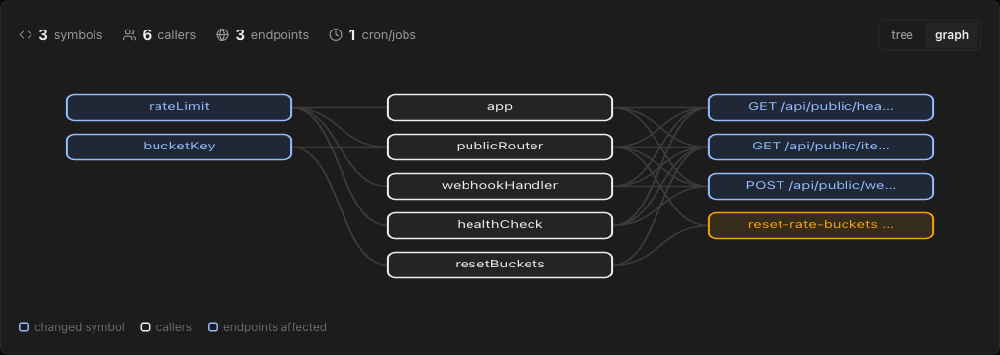

# Task 4 Proofs – Graph view with a Tree / Graph toggle

## Task Summary
`BlastGraph` renders the same `BlastRadius` response as an inline-SVG graph in three columns (changed symbols → callers → endpoints/crons). A segmented toggle (`view.tree` / `view.graph`, Tree by default) switches views. No new dependency.

## What This Task Proves
- `toGraph` builds nodes/edges deterministically from the response alone (no extra request).
- Toggle works and is accessible (`aria-pressed`); the graph has `role="img"` + `aria-label`; the empty graph shows `graph.empty`.

## Artifact: Tests

**Command:** `cd client && pnpm test`
**Result summary:** green (168 tests). `helpers.test.ts` covers 3 columns, caller nodes keyed by name+file, dedupe of shared nodes/edges, zero-caller groups produce no node, empty input. `BlastRadiusCard.test.tsx` covers Tree default, switching to Graph (`svg[aria-label="Blast radius graph"]`), empty graph text.

## Artifact: Graph on the test PR

**Artifact path:** `06-proofs/graph.png` (captured before the toggle labels were capitalized to "Tree"/"Graph")

**Known limitation:** the contract has no per-caller facts, so each caller is linked to every endpoint/cron of its symbol's group.

## Reviewer Conclusion
The second view of the map works from the same data as the tree, with no new dependency.
