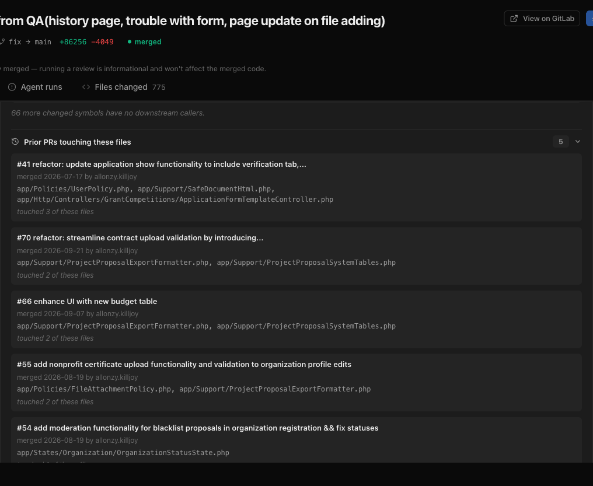

# Task 5 Proofs – Prior PRs touching these files (GitHub + GitLab)

## Task Summary
`GET /pulls/:id/history` returns the existing `PrHistory` contract. A new `CodeHostClient.listPriorPullRequests` port method is implemented for GitHub (commits by path → associated PRs) and GitLab (commits by path → merge requests of commit). The service asks for up to 25 candidates, sorts by file overlap then merge date, shows the top 5, fills `notes` deterministically, caches per PR head sha, and returns an empty history on code-host errors. The UI shows a collapsible "Prior PRs touching these files" row with a count.

## What This Task Proves
- Merged PRs/MRs that touched the same files are listed, excluding the current PR, for both providers.
- No LLM call; failures never break the Blast radius block.
- Repeated views don't re-hit the code host (cache).

## Artifact: Server tests

**Command:** `cd server && pnpm exec vitest run --exclude '**/*.it.test.ts'`
**Result summary:** 35 files / 368 tests pass. `test/github-adapter.test.ts` and `test/gitlab-adapter.test.ts` (mocked HTTP): merged-only, excludes current number, dedupe with overlap accumulation, first-10-files cap, limit. `blast/helpers.test.ts`: `toPriorHistory` sort/slice/notes, parses with `PrHistory`. `blast/service.test.ts`: `excludeNumber = pr.number`, unknown PR → `NotFoundError`, code-host error → `{ history: [] }` + warn, cache hit on the same head sha, cache miss on a new sha.

## Artifact: Client tests

**Command:** `cd client && pnpm test`
**Result summary:** `PriorPrs.test.tsx`: count chip, collapsed by default, expanded items (title, author, date, files, notes), GitHub `…/pull/12` and GitLab `…/-/merge_requests/12` links, empty and error states.

## Artifact: Live GitLab data

**Command:** `curl -s http://localhost:3001/pulls/<prId>/history` (real GitLab repo `demch.co.tech/ednanniabase`, MR !58)
**Result summary:** 5 merged MRs; top item `!41 … touched 3 of these files`, then `!70`, `!66`, `!55` (2 files each).

**Artifact path:** `06-proofs/prior-prs.png`

## Reviewer Conclusion
Prior PRs works for both providers with deterministic output, bounded requests, and graceful failure.
