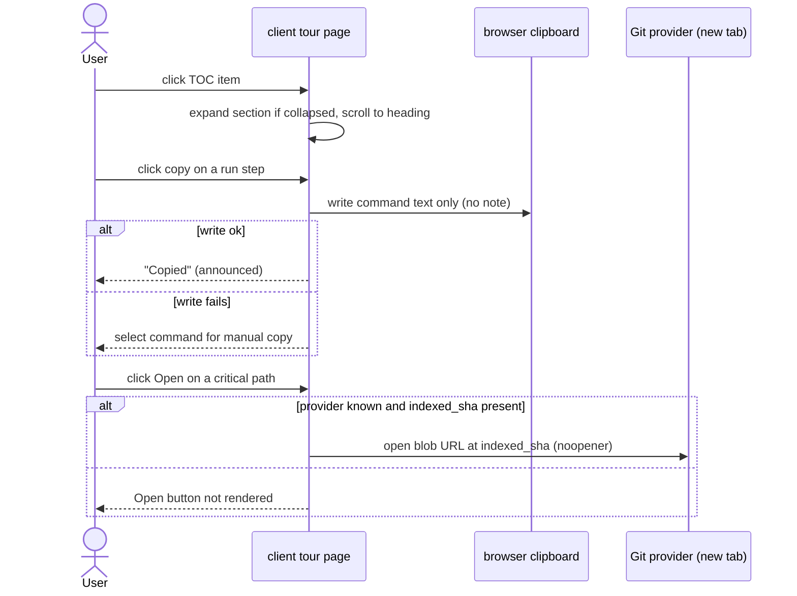

# 08 Design analysis – Onboarding Generator

Date: 2026-10-03 · Spec: [08-spec-onboarding-generator.md](./08-spec-onboarding-generator.md) · Questions: [round 2](./08-questions-2-onboarding-generator.md) · Status: round 2 answered by user 2026-10-03; spec updated to revision 2 (C3 kept as "Share link" copy-URL, C11 badge dropped, C15/C16 dropped, all other proposals adopted)

The spec header says "Design analysis: none". That was wrong. Three mockups arrived after the feature was specified and built (commits `53151a6`, `79e48f2`):

| File | What it shows |
|---|---|
| [08-mockup-onboarding-full.png](./08-mockup-onboarding-full.png) | **Authoritative overview.** The whole page at about 1920 CSS px (3840 px @2x), all five sections expanded |
| [08-mockup-onboarding-top.png](./08-mockup-onboarding-top.png) | The same layout, cropped to the header, architecture, critical paths and the start of run steps |
| [08-mockup-onboarding-run-reading.png](./08-mockup-onboarding-run-reading.png) | Close-up of "How to run locally" (4 steps with copy buttons) and "Guided reading path" (3 items) |

Sources compared: spec ACs/NFRs; `client/src/app/repos/[repoId]/onboarding/_components/OnboardingTourView/*`, `client/src/vendor/ui/nav.ts`, `client/messages/en/onboarding.json`, the `Onboarding` contract in `server/src/vendor/shared/contracts/knowledge.ts`, the skeleton builder and prompt (`server/src/modules/onboarding/helpers.ts`, `server/src/prompts/onboarding.system.md`), and the existing blob-URL helper (`evidenceHref`/`repoBlobUrl` used by Conventions and FindingCard). Mockup text such as "payments-api", the commands and the descriptions is sample data. It is not a requirement.

## 1. What the design shows

1. **Sidebar** (WORKSPACE group): Pull Requests (7) → **Onboarding Tour** (active, network/graph icon) → Project Context. Built order: Pull Requests → Project Context → Onboarding Tour, with a `Lightbulb` icon.
2. **Breadcrumb**: `acme/payments-api › Onboarding Tour`.
3. **Two-column content**: a left "ON THIS PAGE" table of contents (TOC) listing the 5 sections, with the active item highlighted by a left accent bar (scroll-spy), and the main column on the right.
4. **Header**: "Onboarding for **payments-api**" (short repo name in accent mono). Subtitle: "Generated from index of 12,450 files · last refreshed 2h ago". On the right: **Regenerate** (secondary) and **Share link** (secondary, link icon).
5. **Five cards**, each with a tinted square icon, a title and a collapse chevron (all expanded):
   - **Architecture overview**: a prose paragraph with inline mono path chips in accent colour, plus a flow diagram (client → server.ts → middleware → redis / api/public/* → postgres) whose nodes have coloured borders.
   - **Critical paths**: 4 rows. Each row has a file icon, a mono path, "— description" and an **Open** button. Rows are single files, not dependency chains.
   - **How to run locally**: 4 numbered rows with one shell command each, including inline `# comments`, and a **copy** icon per row.
   - **Guided reading path**: 3 numbered items, each a mono path with a one-line "why" below. No score is shown.
   - **First tasks**: 3 cards in a row. Each card has a title, a mono path (file or directory, e.g. `specs/`) and a **Low / Medium complexity** badge.
6. **Not drawn**: model/tokens/cost footer, Outdated badge, status/reason banners, coverage "showing X of Y" notes, ranking-basis note, partial note, and every non-happy state.

## 2. Conflicts: mockup vs spec vs implementation

Severity: **High** means it changes the contract, a security property or an existing AC. **Medium** means a visible behaviour or layout mismatch. **Low** means cosmetic. Every resolution below is *Proposed*. The user decides (see round-2 questions).

| # | Topic | Mockup | Spec | Built | Sev | Proposed resolution | Contract / server impact |
|---|---|---|---|---|---|---|---|
| C1 | Sidebar position | Between Pull Requests and Project Context | AC-1: entry exists, position not stated | After Project Context | Low | Code change: move the entry in the `@devdigest/ui` source of truth (`nav.ts` is vendored, so do not edit the copy). Spec: state the order in AC-1 | None |
| C2 | Sidebar icon | Network/graph glyph | — | `Lightbulb` | Low | Code change: use the closest icon from the existing icon set (no new dependency) | None |
| C3 | Share link button | Header, next to Regenerate | Not in spec | Absent | Medium | **Drop from design.** DevDigest is local-first with no sharing or auth model, so a link only works on the same machine. Fallback: "Copy link" copies the current URL | None if dropped |
| C4 | "ON THIS PAGE" TOC with scroll-spy | Left column | Not in spec | Absent | Medium | Spec + code change: add an AC for a TOC of the 5 section headings with anchor navigation, and hide it below a width breakpoint (see C17) | None (client only) |
| C5 | Collapsible section cards | Chevron per card, all expanded | NFR-6 requires headings in order | Plain `<section>` + `<h2>` | Medium | Spec + code change: expanded by default and not persisted. Collapse must keep the `h2` and expose `aria-expanded`. A TOC click on a collapsed section expands it | None |
| C6 | Section icons | Tinted icon per section | — | None | Low | Code change: map one fixed icon per `kind` | None |
| C7 | Section titles | "Architecture overview", "Critical paths", "How to run locally", "Guided reading path", "First tasks" | Contract keeps per-section `title` (LLM or skeleton) | Renders `sec.title`, which is LLM-written or skeleton text ("Architecture", "Run it locally", "Reading order"). The empty state's `sectionNames` differ again | Medium | Spec + code change: the UI renders **fixed i18n headings by `kind`** (mockup wording) in the cards, the TOC and the empty state. The LLM `title` is ignored. Result: stable TOC, translatable, no untrusted text in headings | `title` stays in the contract (no breaking change), unused by the UI. Optional: drop it from the prompt later |
| C8 | Critical paths = files + description + "Open" | 4 file rows | AC-12: ≤ 5 **dependency chains**. AC-36: text only | Markdown body (chains `a → b → c`) + plain `<code>` link chips | High | Spec + code change: render the section's `links[]` (already validated by AC-21, ≤ 4 per prompt) as rows `path — label`. The chains stay in the body/diagram. Skeleton links have `label = path`, so no description is shown | None for rows. "Open" target: see C9 |
| C9 | "Open" button target | "Open" per critical path | AC-36 / Input sources: paths as text; no file viewer exists | Not linked | Medium | Spec + code change: "Open" opens the provider blob URL at `indexed_sha` in a new tab (`noopener`), reusing the existing `repoBlobUrl` helper. Hidden when the repo has no remote provider or `indexed_sha` is null. Alternative: drop "Open" | None. `indexed_sha` already exists |
| C10 | Copy buttons on run steps | Numbered command rows, copy icon each | AC-36: commands shown as text only, never executed | Markdown bullets `name: command` | High | Copying is not running, so it does not break AC-36's "no execution". But copy-paste is how an injected command (from a README or LLM output) reaches a terminal. Proposed: structured run steps where **each copyable command must match a collected fact verbatim** (a script command, or `<pm> run <name>` for a collected script). Unmatched commands are dropped. A `# note` is shown as muted text and is **not copied**. Add an AC + an edge case (injected `curl … \| sh`) | **New contract field** (e.g. `run_steps[]: {command, note, source}`), new prompt output, server validation like AC-21. Package-manager detection needs lockfile presence (not in AC-8's list) or falls back to `npm` |
| C11 | First tasks as cards with path + complexity | 3 cards, `Low/Medium complexity` | AC-26 fixed template. Contract: Markdown body only, no complexity | Markdown numbered list | High | Spec + code change: **structured first tasks `{title, path}`**, with path validated like AC-21 and a directory allowed. **Drop the complexity badge**: it is an unverifiable LLM guess and the skeleton cannot fill it. Alternative: optional `complexity: low\|medium\|high` from the LLM only, hidden for `source: facts` | New contract field (e.g. `first_tasks[]: {title, path}`, optionally `complexity`). The skeleton maps its 3 template tasks into it. Prompt change |
| C12 | Header title | "Onboarding for payments-api" (short name, accent) | — | "Onboarding tour · acme/payments-api" | Low | Code change: match the mockup, using the existing `repoDisplayName` helper | None |
| C13 | Header subtitle "Generated from index of 12,450 files · last refreshed 2h ago" | — | — | Static "A guided tour of this repository…". `generated_at` appears only in the footer | Medium | Spec + code change: subtitle = `files_indexed` + relative `generated_at`. **12,450 is impossible**: the walker caps at 5,000 files, and a repo that big is `partial`, so AC-29/AC-30 banners must appear (the mockup shows none). Use `generated_at` ("generated 2h ago"), not index time, to avoid the "refreshed" ambiguity | None (`coverage.files_indexed`, `generated_at` exist) |
| C14 | Reading path: 3 items, no score | 3 items, path + why | AC-13: 12 items | Shows "score 0.0123 — why" | Low | Spec + code change: 3 items is sample data, keep the cap at 12. **Hide the numeric score** (meaningless to newcomers). The order is the deterministic signal. Skeleton items have no `why` and show the path only | None |
| C15 | Architecture diagram styling | Coloured node borders by tier | AC-31: render via existing mermaid component | Default mermaid theme | Low | **Drop from design.** Tier colours would need classifying LLM nodes, which is unspecified. Keep the default theme | None |
| C16 | Inline path chips in prose | Accent-coloured mono chips | AC-36 Markdown, no HTML | Markdown inline code | Low | Keep as styled inline code that is **not clickable**. Linking arbitrary LLM text to files would bypass AC-21 | None |
| C17 | Viewport / responsive | One desktop layout (~1920 px; the top crop is the same layout scaled). Content column ~1000+ px wide plus a ~250 px TOC | — | Single column, `maxWidth: 900`, centred | Medium | Spec + code change: TOC + content at ≥ 1280 px viewport; below that, hide the TOC and keep one column. First-task cards in 3 columns that wrap to 1 column below ~900 px of content width. No mobile design exists, so do not specify one (gap G9) | None |
| C18 | Breadcrumb | `repo › Onboarding Tour` | — | `crumb = [{label: "Onboarding tour"}]` (whether the shell adds the repo prefix is unverified) | Low | Code check: show the repo segment like the other repo pages. Unify capitalisation ("Onboarding Tour" in nav vs "Onboarding tour" title) | None |
| C19 | Regenerate always visible | Regenerate only (no Generate shown) | AC-3 Generate in empty state; AC-32 disabled while generating | Matches | — | No conflict. Note only: the mockup shows the stored-tour state | None |
| C20 | Footer (model/tokens/cost) | Not drawn | AC-37 required | Footer under the sections | Medium | Keep AC-37. Place it as a muted line under the last card in the content column. Do not drop it: cost visibility is a goal (cost story) | None |
| C21 | Outdated badge | Not drawn | AC-7: "next to Regenerate" | Badge left of Regenerate | Low | Keep as built. With C3 dropped, the badge sits left of Regenerate | None |
| C22 | Status / coverage / ranking notes | Not drawn | AC-14, AC-16, AC-29, AC-30 | Banners + notes stacked above all sections | Medium | Code change: page-level banners (status, regeneration failed, partial) go under the header. **Per-category notes move into their section**: "showing X of Y" for reading path / critical paths inside that card, and for routes/scripts/structure inside Architecture / Run. The ranking note goes inside Guided reading path | None |

## 3. Gaps: states and copy the design does not draw

| # | Gap | Covered by spec? | Proposed |
|---|---|---|---|
| G1 | Empty state (no stored tour) | AC-3 | Keep the built EmptyState in the content column. TOC hidden (no sections yet). List the fixed headings from C7 |
| G2 | Loading (GET in flight) | Not explicit | Add: 5 card skeletons matching the card layout. TOC hidden until loaded |
| G3 | Generating (up to 90 s) | AC-32 | Keep the status banner. Proposed: keep the stored tour visible while regenerating |
| G4 | Not cloned | AC-4 | As built: banner + disabled Generate |
| G5 | Skeleton tour (`status: skeleton`) | AC-26, AC-29 | Cards render. Run steps / first tasks come from facts (if C10/C11 are accepted). Collapse and TOC work the same |
| G6 | Partial, outdated, regeneration failed, load error | AC-7, AC-28, AC-30, AC-33 | Banner placement per C22 |
| G7 | Section "Unavailable — index <status>" | AC-26 | Show as muted text in the card. No rows, no copy/open controls |
| G8 | Copy feedback and failure | Not in spec | Add: "Copied" confirmation announced to screen readers. If the clipboard API fails, show the command selected for manual copy |
| G9 | Narrow viewport / mobile | None | Out of scope (state it as a non-goal). Only the breakpoint behaviour from C17 |
| G10 | Section with zero links / zero steps / zero tasks | Partly (AC-26) | Card shows the body only, no empty row container |
| G11 | Diagram render failure inside a card | AC-31 | As built; the card keeps the prose |
| G12 | Collapse state on Regenerate / reload | None | Not persisted; all sections expanded after load |

## 4. Uncovered edge cases introduced by the design

- **E22**: an LLM- or README-injected command in run steps (`curl … | sh`, `rm -rf`). The copy button would make it one paste away from running. See C10.
- **E23**: a first-task path is a directory (`specs/`) or a path not in the facts. Validate like AC-21, which already allows structure entries (directories).
- **E24**: a repo with no remote provider (local-only) or `indexed_sha` null. The "Open" button must hide (C9).
- **E25**: `files_indexed` = 0 (skeleton, `no_index`). The subtitle needs alternative copy, e.g. "Generated without an index · 2h ago" (C13).
- **E26**: long paths or descriptions in rows/cards. Truncate with ellipsis and show the full text in `title`. The Open/Copy buttons never wrap off-screen.
- **E27**: the stored tour is in the pre-change shape after the contract gains `run_steps`/`first_tasks`. Per AC-3/E21 it counts as "no tour", and the user must regenerate (one LLM call). Alternative: make the new fields optional and fall back to the Markdown body.

## 5. Module interaction (only the new client-side interactions; server flow unchanged unless C10/C11 are accepted)

If C10/C11 are accepted, the server flow in the spec gains one step: after the LLM output is valid, it validates `run_steps[].command` against facts and `first_tasks[].path` against fact paths, like AC-21, and drops non-matching items. The skeleton fills both from facts.

## 6. UX proposals (all *Proposed*, not in any AC)

- P1: Keep the previous tour visible (dimmed) during regeneration instead of only a banner (G3).
- P2: A small `facts` / `AI` marker per card from the existing `source` field, so users see which sections came from the LLM. Cheap, honest, supports G4.
- P3: "Copy all" on the run-steps card copies the validated commands joined by newlines.
- P4: Drop "Share link" (C3); if anything, a "Copy link" on the page URL.
- P5: Hide the reading-path score (C14). Show it in the item's tooltip instead if wanted.

## INSIGHTS read

`client/INSIGHTS.md` (grep for onboarding/nav/clipboard/TOC/responsive). Nothing onboarding-specific. The cost-UI entry confirms the existing `formatRunCost`/`formatTokens` reuse. No research was delegated: every question was answered by reading code.
