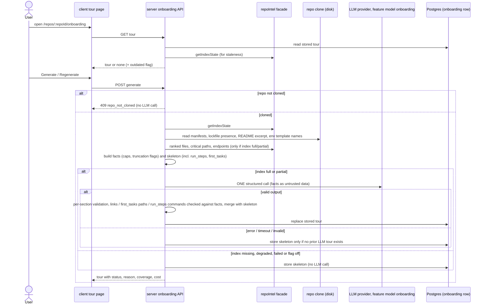
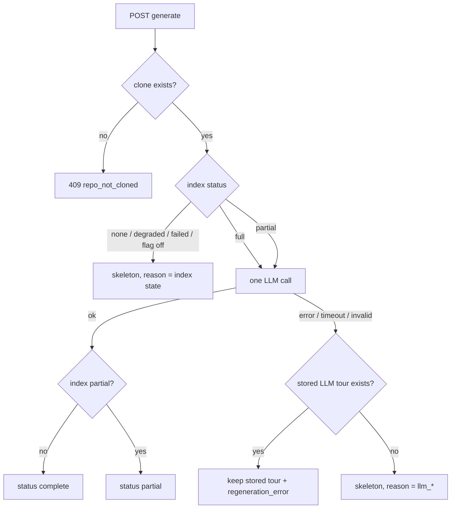
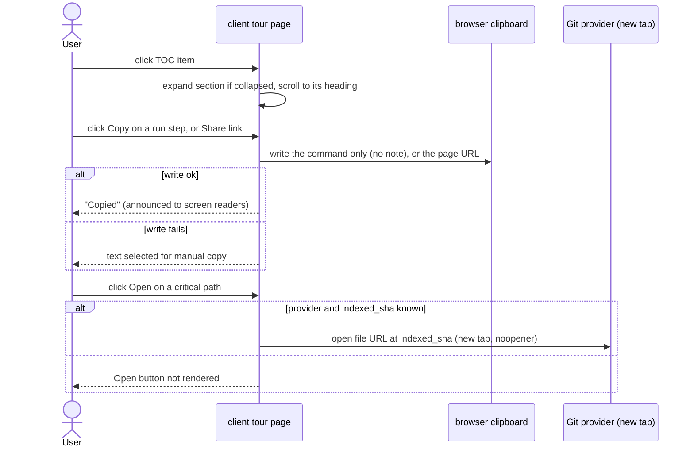

# 08-spec-onboarding-generator.md

Date: 2026-10-02 · Revised: 2026-10-03 (round 2, late mockups) · Status: draft, revision 2. Round 2 answered by the user; this is a delta over the committed implementation (`53151a6`, `79e48f2`) · Modules touched: `server` (`modules/repo-intel` facade reads, onboarding module, `vendor/shared` contract), `client` (repo-scoped tour page, sidebar entry in the `@devdigest/ui` nav) · Questions: [round 1](./08-questions-1-onboarding-generator.md), [round 2](./08-questions-2-onboarding-generator.md) · Design analysis: [08-design-analysis-onboarding-generator.md](./08-design-analysis-onboarding-generator.md) (mockups: [full](./08-mockup-onboarding-full.png), [top](./08-mockup-onboarding-top.png), [run + reading](./08-mockup-onboarding-run-reading.png))

> **Revision 2 markers.** ACs added or changed in revision 2 are tagged **[R2-new]** or **[R2-changed]**. Untagged ACs are unchanged from revision 1, which is already implemented.

## Problem and user

A developer who opens an unfamiliar repository in DevDigest has nothing that tells them how the code is shaped, which files matter, how to run it, or where to start. DevDigest already holds the facts (clone + repo-intel index: import graph, PageRank, endpoints), but they are only used inside review prompts. The newcomer spends hours reading files in the wrong order. The Onboarding Generator turns those facts into a five-section tour of one repository, with a deterministic reading path and an honest status whenever the data or the LLM falls short.

## Goals / Non-goals

**Goals**
- G1 — From a repo's page, the user gets a tour with exactly five sections — architecture overview, critical paths, local run, recommended reading order, first tasks — with one click.
- G2 — Tour facts (stack, structure, routes, scripts, critical paths, reading path) are collected deterministically from the clone and the repo-intel index; the reading path is computed from the import graph as `rank × (1 + hotness)`.
- G3 — Exactly one structured LLM call per generation, with bounded input and output size, also for very large repositories.
- G4 — When the index is not usable or the LLM call fails, the user sees a deterministic skeleton and an honest status/reason, never a blank page or invented content.
- G5 — The latest tour is stored per repo, re-viewable with zero LLM calls, and visibly marked when outdated.
- G6 — Repo text and LLM output are treated as untrusted; no secret values reach the prompt; nothing copyable comes from unverified text.
- G7 — The page follows the supplied mockups: section cards with a table of contents, actionable rows (copy a verified command, open a critical file at the indexed version), first-task cards, and a header that states what the tour is based on.

**Non-goals**
- The app's first-run "Add repository" flow at `/onboarding` (unchanged, apart from the nav highlight fix in AC-24).
- An MCP tool for the tour; writing the tour into the repo folder ("Sync generated docs" setting); tour history/versions.
- Deepening the shallow clone to compute git hotness; parsing non-JS/TS source or non-npm manifests beyond presence detection.
- Fetching issues ("good first issue") or any other data from GitHub/GitLab APIs.
- Automatic generation after clone/index; localization beyond English.
- Executing any script/command shown in the tour.
- From the mockups, explicitly dropped: the first-task **complexity badge** (Low/Medium), tier-coloured diagram nodes, clickable inline path chips in prose, and a mobile layout (only the ≥ 1280 px breakpoint behaviour is specified).
- Real link sharing (a sharing/auth model). "Share link" only copies the local page URL (AC-48).
- An in-app file viewer. "Open" goes to the Git provider (AC-45).

## User stories

- **As a newcomer to a repo**, I want one page that explains the architecture, the main dependency chains, how to run it locally, which files to read first and what to try first, so that my first day is productive.
- **As a newcomer**, I want the reading order to be the same every time for the same index, so that I can trust it is computed, not guessed.
- **As a newcomer**, I want to copy a run command with one click and trust that it really is one of the repo's scripts, so that I don't paste something a README or the model made up into my terminal.
- **As a user of a half-indexed or huge repo**, I want to see what the tour is based on and what is missing, so that I don't mistake a partial tour for a complete one.
- **As a workspace owner**, I want to see the model, tokens and cost of a tour, so that I know what a regeneration spends.

## Workflow / module interaction

Tour status is decided like this:

Client-only interactions added in revision 2 (no server calls):

**Contract (behavior depends on it).** The existing `Onboarding` contract in `server/src/vendor/shared` is extended additively:

| Field | Meaning |
|---|---|
| `sections[]` | exactly 5, ordered `architecture`, `critical_paths`, `local_run`, `reading_order`, `first_tasks`; each keeps `title`, `body` (Markdown), `diagram` (mermaid or null), `links[]` (`label`, `path`) and `source`: `llm` \| `facts`. `title` stays in the contract but the page does not display it (AC-39) |
| `reading_path[]` | deterministic list: `path`, `score`, optional `why` (one line, LLM-written) |
| `run_steps[]` **[R2, optional]** | ordered, ≤ 8 items: `command` (string, fact-verified per AC-41), `note` (string or null, ≤ 200 chars, plain text), `source`: `llm` \| `facts` |
| `first_tasks[]` **[R2, optional]** | ordered, ≤ 5 items: `title` (≤ 120 chars), `path` (fact-verified per AC-42; file or directory) |
| `status` | `complete` \| `partial` \| `skeleton` |
| `reason` | null, or one of `index_partial`, `no_index`, `index_degraded`, `index_failed`, `flag_off`, `llm_failed`, `llm_timeout`, `llm_invalid_output`, `llm_not_configured` |
| `regeneration_error` | null, or an `llm_*` reason of the last failed regeneration that left the stored tour unchanged |
| `ranking_basis` | `pagerank` (hotness unavailable) \| `pagerank_hotness` |
| `coverage` | index status, files indexed, files skipped, and per-category `{ shown, total, truncated }` for routes, scripts, structure, reading path, critical paths |
| `indexed_sha`, `generated_at`, `outdated` | snapshot SHA, timestamp, and whether the repo's current index SHA differs |
| `model`, `tokens_in`, `tokens_out`, `cost_usd` | null on skeleton tours; `cost_usd` null when unknown |

`run_steps` and `first_tasks` are optional so that tours stored before revision 2 still parse (AC-52). A newly generated tour always includes both (possibly empty).

Endpoints: `GET /repos/:id/onboarding` (stored tour, or 404 `no_tour`), `POST /repos/:id/onboarding` (generate). Both scoped to the current workspace.

## Acceptance criteria

**Navigation and viewing**

- AC-1 **[R2-changed]** — The system shall (shall) show an "Onboarding Tour" sidebar entry for the selected repository, positioned in the WORKSPACE group between "Pull Requests" and "Project Context", with a graph/network-style icon from the existing icon set (not `Lightbulb`), that opens `/repos/:repoId/onboarding`.
- AC-2 — КОЛИ the user opens the tour page and a stored tour exists, the system shall (shall) render its five sections in the fixed order without making any LLM call.
- AC-3 **[R2-changed]** — КОЛИ the user opens the tour page and no stored tour exists (a stored row that does not match the current contract counts as none), the system shall (shall) show an empty state that lists the five fixed section headings of AC-39 and offers a "Generate onboarding tour" action.
- AC-4 — ПОКИ the repository has no clone (`clone_path` is null), the system shall (shall) show "Repository is not cloned yet" and keep Generate disabled.
- AC-5 — ЯКЩО `POST /repos/:id/onboarding` is called for a repository without a clone, ТОДІ the system shall (shall) respond 409 with code `repo_not_cloned` and make no LLM call.
- AC-6 — ЯКЩО the repository does not exist in the current workspace, ТОДІ the system shall (shall) respond 404 to both GET and POST.
- AC-7 **[R2-changed]** — ПОКИ the stored tour's `indexed_sha` differs from the repository's current `lastIndexedSha`, the system shall (shall) show an "Outdated" badge immediately left of the Regenerate button in the page header.

**Deterministic facts**

- AC-8 **[R2-changed]** — КОЛИ a tour is generated, the system shall (shall) collect stack facts from the root `package.json` and up to 10 nested `package.json` files at directory depth ≤ 2 (name, framework/runtime dependencies), presence of these manifests: `go.mod`, `pyproject.toml`, `requirements.txt`, `Cargo.toml`, `pom.xml`, `build.gradle`, `Gemfile`, `composer.json`, `Dockerfile`, `docker-compose.yml`, `Makefile`, and the package manager from root lockfile presence: `pnpm-lock.yaml` → `pnpm`, else `yarn.lock` → `yarn`, else `bun.lockb` or `bun.lock` → `bun`, else `npm`.
- AC-9 — КОЛИ a tour is generated, the system shall (shall) collect scripts (name and command, command truncated to 200 characters) from the same manifests, at most 30, root manifest first, then by manifest path ascending.
- AC-10 — КОЛИ a tour is generated, the system shall (shall) collect the directory structure to depth ≤ 2 with per-directory file counts, at most 40 entries, excluding repo-intel's excluded directories, ordered by file count descending then path ascending.
- AC-11 — ПОКИ the index status is `full` or `partial`, the system shall (shall) collect routes from the index's endpoint facts, at most 50, ordered by the declaring file's rank descending then endpoint string ascending.
- AC-12 — ПОКИ the index status is `full` or `partial`, the system shall (shall) collect critical paths from the repo-intel facade (≤ 5 dependency chains). (Collection unchanged; the card presentation is AC-44.)
- AC-13 — ПОКИ the index status is `full` or `partial`, the system shall (shall) compute the reading path as the 12 highest-scoring indexed files, excluding tests, configs, declaration files and migrations, where `score = rank × (1 + hotness)` with hotness in [0, 1], ordered by score descending then path ascending.
- AC-14 **[R2-changed]** — ПОКИ hotness is unavailable for the repository (shallow clone), the system shall (shall) set `ranking_basis` to `pagerank` and the page shall show "Ranked by import graph only — no git history in the shallow clone" inside the "Guided reading path" card.
- AC-15 — The system shall (shall) produce byte-identical facts and skeleton (including skeleton `run_steps` and `first_tasks`) for two generations over the same clone content and the same index SHA.
- AC-16 **[R2-changed]** — ЯКЩО any fact category exceeds its cap, ТОДІ the system shall (shall) keep the first items in the defined order, set that category's `truncated` flag with `shown` and `total`, and the page shall show "showing X of Y" inside the card that presents that category: routes and structure in "Architecture overview", scripts in "How to run locally", reading path in "Guided reading path", critical paths in "Critical paths".
- AC-17 — The system shall (shall) keep the serialized facts sent to the LLM at ≤ 12,000 estimated tokens (characters / 4), dropping from the end of the lowest-priority categories first in this order: structure, routes, README excerpt, scripts; reading path and critical paths are never dropped.

**Generation**

- AC-18 — ПОКИ the index status is `full` or `partial`, КОЛИ the user triggers Generate or Regenerate, the system shall (shall) make exactly one structured LLM call, using the provider/model configured for the `onboarding` feature model, with output limited to 4,000 tokens and a 90-second timeout.
- AC-19 — КОЛИ the LLM output is valid, the system shall (shall) set `reading_path` paths and order from the facts and accept from the LLM only a one-line `why` for listed files, ignoring any file it adds or reorders.
- AC-20 **[R2-changed]** — КОЛИ the LLM output is valid but a section is missing or fails its schema, the system shall (shall) fill that section from the skeleton with `source: facts` and keep the other LLM sections; the same applies to `run_steps` and `first_tasks` when they are missing, fail their schema, or are empty after validation (AC-41, AC-42).
- AC-21 — The system shall (shall) remove from every section any link whose `path` is not among the paths present in the collected facts (indexed files, manifests, README, structure entries).
- AC-22 — КОЛИ generation with a valid LLM output finishes, the system shall (shall) replace the stored tour for the repository, with `status` `complete` (index `full`) or `partial` (index `partial`, `reason: index_partial`) and the model, tokens and cost of the call.
- AC-23 — ПОКИ a generation for a repository is in progress, ЯКЩО another generate request for the same repository arrives, ТОДІ the system shall (shall) respond 409 `generation_in_progress` without starting a second LLM call.
- AC-24 — The system shall (shall) mark "Onboarding Tour" as the active sidebar item only on `/repos/:repoId/onboarding`, not on the `/onboarding` Add-repository page.

**Degraded and failure states**

- AC-25 — ЯКЩО the index is missing, `degraded`, `failed`, or repo-intel is disabled, ТОДІ the system shall (shall) build and store a skeleton tour with `status: skeleton` and the matching `reason` (`no_index`, `index_degraded`, `index_failed`, `flag_off`) without making an LLM call.
- AC-26 **[R2-changed]** — The skeleton shall (shall) contain all five sections built only from facts: architecture = stack + structure; critical paths = the chains, or "unavailable — index <status>"; local run = env variable names + a README link if present, with `run_steps` = one step per root-manifest script in AC-9 order (at most 8), `command` = `<pm> run <name>`, `note` null, `source: facts`; reading order = the reading path, or "unavailable — index <status>"; first tasks = `first_tasks` from a fixed template, each item only when its fact exists: "Run the test script" with the root manifest path (when a `test` script exists), "Read the first reading-path file" with that path, "Trace the first route" with the declaring file path.
- AC-27 — ЯКЩО the LLM call errors, times out, returns output that fails the schema, or no provider key is configured, ТОДІ, when no stored tour with `status` `complete` or `partial` exists, the system shall (shall) store and return the skeleton with `reason` `llm_failed`, `llm_timeout`, `llm_invalid_output` or `llm_not_configured`.
- AC-28 — ЯКЩО the LLM call fails as in AC-27 and a stored tour with `status` `complete` or `partial` exists, ТОДІ the system shall (shall) keep that tour unchanged and return it with `regeneration_error` set, and the page shall show "Regeneration failed (<reason>) — showing the tour from <generated_at>".
- AC-29 **[R2-changed]** — ПОКИ the displayed tour has `status` `skeleton` or `partial`, the page shall (shall) show, directly under the page header and above the first card, a status banner naming the reason in plain words, and, for index-related reasons, a Resync action that triggers the existing repo-intel resync. The page-level banners of AC-4, AC-28, AC-30, AC-32 and AC-33 shall (shall) appear in the same place.
- AC-30 — ПОКИ the displayed tour has `status` `partial`, the page shall (shall) show "Based on N indexed files (M skipped) — index is partial".
- AC-31 — ЯКЩО a section's mermaid diagram fails to render, ТОДІ the page shall (shall) hide that diagram and still render the section body, without an error overlay.
- AC-32 — ПОКИ generation is in progress, the page shall (shall) show a generating state and disable Generate/Regenerate.
- AC-33 — ЯКЩО the GET or POST request fails with a network or 5xx error, ТОДІ the page shall (shall) show "Couldn't load the onboarding tour" with a retry action, keeping any tour already on screen.

**Untrusted text and cost**

- AC-34 — The system shall (shall) send all repo-derived text (paths, manifest content, scripts, endpoints, README excerpt ≤ 4,000 characters, env variable names) to the LLM only inside untrusted-data delimiters under the existing injection guard, with closing-delimiter text inside the data escaped.
- AC-35 — The system shall (shall) read environment variable names only from `.env.example`, `.env.sample` and `.env.template`, never include their values, and never read any other `.env*` file.
- AC-36 **[R2-changed]** — The page shall (shall) render section bodies as Markdown without raw HTML, shall (shall) offer a copy action only for `run_steps[].command` values (all of which passed AC-41), and DevDigest shall (shall) never execute any script or command shown in the tour.
- AC-37 **[R2-changed]** — The page shall (shall) show, as a muted line directly under the last section card, the model, tokens in/out, and cost (or "cost unknown" when `cost_usd` is null) for LLM tours, and "Generated without LLM" for skeleton tours.
- AC-38 — The system shall (shall) write the tour text, titles and copy in English while keeping identifiers, paths, package names, scripts and env variable names verbatim.

**Mockup layout and structured sections (revision 2)**

- AC-39 **[R2-new]** — The page shall (shall) title the five cards, the TOC entries and the empty-state list with fixed headings by section kind — "Architecture overview", "Critical paths", "How to run locally", "Guided reading path", "First tasks" — and shall (shall) not display the section `title` from the LLM or skeleton.
- AC-40 **[R2-new]** — The system shall (shall) ask the LLM for `run_steps` and `first_tasks` within the same single structured call of AC-18 (no additional call).
- AC-41 **[R2-new]** — КОЛИ the LLM output contains `run_steps`, the system shall (shall) keep a step only when its `command`, with leading/trailing whitespace trimmed, equals either a collected script command (AC-9) or `<pm> run <name>` for a collected root-manifest script name with `<pm>` from AC-8, drop every other step, truncate `note` to 200 characters, and keep at most 8 steps in LLM order.
- AC-42 **[R2-new]** — КОЛИ the LLM output contains `first_tasks`, the system shall (shall) keep a task only when its `path` is among the fact paths of AC-21 (directories from structure entries allowed), drop every other task, truncate `title` to 120 characters, and keep at most 5 tasks in LLM order.
- AC-43 **[R2-new]** — ПОКИ the displayed tour has non-empty `run_steps`, the "How to run locally" card shall (shall) render them as numbered rows showing the command in monospace with its `note` as muted plain text, followed by the section body.
- AC-44 **[R2-new]** — The "Critical paths" card shall (shall) render each validated link of the `critical_paths` section as a row `path — label` (only `path` when `label` equals `path`), followed by the section body and diagram that carry the dependency chains.
- AC-45 **[R2-new]** — ПОКИ the repository has a known Git provider and full name and the tour's `indexed_sha` is not null, each critical-path row shall (shall) show an "Open" button that opens the provider's file URL for that path at `indexed_sha` in a new tab with `noopener`; ЯКЩО either is missing, ТОДІ the page shall (shall) not render the button.
- AC-46 **[R2-new]** — ПОКИ the displayed tour has non-empty `first_tasks`, the "First tasks" card shall (shall) render each task as a card with its title and monospace path, in up to 3 columns that wrap to 1 column when the content area is narrower than 900 px, without any complexity indicator.
- AC-47 **[R2-new]** — КОЛИ the user activates Copy on a run step, the page shall (shall) write exactly that step's `command` (never its `note`) to the clipboard and show a "Copied" confirmation exposed to screen readers via a status live region; ЯКЩО the clipboard write fails, ТОДІ the page shall (shall) select the command text and show "Press Ctrl+C / Cmd+C to copy".
- AC-48 **[R2-new]** — КОЛИ the user activates "Share link" in the page header, the page shall (shall) copy the current page URL to the clipboard and show the "Copied" confirmation of AC-47; ЯКЩО the clipboard write fails, ТОДІ the page shall (shall) show the URL in a read-only, pre-selected text field for manual copy.
- AC-49 **[R2-new]** — The page header shall (shall) show the title "Onboarding for <repo short name>", the subtitle "Generated from index of {files_indexed} files · generated {relative generated_at}" — or "Generated without an index · generated {relative generated_at}" when `files_indexed` is 0 or the index status is none — and, on the right, Regenerate and Share link; the breadcrumb shall (shall) read "<repo> › Onboarding Tour".
- AC-50 **[R2-new]** — ПОКИ the viewport is at least 1280 px wide and a tour is displayed, the page shall (shall) show an "On this page" table of contents listing the five headings of AC-39 and highlighting the section currently at the top of the content area; ПОКИ the viewport is narrower than 1280 px, or no tour is displayed, the page shall (shall) hide it.
- AC-51 **[R2-new]** — The page shall (shall) render each section as a collapsible card with a per-kind icon, expanded by default after every load or regeneration (state not persisted), whose toggle exposes `aria-expanded` and keeps the section heading in the DOM when collapsed; КОЛИ the user activates a TOC entry of a collapsed section, the page shall (shall) expand it and scroll to its heading.
- AC-52 **[R2-new]** — ЯКЩО a displayed tour has no `run_steps` (absent or empty) or no `first_tasks` (absent or empty), ТОДІ the page shall (shall) render that section's Markdown body as before, without empty rows, cards or copy controls.
- AC-53 **[R2-new]** — The "Guided reading path" card shall (shall) render the reading path as a numbered list of monospace paths, each with its `why` beneath when present, and shall (shall) not display the numeric `score`.
- AC-54 **[R2-new]** — The page shall (shall) truncate paths, commands, labels and task titles that exceed their row or card width with an ellipsis, expose the full text as a tooltip (`title`), and keep the Copy and Open buttons visible within the row.
- AC-55 **[R2-new]** — ПОКИ a section shows "unavailable — index <status>" (AC-26), its card shall (shall) render that text muted and no rows, Copy or Open controls.

## Edge cases

| # | Edge case | Covered by |
|---|---|---|
| E1 | Repo just added, clone job still running or failed | AC-4, AC-5 |
| E2 | Clone exists, indexing not started yet / no index row | AC-25 (`no_index`) |
| E3 | Repo > 5,000 files → index `partial`, files beyond the cap missing from graph | AC-18, AC-22, AC-30 |
| E4 | Index `degraded` (ripgrep fallback) or `failed` | AC-25, AC-29 |
| E5 | `REPO_INTEL_ENABLED` off | AC-25 (`flag_off`) |
| E6 | Non-JS repo (e.g. Go only): no indexed files, graph empty | AC-8 (presence detection), AC-25/AC-26 ("unavailable"), AC-52 (no run steps → body) |
| E7 | Index full but import graph has no edges → no critical paths | AC-12, AC-26 wording "unavailable" applies per section, AC-55; reading path still from flat rank (AC-13) |
| E8 | Monorepo with > 10 nested manifests or > 30 scripts | AC-8, AC-9, AC-16 |
| E9 | No `package.json` and no README | AC-26 (sections still present; no run steps, local run lists detected manifests only), AC-52 |
| E10 | LLM invents a file path in links | AC-21 |
| E11 | LLM adds/reorders files in the reading order | AC-19 |
| E12 | LLM omits a section or returns a broken diagram | AC-20, AC-31 |
| E13 | Provider error / timeout / no API key on first generation | AC-27 |
| E14 | Same failure on regeneration of a good tour | AC-28 |
| E15 | Double-click / two tabs generating at once | AC-23, AC-32 |
| E16 | Index re-ran after the tour was generated | AC-7 |
| E17 | README or script contains prompt-injection text or `</untrusted>` | AC-34 |
| E18 | Repo contains a real `.env` with secrets | AC-35 |
| E19 | Repo from another workspace | AC-6 |
| E20 | Very long script command or huge README | AC-9 (200 chars), AC-34 (4,000 chars), AC-17 |
| E21 | Prior tour stored in the old (pre-feature) shape | AC-3 — a stored row that fails the contract is treated as "no stored tour" |
| E22 | LLM- or README-injected command in run steps (`curl … \| sh`, `rm -rf /`, a command with an extra `&& …`) | AC-41 (dropped unless it equals a collected fact), AC-36, AC-47 (note never copied) |
| E23 | First-task path is a directory (`specs/`) or a path not in the facts | AC-42 (directory kept if a structure entry; unknown path dropped), AC-20 (all dropped → skeleton tasks) |
| E24 | Repo without a known Git provider (local-only) or tour with `indexed_sha` null (skeleton without index) | AC-45 (Open not rendered) |
| E25 | `files_indexed` = 0 (skeleton, `no_index`) | AC-49 ("Generated without an index") |
| E26 | Very long path, label, command or task title in a row/card | AC-54 |
| E27 | Tour stored by revision 1 (valid contract, no `run_steps`/`first_tasks`) | Contract fields optional; AC-52 body fallback; no regeneration needed |
| E28 | Clipboard API unavailable or denied (non-secure context, permissions) | AC-47, AC-48 manual-copy fallback |
| E29 | Root has several lockfiles, or no lockfile | AC-8 fixed precedence, `npm` default |

## Non-functional requirements

- NFR-1 (performance) — КОЛИ `GET /repos/:id/onboarding` is called, the system shall (shall) respond within 300 ms p95 on the seeded dev stack, with zero LLM calls.
- NFR-2 (performance) — КОЛИ a tour is generated for a repository with a 5,000-file index, the system shall (shall) finish fact collection (before the LLM call) within 5 s.
- NFR-3 (cost) — The system shall (shall) make at most one LLM call per generate request and zero LLM calls for skeleton generation and for viewing.
- NFR-4 (security) — The system shall (shall) resolve every file read for facts inside the repository's clone directory and skip any path (including symlinks) that resolves outside it.
- NFR-5 (observability) — КОЛИ a generation finishes, the system shall (shall) log one line with repo id, status, reason, index status, fact counts/truncation flags, counts of run steps and first tasks dropped by validation, tokens and duration, and no repo text content.
- NFR-6 (accessibility) **[R2-changed]** — The tour page shall (shall) expose the five section headings as `h2` in order (also when a card is collapsed), make status banners and the "Copied" confirmation readable by screen readers (status role), and make Generate/Regenerate/Resync, Share link, card toggles, TOC entries, Copy and Open keyboard-operable.

## Input sources and untrusted text

- **Sources:** the request text (sections, design: deterministic `repoIntel.*` facts, PageRank × (1 + hotness), one structured LLM call, skeleton fallback); the three mockups (revision 2, analysed in the design-analysis file); the code: `server/src/modules/repo-intel` (facade `RepoIntel` with `getIndexState`, `getTopFilesByRank`, `getCriticalPaths`, endpoint facts in `file_facts`; `pipeline/rank.ts` "Option B" hotness = 0; `pipeline/walk.ts` 5,000-file cap), `server/src/modules/repos` (`CLONE_DEPTH = 1`), the committed onboarding module and tour page, the existing `repoBlobUrl` helper (used by Conventions, FindingCard, BlastRadiusCard), the existing icon set, and the sidebar `NAV` in `@devdigest/ui` (vendored as `client/src/vendor/ui/nav.ts`, which is the sanctioned edit target per the user). Prior specs for style: 06 blast-radius, 07 project-context.
- **Untrusted text:** everything read from the repository (file paths, manifests, scripts, endpoint strings, README, env variable names) is data, never instructions — wrapped per AC-34. LLM output is untrusted too: links and first-task paths validated against facts (AC-21, AC-42), run-step commands accepted only when equal to a collected fact (AC-41), reading order not taken from it (AC-19), headings not taken from it (AC-39), Markdown without HTML, notes as plain text, nothing executed (AC-36, AC-43), only verified commands copyable and notes never copied (AC-47), diagrams only through the existing mermaid component (AC-31). Secret values never collected (AC-35).

## Verification hints

| AC | Hint |
|---|---|
| AC-1, AC-24 | client unit test of `activeKeyFor` + nav order/icon; browser check |
| AC-2, AC-3, AC-4, AC-7, AC-29–AC-33, AC-36, AC-37 | client component tests with fetch stubbed (stored tour, none, not cloned, outdated, skeleton, partial, regeneration_error, render failure, 5xx); assert banner/footer/badge placement by DOM order |
| AC-5, AC-6, AC-23 | server integration test (`*.it.test.ts`) on routes; mock LLM call counter |
| AC-8–AC-12, AC-16, AC-17, AC-35, NFR-4 | hermetic test over a temp clone fixture + stubbed `RepoIntel` (caps, ordering, truncation flags, lockfile precedence, `.env` ignored, symlink outside skipped); client test for in-card "showing X of Y" |
| AC-13, AC-14, AC-15 | hermetic test: fixed rank/hotness rows → expected order; run twice → identical output incl. skeleton run steps/tasks; client test for ranking note inside the reading card |
| AC-18–AC-22, AC-27, AC-28, AC-38, AC-40–AC-42 | hermetic service tests with `MockLLMProvider` fixtures (valid, missing section, invented path, reordered files, schema failure, thrown error, timeout, injected `curl … \| sh` step, `<pm> run` match, nested-script verbatim match, unknown task path, directory task path, all steps dropped → skeleton steps) |
| AC-25, AC-26 | hermetic: stubbed `getIndexState` per status → skeleton incl. `run_steps`/`first_tasks`, zero LLM calls |
| AC-34 | hermetic: README containing `</untrusted>` and "ignore previous instructions" → escaped inside delimiters in the captured prompt |
| AC-39, AC-43, AC-44, AC-46, AC-52, AC-53, AC-55 | client component tests: fixed headings ignore LLM titles; run-step rows; critical-path rows with/without label; task cards with no complexity; old-shape tour → Markdown fallback; no score text; unavailable section without controls |
| AC-45 | client test: Open href = provider blob URL at `indexed_sha`, `target=_blank` `rel` contains `noopener`; absent when provider or SHA missing |
| AC-47, AC-48 | client test with stubbed `navigator.clipboard` (resolve → "Copied" in status region, exact command/URL written; reject → selection / read-only field) |
| AC-49 | client test: subtitle with `files_indexed` > 0 and = 0; title uses short name; breadcrumb |
| AC-50, AC-51, AC-54 | client component tests (TOC entries, `aria-expanded`, TOC click expands collapsed card); browser check at 1280 px / 1279 px, scroll-spy highlight, ellipsis + tooltip, 900 px wrap of task cards |
| NFR-1, NFR-2 | integration timing on seeded stack (manual measurement acceptable) |
| NFR-3 | LLM call counter in service tests |
| NFR-5 | log assertion in a service test |
| NFR-6 | component test with role queries; manual keyboard pass in browser |

## Traceability

| Goal / Story | AC | Edge cases | Design element | Verification |
|---|---|---|---|---|
| G1 / newcomer story | AC-1, AC-2, AC-3, AC-4, AC-5, AC-6, AC-18, AC-24, AC-32, AC-33, AC-38 | E1, E15, E19 | full mockup: sidebar entry + order/icon (C1, C2), Regenerate (C19) | client component + route integration |
| G2 / "same every time" story | AC-8–AC-15, AC-19, AC-53 | E6, E7, E8, E9, E11, E29 | run-reading mockup: Guided reading path without score (C14) | hermetic facts tests |
| G3 / cost story | AC-16, AC-17, AC-18, AC-23, AC-37, AC-40, NFR-3 | E3, E8, E15, E20 | footer not drawn — kept under last card (C20) | LLM call counter, truncation tests |
| G4 / partial-repo story | AC-20, AC-25–AC-31, AC-49, AC-52, AC-55 | E2–E7, E12, E13, E14, E21, E25, E27 | header subtitle (C13); banners not drawn — placed under header (C22, G6, G7) | hermetic service + client state tests |
| G5 | AC-2, AC-7, AC-22, AC-28 | E14, E16, E21, E27 | Outdated badge left of Regenerate (C21) | integration + component |
| G6 / copy-a-command story | AC-21, AC-34, AC-35, AC-36, AC-41, AC-42, AC-47, NFR-4 | E10, E17, E18, E22, E23, E28 | run-steps copy buttons (C10) | hermetic validation + prompt/escape tests, clipboard component test |
| G7 | AC-39, AC-43–AC-51, AC-54, NFR-6 | E24, E26, E28 | TOC (C4), collapsible cards + icons (C5, C6), headings (C7), critical-path rows + Open (C8, C9), run steps (C10), first-task cards without badge (C11), header + Share link (C3, C12, C13), breadcrumb (C18), layout breakpoints (C17) | client component tests + browser check |

Design elements intentionally not covered: diagram tier colours (C15), clickable inline path chips (C16), complexity badge (C11), mobile layout (G9) — all listed under Non-goals. Loading skeleton cards (G2) and dimming the stored tour during regeneration (G3/P1), a per-card `facts`/`AI` marker (P2) and "Copy all" (P3) remain *Proposed* only.

## Open questions

None open. Round 1 was decided by recommendation; round 2 ([08-questions-2-onboarding-generator.md](./08-questions-2-onboarding-generator.md)) was answered by the user on 2026-10-03. Two details were derived from those answers without a separate question and are open to veto: the lockfile precedence for `<pm>` (AC-8, E29) and the caps of 8 run steps / 5 first tasks with 200/120-character truncation (AC-41, AC-42).
