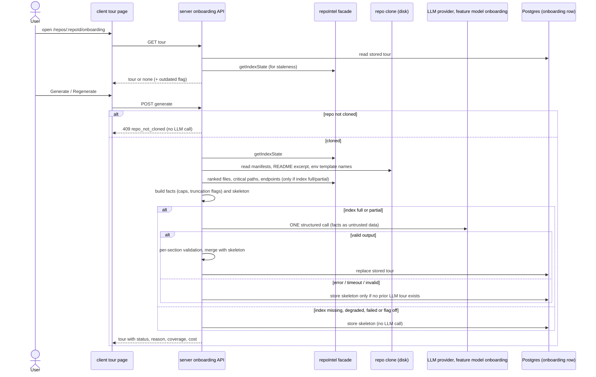
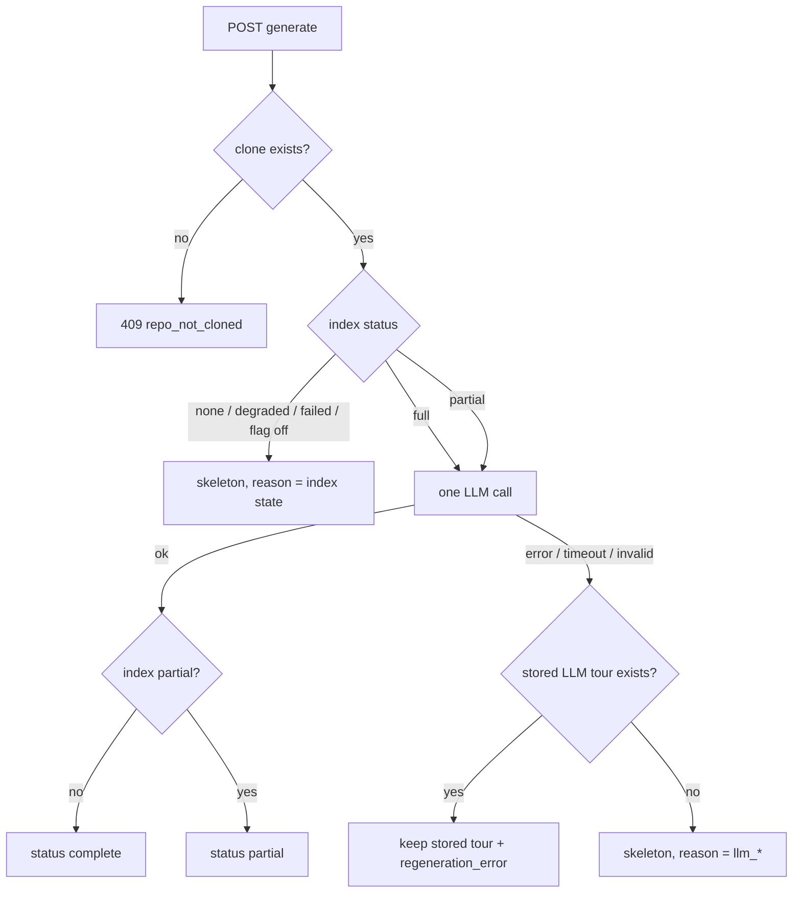

# 08-spec-onboarding-generator.md

Date: 2026-10-02 · Status: draft · Modules touched: `server` (`modules/repo-intel` facade reads, new onboarding module, `vendor/shared` contract), `client` (repo-scoped tour page, sidebar entry) · Questions: [round 1](./08-questions-1-onboarding-generator.md) · Design analysis: none (no mockup or Figma supplied; the only "design" is the textual architecture in the request)

## Problem and user

A developer who opens an unfamiliar repository in DevDigest has nothing that tells them how the code is shaped, which files matter, how to run it, or where to start. DevDigest already holds the facts (clone + repo-intel index: import graph, PageRank, endpoints), but they are only used inside review prompts. The newcomer spends hours reading files in the wrong order. The Onboarding Generator turns those facts into a five-section tour of one repository, with a deterministic reading path and an honest status whenever the data or the LLM falls short.

## Goals / Non-goals

**Goals**
- G1 — From a repo's page, the user gets a tour with exactly five sections — architecture overview, critical paths, local run, recommended reading order, first tasks — with one click.
- G2 — Tour facts (stack, structure, routes, scripts, critical paths, reading path) are collected deterministically from the clone and the repo-intel index; the reading path is computed from the import graph as `rank × (1 + hotness)`.
- G3 — Exactly one structured LLM call per generation, with bounded input and output size, also for very large repositories.
- G4 — When the index is not usable or the LLM call fails, the user sees a deterministic skeleton and an honest status/reason, never a blank page or invented content.
- G5 — The latest tour is stored per repo, re-viewable with zero LLM calls, and visibly marked when outdated.
- G6 — Repo text and LLM output are treated as untrusted; no secret values reach the prompt.

**Non-goals**
- The app's first-run "Add repository" flow at `/onboarding` (unchanged, apart from the nav highlight fix in AC-24).
- An MCP tool for the tour; writing the tour into the repo folder ("Sync generated docs" setting); tour history/versions.
- Deepening the shallow clone to compute git hotness; parsing non-JS/TS source or non-npm manifests beyond presence detection.
- Fetching issues ("good first issue") or any other data from GitHub/GitLab APIs.
- Automatic generation after clone/index; localization beyond English.
- Executing any script/command shown in the tour.

## User stories

- **As a newcomer to a repo**, I want one page that explains the architecture, the main dependency chains, how to run it locally, which files to read first and what to try first, so that my first day is productive.
- **As a newcomer**, I want the reading order to be the same every time for the same index, so that I can trust it is computed, not guessed.
- **As a user of a half-indexed or huge repo**, I want to see what the tour is based on and what is missing, so that I don't mistake a partial tour for a complete one.
- **As a workspace owner**, I want to see the model, tokens and cost of a tour, so that I know what a regeneration spends.

## Workflow / module interaction

Tour status is decided like this:

**Contract (behavior depends on it).** The existing `Onboarding` contract in `server/src/vendor/shared` is extended additively:

| Field | Meaning |
|---|---|
| `sections[]` | exactly 5, ordered `architecture`, `critical_paths`, `local_run`, `reading_order`, `first_tasks`; each keeps `title`, `body` (Markdown), `diagram` (mermaid or null), `links[]` (`label`, `path`) and gains `source`: `llm` \| `facts` |
| `reading_path[]` | deterministic list: `path`, `score`, optional `why` (one line, LLM-written) |
| `status` | `complete` \| `partial` \| `skeleton` |
| `reason` | null, or one of `index_partial`, `no_index`, `index_degraded`, `index_failed`, `flag_off`, `llm_failed`, `llm_timeout`, `llm_invalid_output`, `llm_not_configured` |
| `regeneration_error` | null, or an `llm_*` reason of the last failed regeneration that left the stored tour unchanged |
| `ranking_basis` | `pagerank` (hotness unavailable) \| `pagerank_hotness` |
| `coverage` | index status, files indexed, files skipped, and per-category `{ shown, total, truncated }` for routes, scripts, structure, reading path, critical paths |
| `indexed_sha`, `generated_at`, `outdated` | snapshot SHA, timestamp, and whether the repo's current index SHA differs |
| `model`, `tokens_in`, `tokens_out`, `cost_usd` | null on skeleton tours; `cost_usd` null when unknown |

Endpoints: `GET /repos/:id/onboarding` (stored tour, or 404 `no_tour`), `POST /repos/:id/onboarding` (generate). Both scoped to the current workspace.

## Acceptance criteria

**Navigation and viewing**

- AC-1 — The system shall (shall) show an "Onboarding Tour" sidebar entry for the selected repository that opens `/repos/:repoId/onboarding`.
- AC-2 — КОЛИ the user opens the tour page and a stored tour exists, the system shall (shall) render its five sections in the fixed order without making any LLM call.
- AC-3 — КОЛИ the user opens the tour page and no stored tour exists (a stored row that does not match the current contract counts as none), the system shall (shall) show an empty state that names the five sections and offers a "Generate onboarding tour" action.
- AC-4 — ПОКИ the repository has no clone (`clone_path` is null), the system shall (shall) show "Repository is not cloned yet" and keep Generate disabled.
- AC-5 — ЯКЩО `POST /repos/:id/onboarding` is called for a repository without a clone, ТОДІ the system shall (shall) respond 409 with code `repo_not_cloned` and make no LLM call.
- AC-6 — ЯКЩО the repository does not exist in the current workspace, ТОДІ the system shall (shall) respond 404 to both GET and POST.
- AC-7 — ПОКИ the stored tour's `indexed_sha` differs from the repository's current `lastIndexedSha`, the system shall (shall) show an "Outdated" badge next to Regenerate.

**Deterministic facts**

- AC-8 — КОЛИ a tour is generated, the system shall (shall) collect stack facts from the root `package.json` and up to 10 nested `package.json` files at directory depth ≤ 2 (name, framework/runtime dependencies), plus presence of these manifests: `go.mod`, `pyproject.toml`, `requirements.txt`, `Cargo.toml`, `pom.xml`, `build.gradle`, `Gemfile`, `composer.json`, `Dockerfile`, `docker-compose.yml`, `Makefile`.
- AC-9 — КОЛИ a tour is generated, the system shall (shall) collect scripts (name and command, command truncated to 200 characters) from the same manifests, at most 30, root manifest first, then by manifest path ascending.
- AC-10 — КОЛИ a tour is generated, the system shall (shall) collect the directory structure to depth ≤ 2 with per-directory file counts, at most 40 entries, excluding repo-intel's excluded directories, ordered by file count descending then path ascending.
- AC-11 — ПОКИ the index status is `full` or `partial`, the system shall (shall) collect routes from the index's endpoint facts, at most 50, ordered by the declaring file's rank descending then endpoint string ascending.
- AC-12 — ПОКИ the index status is `full` or `partial`, the system shall (shall) collect critical paths from the repo-intel facade (≤ 5 dependency chains).
- AC-13 — ПОКИ the index status is `full` or `partial`, the system shall (shall) compute the reading path as the 12 highest-scoring indexed files, excluding tests, configs, declaration files and migrations, where `score = rank × (1 + hotness)` with hotness in [0, 1], ordered by score descending then path ascending.
- AC-14 — ПОКИ hotness is unavailable for the repository (shallow clone), the system shall (shall) set `ranking_basis` to `pagerank` and the page shall show "Ranked by import graph only — no git history in the shallow clone".
- AC-15 — The system shall (shall) produce byte-identical facts and skeleton for two generations over the same clone content and the same index SHA.
- AC-16 — ЯКЩО any fact category exceeds its cap, ТОДІ the system shall (shall) keep the first items in the defined order, set that category's `truncated` flag with `shown` and `total`, and the page shall show "showing X of Y" for it.
- AC-17 — The system shall (shall) keep the serialized facts sent to the LLM at ≤ 12,000 estimated tokens (characters / 4), dropping from the end of the lowest-priority categories first in this order: structure, routes, README excerpt, scripts; reading path and critical paths are never dropped.

**Generation**

- AC-18 — ПОКИ the index status is `full` or `partial`, КОЛИ the user triggers Generate or Regenerate, the system shall (shall) make exactly one structured LLM call, using the provider/model configured for the `onboarding` feature model, with output limited to 4,000 tokens and a 90-second timeout.
- AC-19 — КОЛИ the LLM output is valid, the system shall (shall) set `reading_path` paths and order from the facts and accept from the LLM only a one-line `why` for listed files, ignoring any file it adds or reorders.
- AC-20 — КОЛИ the LLM output is valid but a section is missing or fails its schema, the system shall (shall) fill that section from the skeleton with `source: facts` and keep the other LLM sections.
- AC-21 — The system shall (shall) remove from every section any link whose `path` is not among the paths present in the collected facts (indexed files, manifests, README, structure entries).
- AC-22 — КОЛИ generation with a valid LLM output finishes, the system shall (shall) replace the stored tour for the repository, with `status` `complete` (index `full`) or `partial` (index `partial`, `reason: index_partial`) and the model, tokens and cost of the call.
- AC-23 — ПОКИ a generation for a repository is in progress, ЯКЩО another generate request for the same repository arrives, ТОДІ the system shall (shall) respond 409 `generation_in_progress` without starting a second LLM call.
- AC-24 — The system shall (shall) mark "Onboarding Tour" as the active sidebar item only on `/repos/:repoId/onboarding`, not on the `/onboarding` Add-repository page.

**Degraded and failure states**

- AC-25 — ЯКЩО the index is missing, `degraded`, `failed`, or repo-intel is disabled, ТОДІ the system shall (shall) build and store a skeleton tour with `status: skeleton` and the matching `reason` (`no_index`, `index_degraded`, `index_failed`, `flag_off`) without making an LLM call.
- AC-26 — The skeleton shall (shall) contain all five sections built only from facts: architecture = stack + structure; critical paths = the chains, or "unavailable — index <status>"; local run = scripts verbatim + env variable names + a README link if present; reading order = the reading path, or "unavailable — index <status>"; first tasks = a fixed template filled from facts (run the test script if one exists, read the first reading-path file, trace the first route).
- AC-27 — ЯКЩО the LLM call errors, times out, returns output that fails the schema, or no provider key is configured, ТОДІ, when no stored tour with `status` `complete` or `partial` exists, the system shall (shall) store and return the skeleton with `reason` `llm_failed`, `llm_timeout`, `llm_invalid_output` or `llm_not_configured`.
- AC-28 — ЯКЩО the LLM call fails as in AC-27 and a stored tour with `status` `complete` or `partial` exists, ТОДІ the system shall (shall) keep that tour unchanged and return it with `regeneration_error` set, and the page shall show "Regeneration failed (<reason>) — showing the tour from <generated_at>".
- AC-29 — ПОКИ the displayed tour has `status` `skeleton` or `partial`, the page shall (shall) show a status banner naming the reason in plain words, and, for index-related reasons, a Resync action that triggers the existing repo-intel resync.
- AC-30 — ПОКИ the displayed tour has `status` `partial`, the page shall (shall) show "Based on N indexed files (M skipped) — index is partial".
- AC-31 — ЯКЩО a section's mermaid diagram fails to render, ТОДІ the page shall (shall) hide that diagram and still render the section body, without an error overlay.
- AC-32 — ПОКИ generation is in progress, the page shall (shall) show a generating state and disable Generate/Regenerate.
- AC-33 — ЯКЩО the GET or POST request fails with a network or 5xx error, ТОДІ the page shall (shall) show "Couldn't load the onboarding tour" with a retry action, keeping any tour already on screen.

**Untrusted text and cost**

- AC-34 — The system shall (shall) send all repo-derived text (paths, manifest content, scripts, endpoints, README excerpt ≤ 4,000 characters, env variable names) to the LLM only inside untrusted-data delimiters under the existing injection guard, with closing-delimiter text inside the data escaped.
- AC-35 — The system shall (shall) read environment variable names only from `.env.example`, `.env.sample` and `.env.template`, never include their values, and never read any other `.env*` file.
- AC-36 — The page shall (shall) render section bodies as Markdown without raw HTML and shall show scripts/commands as text only; DevDigest shall not execute any of them.
- AC-37 — The page shall (shall) show in the tour footer the model, tokens in/out, and cost (or "cost unknown" when `cost_usd` is null) for LLM tours, and "Generated without LLM" for skeleton tours.
- AC-38 — The system shall (shall) write the tour text, titles and copy in English while keeping identifiers, paths, package names, scripts and env variable names verbatim.

## Edge cases

| # | Edge case | Covered by |
|---|---|---|
| E1 | Repo just added, clone job still running or failed | AC-4, AC-5 |
| E2 | Clone exists, indexing not started yet / no index row | AC-25 (`no_index`) |
| E3 | Repo > 5,000 files → index `partial`, files beyond the cap missing from graph | AC-18, AC-22, AC-30 |
| E4 | Index `degraded` (ripgrep fallback) or `failed` | AC-25, AC-29 |
| E5 | `REPO_INTEL_ENABLED` off | AC-25 (`flag_off`) |
| E6 | Non-JS repo (e.g. Go only): no indexed files, graph empty | AC-8 (presence detection), AC-25/AC-26 ("unavailable") |
| E7 | Index full but import graph has no edges → no critical paths | AC-12, AC-26 wording "unavailable" applies per section; reading path still from flat rank (AC-13) |
| E8 | Monorepo with > 10 nested manifests or > 30 scripts | AC-8, AC-9, AC-16 |
| E9 | No `package.json` and no README | AC-26 (sections still present; local run lists detected manifests only) |
| E10 | LLM invents a file path in links | AC-21 |
| E11 | LLM adds/reorders files in the reading order | AC-19 |
| E12 | LLM omits a section or returns a broken diagram | AC-20, AC-31 |
| E13 | Provider error / timeout / no API key on first generation | AC-27 |
| E14 | Same failure on regeneration of a good tour | AC-28 |
| E15 | Double-click / two tabs generating at once | AC-23, AC-32 |
| E16 | Index re-ran after the tour was generated | AC-7 |
| E17 | README or script contains prompt-injection text or `</untrusted>` | AC-34 |
| E18 | Repo contains a real `.env` with secrets | AC-35 |
| E19 | Repo from another workspace | AC-6 |
| E20 | Very long script command or huge README | AC-9 (200 chars), AC-34 (4,000 chars), AC-17 |
| E21 | Prior tour stored in the old (pre-feature) shape | AC-3 — a stored row that fails the new contract is treated as "no stored tour" |

## Non-functional requirements

- NFR-1 (performance) — КОЛИ `GET /repos/:id/onboarding` is called, the system shall (shall) respond within 300 ms p95 on the seeded dev stack, with zero LLM calls.
- NFR-2 (performance) — КОЛИ a tour is generated for a repository with a 5,000-file index, the system shall (shall) finish fact collection (before the LLM call) within 5 s.
- NFR-3 (cost) — The system shall (shall) make at most one LLM call per generate request and zero LLM calls for skeleton generation and for viewing.
- NFR-4 (security) — The system shall (shall) resolve every file read for facts inside the repository's clone directory and skip any path (including symlinks) that resolves outside it.
- NFR-5 (observability) — КОЛИ a generation finishes, the system shall (shall) log one line with repo id, status, reason, index status, fact counts/truncation flags, tokens and duration, and no repo text content.
- NFR-6 (accessibility) — The tour page shall (shall) expose sections as headings in order, make status banners readable by screen readers (status role), and make Generate/Regenerate/Resync keyboard-operable.

## Input sources and untrusted text

- **Sources:** the request text (sections, design: deterministic `repoIntel.*` facts, PageRank × (1 + hotness), one structured LLM call, skeleton fallback); the code: `server/src/modules/repo-intel` (facade `RepoIntel` with `getIndexState`, `getTopFilesByRank`, `getCriticalPaths`, endpoint facts in `file_facts`; `README.md`; `pipeline/rank.ts` "Option B" hotness = 0; `pipeline/walk.ts` 5,000-file cap), `server/src/modules/repos` (`CLONE_DEPTH = 1`), existing assets to reuse rather than duplicate: `Onboarding` contract (`vendor/shared/contracts/knowledge.ts`), `onboarding` table (`db/schema/context.ts`), prompt template `server/src/prompts/onboarding.system.md` (currently names other sections), Feature Model `onboarding` (Settings), `client/messages/en/onboarding.json` (copy names other sections), nav label `shell.json` → `nav.onboarding-tour`, `activeKeyFor` in the app shell, `useRepoIntelStatus` / `useResyncRepoIntel` hooks. The sidebar `NAV` list lives in vendored `@devdigest/ui`; adding the entry must go through its source of truth (planner to resolve). Prior specs for style: 06 blast-radius, 07 project-context.
- **Untrusted text:** everything read from the repository (file paths, manifests, scripts, endpoint strings, README, env variable names) is data, never instructions — wrapped per AC-34. LLM output is untrusted too: links validated (AC-21), reading order not taken from it (AC-19), Markdown without HTML and commands never executed (AC-36), diagrams only through the existing mermaid component (AC-31). Secret values never collected (AC-35).

## Verification hints

| AC | Hint |
|---|---|
| AC-1, AC-24 | client unit test of `activeKeyFor` + nav render; browser check |
| AC-2, AC-3, AC-4, AC-7, AC-29–AC-33, AC-36, AC-37 | client component tests with fetch stubbed (stored tour, none, not cloned, outdated, skeleton, partial, regeneration_error, render failure, 5xx) |
| AC-5, AC-6, AC-23 | server integration test (`*.it.test.ts`) on routes; mock LLM call counter |
| AC-8–AC-12, AC-16, AC-17, AC-35, NFR-4 | hermetic test over a temp clone fixture + stubbed `RepoIntel` (caps, ordering, truncation flags, `.env` ignored, symlink outside skipped) |
| AC-13, AC-14, AC-15 | hermetic test: fixed rank/hotness rows → expected order; run twice → identical output |
| AC-18, AC-19, AC-20, AC-21, AC-22, AC-27, AC-28, AC-38 | hermetic service tests with `MockLLMProvider` fixtures (valid, missing section, invented path, reordered files, schema failure, thrown error, timeout) |
| AC-25, AC-26 | hermetic: stubbed `getIndexState` per status → skeleton, zero LLM calls |
| AC-34 | hermetic: README containing `</untrusted>` and "ignore previous instructions" → escaped inside delimiters in the captured prompt |
| NFR-1, NFR-2 | integration timing on seeded stack (manual measurement acceptable) |
| NFR-3 | LLM call counter in service tests |
| NFR-5 | log assertion in a service test |
| NFR-6 | component test with role queries; manual keyboard pass in browser |

## Traceability

| Goal / Story | AC | Edge cases | Design element | Verification |
|---|---|---|---|---|
| G1 / newcomer story | AC-1, AC-2, AC-3, AC-4, AC-5, AC-6, AC-18, AC-24, AC-32, AC-33, AC-38 | E1, E15, E19 | none (no mockup) — existing nav label, i18n copy | client component + route integration |
| G2 / "same every time" story | AC-8–AC-15, AC-19 | E6, E7, E8, E9, E11 | request design: `repoIntel.*`, PageRank × (1 + hotness) | hermetic facts tests |
| G3 / cost story | AC-16, AC-17, AC-18, AC-23, AC-37, NFR-3 | E3, E8, E15, E20 | request design: one structured call | LLM call counter, truncation tests |
| G4 / partial-repo story | AC-20, AC-25–AC-31 | E2–E7, E12, E13, E14, E21 | request design: skeleton + honest status | hermetic service + client state tests |
| G5 | AC-2, AC-7, AC-22, AC-28 | E14, E16, E21 | — | integration + component |
| G6 | AC-21, AC-34, AC-35, AC-36, NFR-4 | E10, E17, E18 | — | hermetic prompt/escape tests |

## Open questions

None open. All round-1 decisions in [08-questions-1-onboarding-generator.md](./08-questions-1-onboarding-generator.md) were **decided by recommendation, pending user veto** (no interactive question tool was available); a veto reopens the affected ACs in round 2.
