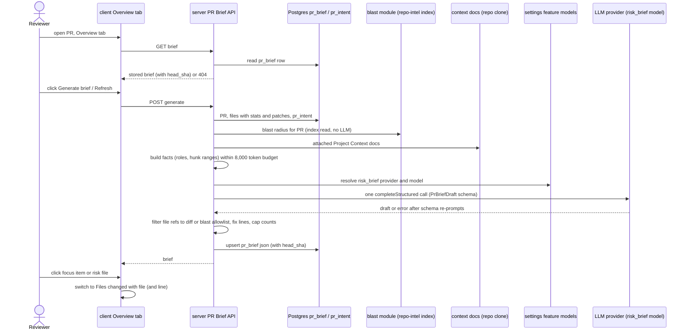

# 09-spec-pr-brief.md

Date: 2026-10-03 · Status: draft · Modules touched: `server` (new PR Brief module; reads from `reviews` (intent, smart-diff roles, PR files), `blast`, `context`, `settings` feature models), `client` (PR detail Overview tab, Files changed tab navigation, `messages/en/brief.json`), `@devdigest/shared` contract `contracts/brief.ts` (source in `server/src/vendor/shared`, identical copy in `client/src/vendor/shared`) · Questions: none. The orchestrator asked for no user questions, so defaults are stated inline and listed under *Decided defaults* · Design analysis: none as a file. The only design source is the text description of the mockup in the request (no Figma, no image). Gaps from it are folded into Edge cases and *Decided defaults*.

## Problem and user

A reviewer who opens a PR in DevDigest sees the Intent card, the Blast radius card and the raw description, but nothing tells them **what is risky in this PR** or **where to start reading**. DevDigest already computes the facts (intent, blast radius, per-file diff stats, Smart Diff roles, linked specs), but the reviewer has to combine them on their own. The PR Brief turns those facts into one card on the Overview tab: a short summary, concrete risk areas tied to files, and an ordered "read these first" list of `file:line` items that open the Files changed tab. It uses one LLM call on precomputed facts, so it stays cheap. No path in it can be invented.

## Goals / Non-goals

**Goals**
- G1: On the Overview tab the reviewer sees one PR Brief card. Before a brief exists it shows a **Generate brief** button. After generation it shows a summary (what + why), **Risk areas** and **Review focus**.
- G2: The brief is built from facts that already exist: intent, blast radius summary + caller files, per-file diff stats with Smart Diff roles and hunk line ranges, PR description and attached Project Context docs. Exactly **one** model call is made and no hunk bodies are sent.
- G3: Every file the brief names exists in the PR diff or in the Blast radius map. The server enforces this and the model is not trusted for it.
- G4: Review focus items and risks link to the Files changed tab on the right file (and line, P2).
- G5: The brief is cached per PR and bound to the head SHA it was generated for. A reload shows it without regeneration. Refresh regenerates it. A newer head commit marks it stale.
- G6: When intent, blast radius or specs are missing, the brief is still generated and states which inputs were missing.
- G7: Model choice comes from the `risk_brief` feature model setting. Input stays within a fixed token budget. Output is validated against the contract.

**Non-goals**
- Computing intent or blast radius as part of brief generation. The brief reads what exists. Deriving intent is a separate LLM call that stays behind the Intent card's own button.
- PR history ("Prior PRs") in the brief. `PrBrief.history` is not populated by this feature.
- Sending diff hunk bodies, file contents or the repo map to the model.
- Automatic generation on PR open or on new commits. Generation is always user-triggered.
- Exposing the brief over MCP, posting it to GitHub/GitLab, brief history/versions.
- A new verdict or score. The banner reuses the latest review's verdict and score (see AC-20).
- Pixel-matching the mockup. A simple list layout is acceptable.
- Localization beyond English.

## User stories

- **As a reviewer**, I want one card on Overview that says what the PR does, what is risky and where to start, so that I don't build that picture by hand from four places.
- **As a reviewer**, I want each risk to name a file and each focus item to be `file:line — reason` that I can click, so that I go straight to the code.
- **As a reviewer**, I want the brief to say plainly when it was generated without intent, blast radius or specs, so that I don't take a thin brief for a complete one.
- **As a reviewer**, I want the brief to stay after a reload and to warn me when the PR got new commits, so that I neither pay twice nor read an outdated brief.
- **As a workspace owner**, I want the brief to use the model I picked for "Risk Brief" in Settings and make one bounded call, so that cost is predictable.

## Workflow / module interaction

A failed fact source (blast throws or is degraded, intent missing, spec unreadable) never fails generation. It adds an entry to `missing_inputs`. Only an empty diff, a missing PR, or an LLM/provider failure fail the request.

### Contracts (behavior depends on them)

**Model output schema `PrBriefDraft`** (new, in `contracts/brief.ts`). All fields are required because strict `json_schema` mode rejects optional properties (server INSIGHTS 2026-09-21):
- `summary: string`, 1–3 sentences on what the PR changes and why.
- `risks: Risk[]`, the existing `Risk` shape (`kind`, `title`, `explanation`, `severity: high|medium|low`, `file_refs: string[]`).
- `review_focus: { file: string; line: number (int); reason: string }[]`, in reading order.

**Stored/served `PrBrief`** (existing schema, changed in **both** copies, which must stay byte-identical):
- add `summary: string`
- add `review_focus: ReviewFocusItem[]` (`{ file, line, reason }`)
- add `head_sha: string`, the PR head commit the brief was generated for
- add `generated_at: string` (ISO timestamp)
- add `missing_inputs: ('intent' | 'blast' | 'specs' | 'description')[]`
- add `generation: { provider, model, tokens_in, tokens_out, cost_usd (nullable), attempts }`
- change `intent` to `Intent | null` and `blast` to `BlastRadius | null`. They hold the inputs used, or null when that input was missing.
- change `history` to optional. This feature does not fill it.
- keep `risks: Risks`.

These edits are safe because `PrBrief` currently has no producer and no consumer beyond a type re-export, and the `pr_brief` table is unused.

**API** (workspace-scoped like every PR route):
- `GET /pulls/:id/brief` → `200 PrBrief` | `404` (no brief yet). Never calls the LLM.
- `POST /pulls/:id/brief` → generates (or regenerates) and returns `200 PrBrief`. Errors: `404` unknown PR, `422 empty_diff`, `400` provider not configured, `502 llm_failed` / `llm_invalid_output`.

**Files changed deep link** (client URL): `?tab=diff&file=<path>[&line=<n>]` on the PR detail route. This is the only coupling between the brief and the Files changed tab.

## Acceptance criteria

Priority tags: **[P1]** blocking, **[P2]**, **[P3]**.

### Card, generation and display
- AC-1 [P1]: ПОКИ no brief is stored for the PR, the Overview tab shall (shall) show a PR Brief card with a "Generate brief" button and no model call shall be made until the user clicks it.
- AC-2 [P1]: КОЛИ the user clicks Generate brief and generation succeeds, the Overview tab shall (shall) show in the PR Brief card the summary, a "Risk areas" block and a "Review focus" block, without a page reload.
- AC-3 [P1]: The Overview tab shall (shall) show the existing Intent and Blast radius blocks next to the PR Brief content (the brief banner on top, Intent and Blast radius side by side below it — a responsive `auto-fit` grid that stacks on narrow widths; Risk areas render inside the Intent card, Review focus as its own card below). The brief shall not render a second copy of them.
- AC-4 [P1]: ЯКЩО any of intent, blast radius, attached specs or PR description was unavailable at generation time, ТОДІ the brief shall (shall) list each missing input by name in a visible "Generated without: …" note inside the card. The model input shall also state which inputs are missing.
- AC-5 [P1]: The system shall (shall) render every risk with at least its title, its severity and at least one file path.
- AC-6 [P1]: The system shall (shall) render every review focus item as `file:line — reason`.
- AC-7 [P1]: ПОКИ the brief has zero risks after validation, the Risk areas block shall (shall) show the "No notable risks flagged." text. ПОКИ it has zero focus items, the Review focus block shall (shall) show a "No specific starting point — read core files first." text.
- AC-8 [P1]: КОЛИ the page is reloaded or the Overview tab is reopened, the system shall (shall) show the stored brief from `GET` with zero model calls.
- AC-9 [P1]: КОЛИ the user clicks the Refresh button on a shown brief, the system shall (shall) regenerate the brief with one model call and replace the shown brief with the new one on success.
- AC-10 [P1]: ЯКЩО regeneration fails, ТОДІ the system shall (shall) keep the previously stored brief unchanged and shown, and show an error message with a retry action.

### Grounding: no invented paths
- AC-11 [P1]: The system shall (shall) build an allowlist of file paths as the union of the PR diff file paths and all `file` values in the Blast radius map (changed symbols and callers), compared by exact path string.
- AC-12 [P1]: КОЛИ the model returns a risk, the system shall (shall) remove every `file_refs` entry not in the allowlist and drop the risk entirely if no entry remains.
- AC-13 [P1]: КОЛИ the model returns a review focus item whose `file` is not in the allowlist, the system shall (shall) drop that item.
- AC-14 [P2]: КОЛИ a kept focus item's `line` is not a valid anchor for its file, the system shall (shall) replace it with the nearest valid anchor line. Valid anchors are line numbers inside a hunk's new-side range for diff files, and caller lines from the Blast radius map for caller-only files. If the file has no anchor, line 1 is used.
- AC-15 [P1]: The system shall (shall) store and return at most 8 risks and at most 8 focus items, keeping the model's order (risks are then shown sorted high → medium → low, stable).

### Navigation
- AC-16 [P1]: КОЛИ the user clicks a review focus item, the client shall (shall) switch to the Files changed tab with that file expanded (even if its Smart Diff role group is collapsed by default) and scrolled into view.
- AC-17 [P2]: КОЛИ the user clicks a review focus item whose line is rendered in the diff, the client shall (shall) scroll to that line and highlight it. ЯКЩО the line is not rendered (outside the shown hunks), ТОДІ the client shall scroll to the file header instead.
- AC-18 [P3]: КОЛИ the user clicks a file reference on a risk, the client shall (shall) navigate as in AC-16 for that file.
- AC-19 [P3]: ЯКЩО a clicked file is not in the PR diff (a Blast-radius-only caller file), ТОДІ the Files changed tab shall (shall) show a "File not in this PR's diff" notice naming the path, instead of failing silently.

### Banner, details, loading, labels
- AC-20 [P3]: ДЕ the PR has at least one completed review, the brief card shall (shall) show the verdict banner (reusing VerdictBanner) with that latest review's verdict and PR score and the brief summary as its text. ПОКИ no review exists, the summary shall be shown without verdict or score.
- AC-21 [P3]: Each risk shall (shall) show its explanation collapsed by default. КОЛИ the user expands it, the full explanation text shall show. Severity shall be shown by a colored icon or badge per `high|medium|low`.
- AC-22 [P3]: ПОКИ generation is in progress in this tab, the card shall (shall) show a skeleton in place of summary, risks and focus, and the Generate / Refresh button shall be disabled.
- AC-23 [P3]: The PR Brief card's user-visible labels and messages shall (shall) come from the `brief` message namespace (`client/messages/en/brief.json`), with none hardcoded in components.

### Model call, budget, cache
- AC-24 [P2]: КОЛИ a generation runs, the system shall (shall) make exactly one `completeStructured` invocation. Its built-in schema re-prompts (up to 2) count as attempts of that one call. No other LLM call (intent derivation, embedding, classification) shall be made by brief generation.
- AC-25 [P2]: The system shall (shall) resolve provider and model through the `risk_brief` feature model (workspace override, else registry default) and never through a hardcoded model.
- AC-26 [P2]: The system shall (shall) keep the full model input (system prompt + facts) at ≤ 8,000 estimated tokens, where tokens = ceil(characters / 4) (the estimator already used by Project Context and Onboarding). It shall apply the section caps and drop order in NFR-1.
- AC-27 [P2]: The model input shall (shall) contain no diff hunk bodies and no file contents. Per file it may contain only path, additions, deletions, Smart Diff role and hunk new-side line ranges (numbers only, with `@@` context text stripped).
- AC-28 [P2]: КОЛИ the model output fails `PrBriefDraft` validation after all re-prompts, the system shall (shall) fail the request with `llm_invalid_output` and store nothing.
- AC-29 [P2]: КОЛИ a brief is stored, it shall (shall) include the PR `head_sha` it was generated for.
- AC-30 [P2]: ПОКИ the stored brief's `head_sha` differs from the PR's current head SHA, the card shall (shall) show "PR updated since this brief was generated" with a Regenerate action. It shall not regenerate automatically.
- AC-31 [P2]: КОЛИ a second generate request for the same PR arrives while one is in flight in the server process, the system shall (shall) return the result of the in-flight generation and shall not start a second model call.
- AC-32 [P2]: The stored brief shall (shall) record provider, model, tokens in/out, cost (null when unknown) and attempts, and the card shall show them as one muted line.

### Failure and empty inputs
- AC-33 [P1]: ЯКЩО the PR diff has zero files, ТОДІ the system shall (shall) make no model call, respond `422 empty_diff`, and the card shall show "This PR has no changed files — nothing to brief." with the Generate button disabled (the client disables it when `pr.files.length === 0`, so the request is normally never sent).
- AC-34 [P1]: ЯКЩО the blast radius read throws, or returns `degraded` with reason `flag_off`, `index_failed`, `repo_too_large` or `no_data`, ТОДІ the system shall (shall) generate without blast facts and add `blast` to `missing_inputs`. With reason `index_partial` it shall use the partial data and tell the model the caller list may be incomplete.
- AC-35 [P1]: ЯКЩО no `pr_intent` row exists for the PR, ТОДІ the system shall (shall) generate without intent and add `intent` to `missing_inputs`.
- AC-36 [P1]: ЯКЩО the provider for `risk_brief` is not configured (no API key), ТОДІ the system shall (shall) fail with a message that names the Risk Brief model in Settings, make no model call and store nothing.

## Edge cases

| # | Case | Behavior | AC |
|---|---|---|---|
| E1 | No intent derived | Brief generated, "Generated without: intent". Intent card keeps its own "Derive intent" button | AC-4, AC-35 |
| E2 | No blast (not indexed, flag off, too large, index failed) | Brief generated without blast, noted. Allowlist = diff files only | AC-4, AC-11, AC-34 |
| E3 | Blast `index_partial` | Used, model told it may be incomplete. Not listed as missing | AC-34 |
| E4 | No attached Project Context docs, or doc missing/unreadable | `specs` in `missing_inputs`. Generation proceeds | AC-4 |
| E5 | Empty PR description | `description` in `missing_inputs` | AC-4 |
| E6 | Empty diff (0 files) | No model call, 422, disabled button with message | AC-33 |
| E7 | Model cites a path not in the diff or blast map | Ref removed, risk dropped if no refs left, focus item dropped | AC-12, AC-13 |
| E8 | Model cites a valid file with a bogus line | Snapped to nearest valid anchor | AC-14 |
| E9 | Focus/risk file is a caller-only file (not in diff) | Click shows "File not in this PR's diff" notice | AC-19 |
| E10 | Path differs only by case or leading `./` | Treated as not in allowlist (exact match) and dropped | AC-11 |
| E11 | All risks/focus filtered out | Empty-state texts shown. The brief is still stored | AC-7 |
| E12 | Concurrent Generate (double click, two tabs) | Joined to the in-flight generation, one model call | AC-31 |
| E13 | Reload while generating | Shows the previous brief, or the Generate button if none. Clicking again joins the in-flight generation | AC-8, AC-31 |
| E14 | LLM network/timeout failure | 502 `llm_failed`, previous brief kept | AC-10 |
| E15 | Invalid JSON / schema mismatch after re-prompts | 502 `llm_invalid_output`, nothing stored | AC-28, AC-10 |
| E16 | New commit pushed after brief | Stale banner + Regenerate. No auto-regeneration | AC-30 |
| E17 | Huge PR (hundreds of files, long description) | Caps and drop order keep input ≤ 8,000 tokens. Allowlist still uses the full diff | AC-26, NFR-1 |
| E18 | Provider not configured | Clear error naming the Settings entry. No call | AC-36 |
| E19 | Deleted file in focus | It is in the diff, so it is kept. Line anchor is the hunk's old side → nearest anchor rule falls back to line 1 | AC-14 |
| E20 | No review run yet | Banner without verdict or score, summary shown | AC-20 |
| E21 | PR merged/closed | Brief allowed as for open PRs | AC-1 |
| E22 | Model returns > 8 risks or focus items | First 8 kept | AC-15 |
| E23 | Process restarts during generation | Request fails client-side. Nothing stored. User retries | AC-10 |

## Non-functional requirements

- NFR-1 (budget, P2): The system shall (shall) assemble model input within **8,000 estimated input tokens** (ceil(chars/4)), with these section caps:

  | Section | Cap |
  |---|---|
  | System prompt and instructions | ~800 tokens |
  | Intent (intent, in/out of scope) | 400 tokens |
  | Blast radius (summary + caller files with lines, ≤ 40 callers) | 1,200 tokens |
  | Diff stats (path, +/−, role, hunk ranges), files sorted by additions+deletions desc | 3,600 tokens |
  | PR description | 800 tokens |
  | Attached Project Context docs (head of each) | 1,200 tokens |

  When the total would still exceed 8,000, the system drops content in this order until it fits: spec text, then description tail, then blast callers beyond the first 10, then diff-stat rows from the lowest-churn end. Dropped rows are replaced by one line "+N more files (A additions, D deletions)". Diff rows for the top 20 files by churn are never dropped.
  Why 8,000: the brief needs metadata, not code. The capped sections cover a typical PR (≤ 150 files) with headroom. The cost on the default `gpt-4.1` is about $0.016 input per brief. It is smaller than Onboarding's 12,000 because there is no README or route table, and it leaves room for re-prompt attempts that re-send the input.
- NFR-2 (output, P2): The model call shall (shall) use a max output of 2,000 tokens and a 60-second timeout per attempt.
- NFR-3 (latency): `GET /pulls/:id/brief` shall (shall) respond from the stored row with zero LLM calls and no provider (GitHub/GitLab) calls.
- NFR-4 (observability, P2): КОЛИ a generation finishes or fails, the server shall (shall) log exactly one line with PR id, provider, model, attempts, tokens in/out, cost, duration, estimated input tokens, truncation flags, `missing_inputs`, and counts of dropped risks, dropped file refs, dropped focus items and snapped lines. The line shall contain no PR text, spec text or model text.
- NFR-5 (security): Model-written text (summary, titles, explanations, reasons) shall (shall) be rendered as plain text. It shall not be rendered as Markdown or HTML, and no link shall be created from it except the validated file navigation.
- NFR-6 (accessibility): Focus items and risk file references shall (shall) be keyboard-operable buttons or links with an accessible name containing the path and line. Severity shall not be conveyed by color alone (the label text is present).

## Input sources and untrusted text

| Source | Trust | Handling |
|---|---|---|
| PR title, description, linked-issue text | untrusted (author-controlled) | Sent inside delimited untrusted blocks with the same injection guard used by review prompts. Capped per NFR-1 |
| Attached Project Context docs | untrusted (repo content) | Same delimiters. Read only from the clone, path-restricted like Project Context reads (no traversal) |
| Intent (`pr_intent`) | model-derived, untrusted | Treated as data, delimited |
| File paths, hunk ranges, blast callers | repo-derived | Paths are data. Hunk context text after `@@` is stripped |
| Model output | untrusted | Zod-validated (`PrBriefDraft`). Paths filtered to the allowlist. Lines snapped. Counts capped. Text rendered as plain text (NFR-5) |

Instructions inside any of these never change the system's behavior. The model is told the blocks are data.

## Decided defaults (by recommendation, pending user veto)

- D1: **"Attached specs"** = the Project Context docs attached to the workspace's enabled review agents (each enabled agent's `context_paths` plus the `context_paths` of its enabled linked skills — the same effective set reviews receive), read from the clone through Project Context's path-vetted reader. Ordered by how many enabled agents use the doc (desc), then path (asc). The head of each doc is included until the 1,200-token spec section cap. PR-referenced spec paths are not read separately (they already feed the Intent). `specs` is in `missing_inputs` when no doc is attached or none is readable. Resolved by the user (2026-10-03).
- D2: Intent and Blast radius are **not** computed by brief generation. This keeps the one-model-call rule and avoids hidden cost. Missing inputs are reported instead.
- D3: Verdict and score come from the latest completed review. The brief model does not produce a verdict.
- D4: Stale brief = banner + manual Regenerate. There is no auto-regeneration, because it would trigger a model call without consent.
- D5: The model gets hunk new-side **line ranges** (numbers only) so it can name real lines without hunk bodies. The server still snaps invalid lines (AC-14).
- D6: The in-flight de-duplication is per server process. This is enough for the single-process local-first deployment. A multi-instance setup would need a DB-level lock.
- D7: Path matching is exact. There is no case or `./` normalization.

## Verification hints

| AC | Hint |
|---|---|
| AC-1, 2, 5–7, 20–23 | client component test (RTL) with hook/fetch mocks. Browser check on seeded PR |
| AC-3 | client test: Intent and Blast cards rendered once. Manual at 1280 px / 800 px |
| AC-4, 34, 35 | server hermetic test with fake container: no intent row / blast throws / degraded reasons → `missing_inputs` and the prompt mention |
| AC-8 | integration test: GET after POST returns the same JSON. Mock LLM call count stays 1 |
| AC-9, 10 | server hermetic: second POST replaces. Failing mock keeps the old row |
| AC-11–15 | server hermetic unit tests on the filter/snap function with crafted drafts |
| AC-16–19 | client test on deep-link handling in Files changed. e2e flow click focus → diff tab |
| AC-24 | server hermetic: spy on `completeStructured` called once. No other LLM method called |
| AC-25 | hermetic: workspace override → that model passed to the provider |
| AC-26, 27 | hermetic: huge fixture PR → estimated tokens ≤ 8,000. Prompt contains no `+`/`-` hunk lines or `@@` context text |
| AC-28 | hermetic: stub throws the real adapter's schema-validation error (server INSIGHTS: a bad mock fixture classifies differently) |
| AC-29, 30 | hermetic: stored `head_sha`. Client test: mismatched SHA shows the banner |
| AC-31 | hermetic: two concurrent calls with a delayed mock → one LLM invocation, same result |
| AC-32, NFR-4 | hermetic: log line fields, no PR text in it |
| AC-33 | hermetic: zero files → 422, LLM not called |
| AC-36 | hermetic: ConfigError path → 400, no row |
| Contract | typecheck both packages. `diff` of the two `brief.ts` copies is empty |

## Traceability

| Goal / Story | AC | Edge cases | Design element (text mockup) | Verification |
|---|---|---|---|---|
| G1 card + generate | AC-1, 2, 7, 22, 23 | E6, E11, E13 | PR Brief card, Generate button, skeleton | client RTL |
| G2 facts, one call, no hunks | AC-24, 26, 27 | E17 | — | server hermetic |
| G3 no invented paths | AC-11–15 | E7, E8, E10, E22 | Risk areas / Review focus lists | server hermetic |
| G4 navigation | AC-16–19 | E9, E19 | "Review focus — read these first" list, risk file refs | client test, e2e |
| G5 cache + SHA | AC-8–10, 29–31 | E12, E13, E14, E16, E23 | Refresh button, stale banner | integration + client |
| G6 missing inputs | AC-3, 4, 34, 35 | E1–E5 | Intent + Blast side by side | server hermetic, client |
| G7 model, budget, validation | AC-25, 26, 28, 32, 36 | E15, E18 | muted generation line | server hermetic |
| Story: risks with file | AC-5, 21 | E7 | severity-colored risk icon, expandable explanation | client RTL |
| Story: verdict context | AC-20 | E20 | banner (verdict / score + summary) | client RTL |
| Untrusted text | NFR-5 | — | — | client test (no HTML rendering) |

## Open questions

None blocking. The defaults D1–D7 above are open to user veto. The most likely to be revisited:
- None. D1 resolved by the user (2026-10-03): attached specs = Project Context docs attached to the reviewers.
