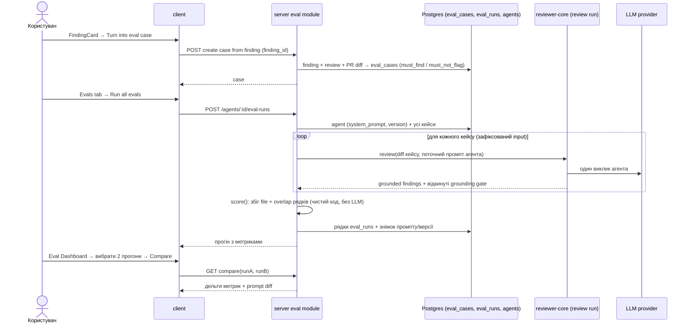

# 10-spec-eval-pipeline.md

Date: 2026-10-09 · Status: draft · Modules touched: `server` (новий модуль `eval`: кейси, прогін, скоринг, дашборд; читає `agents`, `reviews`/`findings`, `reviewer-core`), `client` (FindingCard, вкладка Evals в AgentEditor, сторінка Eval Dashboard, пункт сайдбару, `messages/en/eval.json`), `@devdigest/shared` (`contracts/eval-ci.ts`, `contracts/knowledge.ts` — джерело в `server/src/vendor/shared`, копія в `client/src/vendor/shared`), корінь репозиторію (скрипт `verify:l06`) · Questions: немає · Дизайн: 6 скріншотів макетів (див. *Design considerations*).

> Розташування: за домашнім завданням файл має називатись `specs/eval-pipeline.md`. За `specs/README.md` крос-модульні специфікації лежать у `specs/NN-spec-<name>/`, тому файл — `specs/10-spec-eval-pipeline/10-spec-eval-pipeline.md` (наступний вільний NN після 09). Якщо перевіряючий очікує буквальний шлях — див. Open Questions №1.

## Problem and user

Рев'юер-агент у DevDigest змінюється: правиться system prompt, модель, скіли. Сьогодні немає способу дізнатись, чи нова версія стала кращою, чи просто інакшою. Користувач бачить реальні знахідки, приймає або відхиляє їх (`accepted_at` / `dismissed_at`), але це знання не повертається в агента як регресійний набір.

Eval Pipeline перетворює рішення рев'юера на еталонні кейси: «прийняв знахідку» → агент **має** її знайти; «відхилив» → агент **не має** її повторювати. Прогін агента на всіх кейсах дає три числа (recall, precision, citation_accuracy), які порівнюються між версіями промпту. Скоринг — повністю детермінований код без LLM: очікування — це `file:line`, збіг рахується порівнянням файлу і діапазонів рядків.

## Goals / Non-goals

**Goals**
- G1: Зі знахідки (FindingCard) одним кліком створити eval case: accepted → `must_find`, dismissed → `must_not_flag`; кейс зберігає diff-фрагмент і очікування.
- G2: Бачити всі кейси набору агента (вкладка Evals) і запускати прогін на всіх одразу.
- G3: Кожен прогін видає recall / precision / citation_accuracy, порахованих кодом без жодного виклику LLM у скорингу.
- G4: Зберігати історію прогонів із знімком system prompt (і версії агента), бачити її в Evals tab і на сторінці Eval Dashboard.
- G5: Порівняти два прогони поруч: дельти метрик + diff system prompt («старий vs новий»).
- G6: Вхідні дані прогону зафіксовані (diff/files/meta кейсу, один і той самий набір), щоб прогони різних версій агента були порівнянні.
- G7: Набір агента містить ≥ 8 кейсів (сід), а зміна промпту видимо рухає метрики.
- G8: `pnpm verify:l06` у корені запускається і зелений.

**Non-goals**
- LLM-суддя, семантичне порівняння тексту, збіг за title/rationale. Збіг тільки за файлом і рядками.
- Eval для скілів (`owner_kind='skill'`). Таблиці це допускають, UI і прогін цієї фічі — лише `agent`.
- Паралельні/фонові черги прогонів, розклад, CI-інтеграція eval (`ci_runs`).
- Автоматичне створення кейсів без дії користувача; пакетне створення зі всіх знахідок PR.
- Автоматичний промоут/відкат версії агента. Кнопка «Promote vN» з макета — поза обсягом (див. Open Questions №4).
- Редагування вже виконаних прогонів; експорт історії.
- Локалізація, відмінна від English.

## User stories

- **Як рев'юер**, я хочу натиснути «Turn into eval case» на знахідці, щоб не писати кейс руками: прийняту знахідку агент має знаходити й надалі, відхилену — не повторювати.
- **Як автор агента**, я хочу бачити всі кейси свого агента і запускати їх разом, щоб після правки промпту одразу знати, чи не стало гірше.
- **Як автор агента**, я хочу бачити recall / precision / citation_accuracy і їх зміну відносно попереднього прогону, щоб відрізнити покращення від регресії.
- **Як автор агента**, я хочу порівняти два прогони поруч з diff'ом промпту, щоб зрозуміти, яка зміна в тексті змінила метрики.
- **Як власник workspace**, я хочу, щоб скоринг не викликав модель, щоб оцінка була відтворюваною і безкоштовною.

## Workflow / module interaction

## Definitions (скоринг)

- **Очікування кейсу**: `must_find` — масив `{file, start_line, end_line}` (за потреби `severity`/`category`/`title` як довідкові, не для збігу); `must_not_flag` — масив `{file, start_line, end_line}`. Порожній `must_find` + порожній `must_not_flag` = «чистий» кейс: агент не має знайти нічого.
- **Збіг** знахідки з очікуванням: `finding.file === expected.file` і діапазони `[start_line, end_line]` перетинаються (включно з межами).
- **Знахідка агента** для скорингу = знахідка, що пережила grounding gate (`groundFindings`). Відкинуті gate'ом рахуються тільки в знаменнику citation_accuracy.
- **recall** = (кількість `must_find`-очікувань, що мають збіг) / (кількість `must_find`-очікувань). Якщо очікувань 0 → метрика не визначена (виключається з агрегації, а не 1.0).
- **precision** = (кількість знахідок, що не потрапили у `must_not_flag` і не є «шумом») / (кількість знахідок). Знахідка — шум, якщо збігається з `must_not_flag`-очікуванням, або якщо кейс «чистий» (обидва списки порожні) і знахідка є. У кейсі лише з `must_not_flag` сторонні знахідки шумом не вважаються. Знахідка, що збіглась із `must_find`, — не шум. Якщо знахідок 0 → precision = 1.0 для цього кейсу з нульовою вагою не додається (див. AC-14).
- **citation_accuracy** = (знахідки, що пережили grounding gate) / (усі знахідки, які повернув агент до gate). Якщо знахідок 0 → не визначена.
- **Pass кейсу**: всі `must_find` знайдені і жодне `must_not_flag` не спрацювало (для «чистого» кейсу — 0 знахідок).
- **Агрегація прогону**: recall/precision/citation рахуються по сумі лічильників усіх кейсів (micro), а не як середнє середніх.

## Acceptance criteria (EARS)

### Створення кейсу з знахідки
- AC-1: When користувач натискає «Turn into eval case» на знахідці зі статусом accepted, the system shall створити кейс типу `must_find` з очікуванням `{file, start_line, end_line}` цієї знахідки і diff-фрагментом PR, що містить ці рядки.
- AC-2: When користувач натискає «Turn into eval case» на знахідці зі статусом dismissed, the system shall створити кейс типу `must_not_flag` з тим самим `{file, start_line, end_line}` і diff-фрагментом.
- AC-3: Where знахідка не має ні accepted, ні dismissed, the system shall показати кнопку, але вимагати вибору типу очікування (за замовчуванням `must_find`) перед створенням. *(див. Decided defaults D2)*
- AC-4: The system shall створювати кейс одним запитом без додаткових форм і показати підтвердження («Case created») з посиланням на кейс.
- AC-5: If кейс для того самого агента з тим самим `file`, діапазоном і типом очікування вже існує, the system shall не створювати дубль і повідомити, що кейс уже є.
- AC-6: The system shall прив'язувати кейс до агента, що створив рев'ю знахідки (`owner_kind='agent'`, `owner_id` = агент рев'ю). If агент рев'ю видалений, the system shall відхилити створення з зрозумілою помилкою.
- AC-7: The system shall зберігати у кейсі лише diff-фрагмент (файли знахідки, зона ±N рядків навколо діапазону), а не повний diff PR, і ім'я кейсу, згенероване з title знахідки (унікальне в межах агента).

### Список кейсів і прогін
- AC-8: The Evals tab shall показувати всі кейси агента: ім'я, тип очікування (`must_find` / `must_not_flag` / empty), статус останнього прогону (passed / failed / never run), з діями Run / Edit / Delete.
- AC-9: When користувач натискає «Run all evals», the system shall викликати `POST /agents/:id/eval-runs`, що виконує агента на всіх кейсах його набору і повертає прогін з метриками та результатом по кожному кейсу.
- AC-10: The system shall виконувати кожен кейс із зафіксованим входом (`input_diff`, `input_files`, `input_meta` кейсу) і не підмішувати нічого з живих PR, щоб прогони були порівнянні між версіями агента.
- AC-11: The system shall зберігати разом із прогоном знімок `system_prompt` і `version` агента на момент запуску.
- AC-12: If набір агента порожній, the system shall відповісти помилкою валідації (4xx) і не створювати прогін.
- AC-13: If виклик LLM для одного кейсу завершився помилкою, the system shall позначити цей кейс як `error`, продовжити інші і виключити його з агрегації метрик, показавши це користувачу.
- AC-13a: While прогін виконується, the system shall блокувати повторний запуск для цього агента (одночасно один активний прогін) і показувати стан «Running…».

### Скоринг
- AC-14: The system shall рахувати recall, precision і citation_accuracy за розділом *Definitions*, значення в діапазоні 0..1, у випадку невизначеності метрика = `null` і не показується як 0%.
- AC-15: The scoring shall не робити жодних мережевих викликів і викликів LLM; модуль скорингу не імпортує LLM-провайдера і приймає на вхід лише очікування та знахідки.
- AC-16: The scoring shall бути детермінованою: той самий вхід дає той самий вихід.
- AC-17: Where є `must_not_flag`-очікування, the system shall зменшувати precision, якщо агент залишив збіг із ним.
- AC-18: The system shall рахувати citation_accuracy за знахідками, відкинутими grounding gate.

### Історія, порівняння і дашборд
- AC-19: The Evals tab shall показувати метрики останнього прогону з дельтою до попереднього (▲/▼ у пунктах) і «traces passed X/Y».
- AC-20: The system shall додати окремий пункт «Eval Dashboard» у лівий сайдбар (група Skills Lab) зі сторінкою: список агентів (остання версія, recall/precision/citation, sparkline, pass-лічильник) і таблиця «Recent eval runs» по всіх агентах.
- AC-21: When користувач відкриває агента на дашборді, the system shall показати 3 метрики з дельтою, графік тренду і таблицю прогонів (дата, версія, метрики, pass, вартість), та алерт, якщо будь-яка метрика впала відносно попереднього прогону.
- AC-22: When користувач вибирає рівно два прогони і натискає Compare, the system shall показати дельти recall/precision/citation/cost і diff system prompt між ними (старий vs новий).
- AC-23: If вибрано не два прогони, the system shall вимкнути Compare.
- AC-24: If два прогони мають однаковий system prompt, the system shall показати «prompts are identical» замість порожнього diff'у.
- AC-25: The system shall показувати вартість прогону (`cost_usd`) і тривалість.

### Експеримент і набір
- AC-26: The seed shall створити для демо-агента ≥ 8 кейсів, з яких ≥ 2 типу `must_not_flag` і ≥ 1 «чистий».
- AC-27: When system prompt змінюється між двома прогонами, the two runs shall давати різні recall і/або precision на сіді; навмисно зіпсований промпт shall знижувати precision відносно базового (проводиться як ручний/скриптований експеримент, результат фіксується в скріншоті порівняння).
- AC-28: `pnpm verify:l06` shall запускатись з кореня репозиторію й повертати 0, коли: typecheck і hermetic-тести пакетів, яких торкнулась фіча (`server`, `client`, `reviewer-core`), проходять; unit-тести скорингу проходять; перевірка «скоринг не імпортує LLM-клієнти» проходить.

## Edge cases

| # | Ситуація | Очікувана поведінка |
|---|---|---|
| E1 | Агент знайшов правильний файл, але рядки не перетинаються з очікуванням | Не збіг: recall не зростає, знахідка лишається в знаменнику precision |
| E2 | Дві знахідки агента збігаються з одним `must_find` | Очікування рахується знайденим один раз; обидві знахідки не шум |
| E3 | Одна знахідка збігається одночасно з `must_find` і `must_not_flag` | `must_not_flag` має пріоритет: знахідка — шум, кейс failed (суперечливий кейс, показати попередження в редакторі) |
| E4 | Знахідка поза межами diff кейсу | Відкидається grounding gate, зменшує citation_accuracy |
| E5 | У всіх кейсів немає `must_find` | recall = `null`, precision/citation рахуються |
| E6 | Агент не повернув жодної знахідки | precision/citation = `null` для цього прогону; recall може бути 0 |
| E7 | Знахідка в diff, який вже змінився після створення кейсу | Кейс працює на збереженому фрагменті, не на живому PR (AC-10) |
| E8 | Користувач двічі швидко натискає кнопку | Одне створення (AC-5) / один прогін (AC-13a) |
| E9 | Знахідка в новому/перейменованому файлі | `file` береться з нового шляху diff'у, збіг за ним |
| E10 | Видалення кейса, що є в історії прогонів | Історія зберігає результати по кейсу (ім'я у снепшоті) або прогін показує «case deleted» |
| E11 | Агент без ключа/моделі (немає провайдера) | Прогін відхиляється з повідомленням «provider not configured», прогін не створюється |
| E12 | Дуже великий diff-фрагмент | Фрагмент обрізається до ліміту (див. NFR-2), кейс не створюється, якщо діапазон знахідки не вміщується |

## Non-functional requirements

- NFR-1 (Детермінізм і вартість): скоринг — чистий код; unit-тести скорингу не мокають LLM, бо його немає.
- NFR-2 (Розмір): diff-фрагмент кейсу ≤ 20 KB; ≤ 200 кейсів на агента.
- NFR-3 (Час): створення кейсу < 1 с; прогін з 8 кейсів — у межах одного HTTP-запиту з прогрес-станом (≤ 120 с), без падіння при повільному LLM (таймаут на кейс).
- NFR-4 (Безпека): `POST` scoped до workspace користувача; кейс не зберігає секретів. Diff зі знахідки-секрету (напр. `sk_live_…`) у кейсі маскується (див. Security).
- NFR-5 (Узгодженість з репо): snake_case у REST/Zod, camelCase→snake_case у Drizzle, `*.test.ts` поруч із кодом, колокований UI в `_components/<Name>/`.
- NFR-6 (Доступність): кнопки мають текстові підписи; стани Running/Passed/Failed не передаються лише кольором.

## Design considerations

Макети (прикріплені до запиту):
1. **PR detail → Review runs → FindingCard**: у ряду дій `Accept · Dismiss · Learn · Turn into eval case · Reply to author`. Кнопка нова (виділена на макеті).
2. **Eval Dashboard (список агентів)**: картки Security / Performance / Custom Mentor з recall/prec/cite, sparkline, «Run all agents»; таблиця «Recent eval runs · all agents».
3. **Eval Dashboard → агент**: 3 метрики з дельтами, жовтий алерт «Precision dipped 2pts on v7», графік тренду, таблиця «Recent runs» з чекбоксами і кнопкою Compare.
4. **Compare runs · v6 → v7**: дельти recall/precision/citation/cost і «System prompt diff».
5. **Agents → Evals tab**: Eval metrics (4 плитки), «Eval cases 3/5 passing», рядки кейсів зі статусом, Run / Edit / Delete, «Run all evals», «New eval case».
6. **Eval case editor modal**: Name, Input (Diff / Files / PR meta), Expected output (JSON + valid JSON + Finding skeleton), «Last run passed», Run on save, Run case, Save.

Прогалини макетів, закриті цією спекою:
- Макет №1 не показує вибір типу очікування для знахідки без рішення → AC-3.
- У макеті №3 «Promote v7» — дія промоуту версії, поза обсягом (Open Questions №4).
- Приклад очікуваного виходу в макеті №6 — масив знахідок `{severity, category, title, file, start_line}`; кейси `must_not_flag` мають іншу форму → див. Technical considerations (формат `expected_output`).
- Згідно з макетами, `eval.json` у клієнті вже містить більшість рядків (`dashboard`, `caseEditor`, `evalsTab`, `page`). Нові: Turn into eval case, Compare, prompt diff.

## Repository standards

- Контракти: Zod у `server/src/vendor/shared`, імена схеми й типу однакові; зміни вносяться в джерело, а копія в `client/src/vendor/shared` синхронізується (не редагується вручну).
- Сервер: onion-architecture — `routes.ts` / `service.ts` / `repository.ts` у `server/src/modules/eval`; скоринг — чиста функція без імпортів Fastify/Drizzle/LLM, лежить поруч із сервісом (або в `reviewer-core`, якщо це не порушить його API).
- Міграції: нові колонки/таблиці — лише через `pnpm db:generate`; наявні міграції не редагуються.
- Клієнт: `_components/<Name>/<Name>.tsx` + `styles.ts`, `helpers.ts`, `constants.ts`, `index.ts`; thin `page.tsx`; TanStack Query; next-intl.
- Коміти: `feat:` / `test:` / `docs:`.

## Technical considerations

- **Вже є**: таблиці `eval_cases`, `eval_runs` (migration 0000), Zod: `EvalCase`, `EvalRun`, `EvalCaseInput`, `EvalRunRecord`, `EvalRunResult`, `EvalDashboard`, `EvalTrendPoint`. Спека не вимагає переписувати їх, а розширити.
- **Чого бракує в даних (вимоги до плану)**:
  - тип очікування кейсу (`must_find` / `must_not_flag`) і посилання на знахідку-джерело;
  - групування прогонів: зараз `eval_runs` — один рядок на (кейс, виконання), тому потрібне поняття «прогін агента» (batch), до якого прив'язані знімок `system_prompt`, `version`, агреговані метрики і час. Конкретна форма (нова таблиця vs колонки) — рішення implementation-planner'а;
  - результат по кожному кейсу в межах прогону (`actual_output`, `pass`).
- **Формат `expected_output`**: об'єкт `{ must_find: [...], must_not_flag: [...] }` (кожен елемент має щонайменше `file`, `start_line`, `end_line`); мапиться на «Expected output» редактора. Старий формат-масив із макета №6 розглядається як `must_find`.
- **Прогін агента**: використовує той самий шлях, що й живе рев'ю (`reviewer-core` + grounding), але з входом кейса. Вихід — знахідки до і після grounding gate, щоб порахувати citation_accuracy.
- **Дашборд-агрегація** (`EvalDashboard`) уже має форму `current / delta / trend / recent_runs / alert` — перевикористати.
- **Prompt diff**: порівнюється знімок `system_prompt` двох прогонів; побудова diff'у — на клієнті (рядковий diff), бекенд віддає обидва тексти.
- **Сумісність із `evals/`**: однойменна директорія `evals/` — це eval Claude Code harness (skills/subagents), не пов'язана з цією фічею; не змішувати.
- **`pnpm verify:l06`**: у корені немає `package.json` скриптів (лише заглушка `test`) і немає pnpm-workspace; скрипт треба додати в кореневий `package.json`, він послідовно викликає перевірки пакетів через `pnpm --dir`.

## Security considerations

- Секрети в diff: знахідки типу `secret_leak` містять реальні значення (`sk_live_…`). При збереженні в кейсі значення маскується (`sk_live_••••`), щоб eval-набір не став сховищем секретів; `file:line` лишається.
- Весь diff і вихід агента — недовірені дані: рендерити як текст, не як HTML.
- Роути scoped до workspace; `agent_id`/`case_id` перевіряються на приналежність workspace (IDOR).
- API-ключі провайдера не потрапляють у знімок прогону й не пишуться в логи.
- Знімок `system_prompt` може містити внутрішні правила — показується лише користувачам workspace.

## Proof artifacts (demoable units)

### Unit 1: Створення кейсу з знахідки
**Purpose:** замкнути цикл «рішення рев'юера → eval».
**Proof:** (a) скріншот FindingCard з кнопкою; (b) API-виклик: accepted → кейс `must_find`, dismissed → кейс `must_not_flag` з правильним `file:line`; (c) повторний клік не створює дубль; (d) тести сервісу.

### Unit 2: Набір кейсів і прогін
**Purpose:** виконати агента на фіксованому наборі.
**Proof:** (a) Evals tab зі списком ≥ 8 кейсів; (b) `POST /agents/:id/eval-runs` повертає прогін із метриками і результатом по кейсах; (c) знімок промпту й версії збережений.

### Unit 3: Скоринг без LLM
**Purpose:** довести детермінізм і відсутність виклику моделі.
**Proof:** (a) unit-тести на Definitions і E1–E6; (b) тест/перевірка, що модуль скорингу не імпортує LLM-клієнтів і працює без мережі; (c) зелений `verify:l06`.

### Unit 4: Історія, дашборд, порівняння
**Purpose:** показати динаміку між версіями.
**Proof:** (a) сторінка Eval Dashboard у сайдбарі; (b) тренд і таблиця прогонів; (c) Compare двох прогонів: дельти + prompt diff.

### Unit 5: Експеримент чутливості
**Purpose:** довести, що метрики рухаються від промпту.
**Proof:** скріншот Compare «базовий → покращений» (recall вгору) і «базовий → навмисно зіпсований» (precision вниз), підписи версій і дельт.

## Success metrics

1. Сід містить ≥ 8 кейсів, ≥ 2 `must_not_flag`, ≥ 1 «чистий».
2. Створення кейсу зі знахідки — 1 клік, обидва типи працюють.
3. Два прогони з різними промптами дають різні recall/precision (різниця ≥ 1 п.п. хоча б по одній метриці).
4. 0 викликів LLM у скорингу (перевірка в `verify:l06`).
5. `pnpm verify:l06` — код виходу 0.

## Decided defaults

- D1: Один eval case = один `file:line` очікування (створюється зі знахідки); кейси з кількома очікуваннями створюються вручну в редакторі.
- D2: Для знахідки без рішення кнопка доступна, тип за замовчуванням `must_find` (користувач може змінити перед створенням).
- D3: Метрики агрегуються micro-способом (по лічильниках).
- D4: Збіг — за точним `file` (без нормалізації регістру) і перетином рядків включно з межами.
- D5: «Чистий» кейс (`empty []`): будь-яка знахідка — шум.
- D6: Eval — тільки для агентів у цій ітерації.

## Open questions

1. Шлях файлу: `specs/10-spec-eval-pipeline/10-spec-eval-pipeline.md` (за конвенцією репо) чи буквально `specs/eval-pipeline.md` (за текстом ДЗ)? За замовчуванням — перше; при потребі додається копія/симлінк.
2. Форма групування прогонів (нова таблиця `eval_batches` vs колонки в `eval_runs`) — рішення планувальника; потребує нової міграції через `pnpm db:generate`.
3. Чи брати `must_not_flag` precision-ваги (штраф) однаковими з «чистими» кейсами — зараз однакові (D5).
4. «Promote vN» з макета Compare: відкладено; чи потрібен у цьому ДЗ? За замовчуванням — ні.
5. Скільки рядків контексту ±N навколо діапазону включати в diff-фрагмент (пропонується 20).
6. Чи запускати прогін синхронно в одному запиті (NFR-3) чи через SSE-прогрес; за замовчуванням — синхронно.
